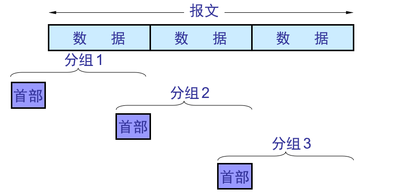
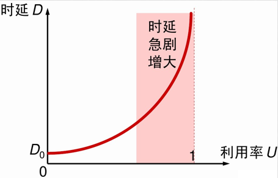
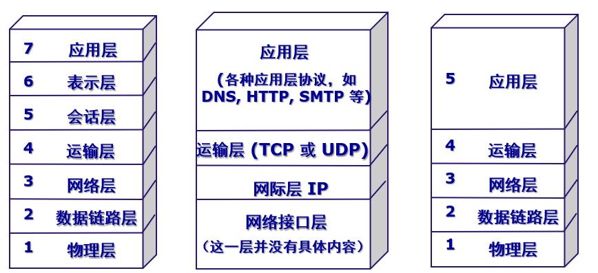
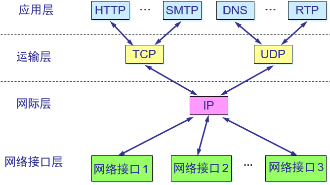

# 互联网的组成

从工作方式看能够分成边缘部分和核心部分

## 边缘部分

​	用户直接使用的连接在互联网上的主机，又称端系统。

### 网络边缘的通讯

​	这是指边缘部分的计算机之间的通讯

##### 1 客户-服务器方式

​	*client*: 服务请求方。需要知道*server*的地址

​	*server*: 服务提供方，一般可处理多请求，一般要求是长期运行，需要来自硬件的支持

##### 2 对等连接方式(P2P, peer to peer)

​	不区分服务请求方和服务提供方，可以看成双向的客户-服务器方式

## 核心部分

​	网络和连接网络的路由器 =>为边缘提供服务

​	路由器(router): 实现分组交换(packet switching)的关键构件

​	交换(switching)：按某种方式动态地分配传输线路的资源

#### 交换(switching)

##### 电路交换

​	来源于电话网络，需要经过 **建立连接 -> 通话 -> 释放连接**(定义)，在通话期间，通话的两个用户始终占用端到端的通讯资源，因此效率通常会很低

##### 报文交换

​	整个报文传送到相应节点，全部存储后再转发

##### 分组交换

​	采用存储转发技术。把报文划分为几个分组后再进行传送

​	报文(message): 要发送的整块数据

​	分组(包, packet): 报文加上必要的控制信息(首部(header))所组成的

​	路由器收到一个分组(包)，先暂存，再检查首部，然后查找转发表，找到合适的端口发送出去。分组在转发的时候可能存在一定的延时，同时分组本身多携带的头部带来一定的额外开销(overhead)。

# 计算机网络的类别

## 按网络的作用范围

|                 |                                |
| --------------- | ------------------------------ |
| 广域网(WAN)     | 几十到几千公里，通常是跨国际。 |
| 城域网(MAN)     | 5-50km。一般是整个城市         |
| 局域网(LAN)     | 校园网，较小范围内的高速连接   |
| 个人区域网(PAN) | 10m范围左右，个人设备连接      |

## 按网络使用者

#### 共用网(public network)

​	电信公司出资搭建的大型网络，资费使用

#### 专用网络(private network)

​	满足一些特殊需求，如，军队，银行等的系统专用网络、

接入网(access network)

> 不属于核心/边缘部分。用户系统到互联网的第一个路由器，从范围上看属于局域网

​	

# 计算机网络的性能

## 1.速率

数据的传送速率，数据率(data rate) or 比特率(bit rate)，通常单位是bit/s (b/s)。不是字节

> 使用k，M，G，T时，分别表示的是$10^3,10^6,10^9,10^{12}$

## 2.带宽(bandwidth)

### 两个意义

- 频域。通频带宽度，指信号包含的各种不同频率成分所占的频率范围，单位是赫兹
- 时域。在计网中经常表示单位时间内，网络中的某信道所能通过的“最高数据率”，单位是bit/s

## 3.吞吐量(throughput)

​	单位时间内通过某个网络(信道/接口)的**实际**数据量。即使带宽足够大，实际吞吐量可能远小于带宽

## 4.时延(delay/latency)

$$
总时延 = 发送时延 + 传播时延 + 处理时延 + 排队时延
$$

### a.发送时延(transmission delay)

​	主机或者路由器发送数据帧所需要的时间
$$
发送时延 = \frac{数据帧长度(bit)}{发送速率(bit/s)}
$$
​	注意和下面传播时延的区别。比如，高速网络链路，提高的是数据发送速率，因此改善的是发送时延，而传播时延不受影响

### b.传播时延

​	**电磁波**在信道中传播一定距离需要花费的时间
$$
传播时延 = \frac{信道长度(m)}{电磁波在信道上的传播速率(m/s)}
$$

### c.处理时延

​	主机或者路由在接收到分组时需要花费一定时间进行处理。分析首部，提取数据部分，进行差错检验等

### d.排队时延

​	分组进入路由器后要排队等待处理，确定好输出端口后还要排队等待输出

## 5.时延带宽积

$$
时延带宽积 = 传播时延 × 带宽
$$

​	可以称为**以比特为单位的链路长度**。从发送端发出，但是还没有到达接收端。

## 6.往返时间(RTT)

​	双向交互所需的时间，比如数据传输中经常需要等待确认消息

## 7.利用率

|            |                                      |
| ---------- | ------------------------------------ |
| 信道利用率 | 信道有多少比例是被利用的(有数据通过) |
| 网络利用率 | 网络的全部信道的平均利用率           |

通常来说，随着信道利用率的提高，时延也会随之变高(类似堵车)。

$$
\begin{split}
D&=\frac{D_0}{1-U}, 其中:\\
D_0 &: 网络空闲时的时延\\
D &: 网络当前时延\\
U &: 利用率
\end{split}
$$

# 计算机网络的体系结构

## 网络协议(network protocol)

​	为进行互联网中的数据交换而建立的规则，标准或约定

### 要素

- 语法：数据与控制信息的**结构**或格式
- 语义：数据所代表的**含义**
- 同步：行为的顺序

## 五层协议的体系结构

## 其他概念

​	实体(entity)：任何可发送或接收信息的硬件

​	协议：控制两个对等实体进行通讯的规则的集合