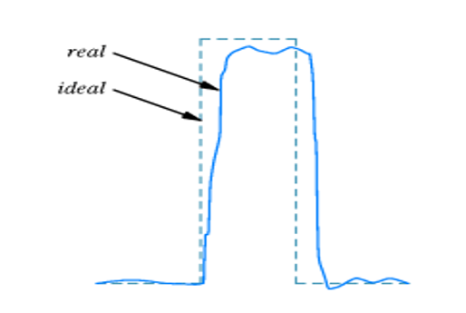
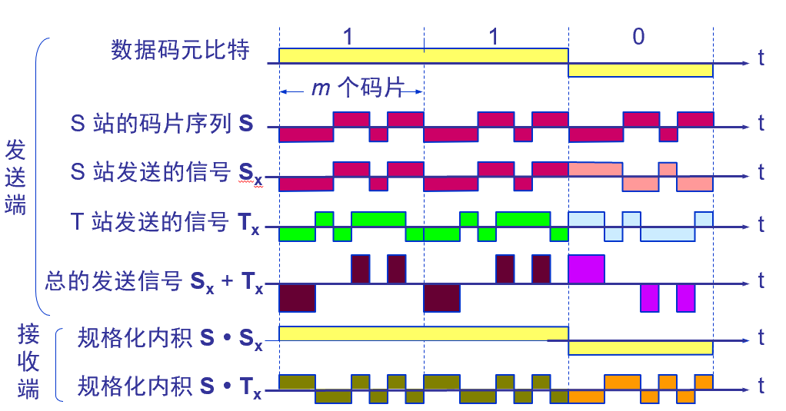

# 基本概念

用于物理层的协议也常称为物理层规程(procedure)。物理层的主要任务是确定与传输媒体的接口有关的一些性质。数据在通信线路上的传输方式通常是串行传输

| 特性     |      |
| -------- | ---- |
| 机械特性 |      |
| 电气特性 |      |
| 功能特性 |      |
| 过程特性 |      |

## 物理层的传输媒体

### 引导型

- 双绞线
- 同轴电缆
- 光缆

### 非引导型

- 短波通信
  - 多径效应
- 卫星

# 基础模型

### 信道

​	向某个方向传送信息的媒体

| 通信双方的信息交互方式 |                                |
| ---------------------- | ------------------------------ |
| 单工通讯               | 只能单向传输                   |
| 半双工通讯             | 可以双向传输，但是只能时分复用 |
| 全双工通讯             | 双方都可以同时通讯，eg：socket |

### 调制

来自信源的信号通常称为**基带信号**。由于其本身经常带有较多低频，甚至直流信号，许多信道并不能传输，因此需要对基带信号进行调制(modulation)

#### 基带调制

​	仅对基带信号的波形进行变化，使其能和信道特性相适应。它把一个数字信号转化为另一个数字信号，所以常称为编码(coding)

#### 带通调制

​	使用载波(carrier)进行调制，把基带信号搬移到较高的频段，并转化为模拟信号，调制后的信号称为带通信号

### 常用编码方式

|                  |                                               |
| ---------------- | --------------------------------------------- |
| 不归零制(NRZ)    | 电平区分，高-1，低-0                          |
| 归零制           | 边沿区分，高-1，低-0                          |
| 曼切斯特编码     | 位的中心上跳为0，下跳为1，反之亦可            |
| 差分曼切斯特编码 | 每位的中心都有跳变，在每一位的开始有跳变才是0 |

### 基本带通调制方法

正交振幅调制(QMA)

### 信道的极限容量

通常来讲，限制码元在信道上的传播速度的因素有：

#### 信道能够通过的频率范围

​	矩形脉冲包含很丰富的高频分量，如果在传输的时候衰减，就可能像上图一样，边缘不再陡峭。这种现象称为**码间串扰**

​	该奎斯特给出了理想的条件下，为了避免码间串扰，码元的传输速率的上限值。**奈氏准则**：在任何信道中，码元的传输速率是有上限的，传输速率超过此上限，就会出现严重的码间串扰问题，使接收端对码元的判决(or识别)成为不可能

​	信道的频带越宽，即能通过的高频分量越多 -> 可以以更高频率发送

#### 信噪比

​	即，信号的平均功率和噪声的平均功率之比，通常用分贝作为度量，即：
$$
信噪比(db)=10log_{10}(S/N)(db)
$$
**香农公式**：信道的极限传输速率：
$$
C=Wlog_{2}(1+S/N)(bit/s)
$$
​	其中，W为信道的带宽。香农公式指出了信息传输速率的上限，其主要意义在于：只要信息传输速率低于信道的极限信息传输速率，就一定存在某种方法来实现无差错的传输。对于带宽，信噪比已经(近乎)确定的信道，可以考虑让每个码元携带更多比特的信息量(???)

> 在数字通信中常常用时间间隔相同的符号来表示一个二进制数字，这样的时间间隔内的信号称为(二进制)码元 		-- 百度百科
>
> 波特率：每秒传送的码元符号的个数

## 信道复用技术

#### 频分复用(FDM)

​	用户在相同的时间占用不同的带宽

#### 时分复用(TDM)

​	在不同的时间占用相同的带宽

- 统计(异步)时分复用

  不是固定分配时隙，而是按需动态分配

#### 波分复用

​	光纤同时传输多个频率很接近的光载波信号

#### 码分复用(CDM)

​	

利用正交技术。将一个比特时间划分为多个码片(chip)。各个基站的码元序列正交，发送1的时候就发送这个序列的原码，发送0的时候就发送反码。接受方同时接受多个序列，想接收谁家的信息就用它家的码片序列来乘信号，即可过滤掉其他家的信号