# 基本概念

## 网络层干了什么

网络层应当向运输层提供怎样的服务，**面向连接还是面向无连接**？

​	面向连接的服务借鉴于电信的电话网，可以建立提供有序，可靠的传输，但是会占用“虚电路”的网络资源

​	面向无连接的方式是将数据分组发送，提供“尽力”的服务。当初提出以及最终应用无连接的方式有原因是：基于计算机很强的差错处理能力，能接受网络层提供这种“尽力”的服务

​	网络层最首要的问题是**多网络的互联问题**，各种网络可能差异巨大，以太网，卫星链路等。如何将繁多的网络统一，向上提供抽象？对各种网络制定一个标准的方式并不适合，因为各种异构网络差异巨大，后来提供的解决方式是类似“网络层为各种异构网络提供适配器”的方式：使用IP协议让性能各异的网路在网络层上看起来像是一个统一的网络 - 虚拟互联网。

## IP协议

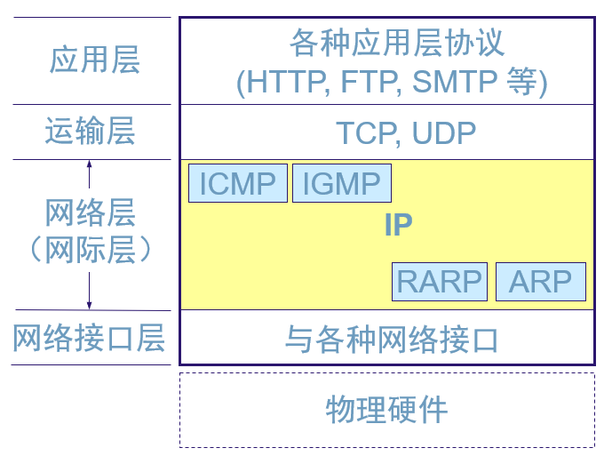

​	IP协议的实现还依赖于另外三个协议：

- ARP(address resolution protocol)
- ICMP(internet control message protocol)
- IGMP(internet group management protocol)

  其中，ARP协议工作在数据链路层和网络层之间，为IP协议工作提供支持，而ICMP和IGMP基于IP协议为上层提供服务。

## IP地址

​	网络层既然想解决“多网互联”，那就必须解决“标识”问题，即在庞大的互联网中“谁是谁”的问题，这不只是“identify”，而且需要“location”。在数据链路层中我们使用了MAC地址来解决“identify”，由于局域网规模小，因此使用广播的方式，也避免了“location”问题，但是“广播”明显不能再用在互联网上了，这时候我们需要真正的“地址”，这就是IP地址。

​	IP地址到现在经历过了三个阶段

- 分类的IP地址
- 子网划分 -> 为了拿到网络号的机构能更好地管理以及使用ip
- 构成超网 -> IP地址不够用


# IP协议栈

## IP协议

### 1.IP地址

#### 分类的IP地址

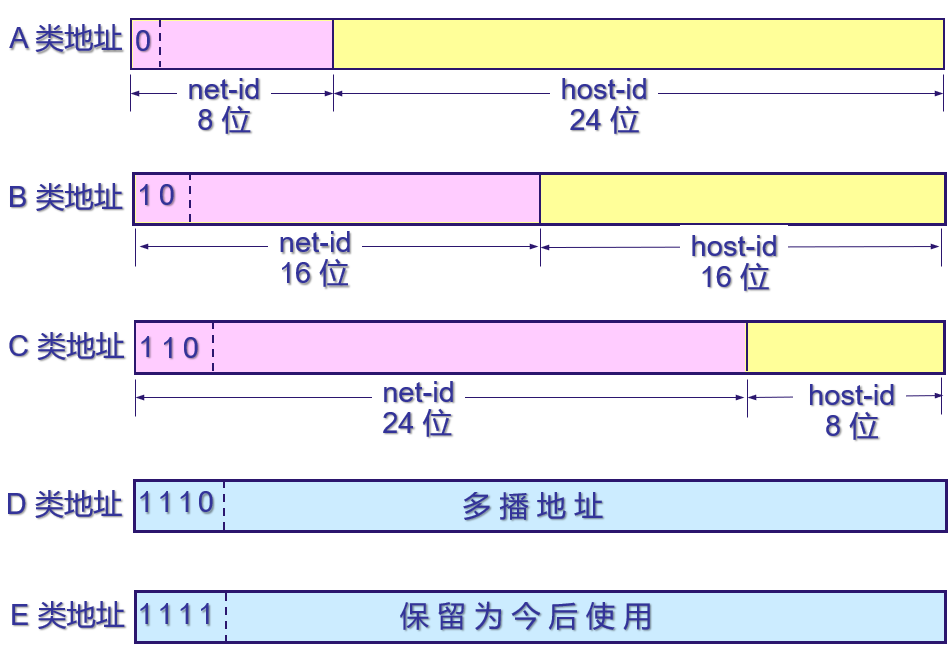

​	前面部分为网络号，后面部分为主机号。其中：

- A类网络有2^7^-2个 ->全0不能用
- B类网络有2^14^-1个
- C类网络有2^21^-1个

对于主机号，全0表示本主机，全1表示本局域网所有主机。

#### 子网划分

​	子网划分发生在一个具体的某类地址下，是对这个网络中主机更加灵活的管理。子网号是借用了几个主机号而构成的，因此主机号会变少，其具体的实现是，路由器通过子网掩码来确定子网地址，然后进行转发。

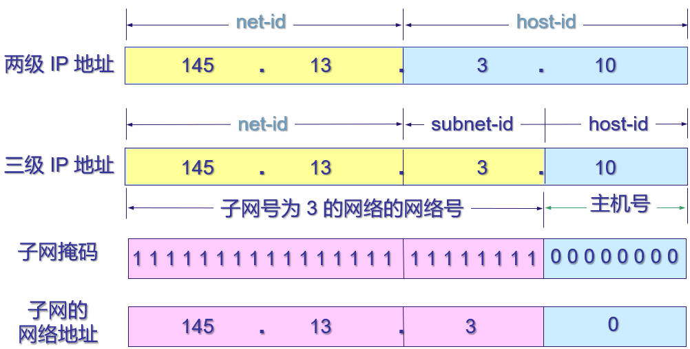

子网划分后，由于全0表示本主机，全1表示本局域网所有主机，因此每个子网下的主机号全0或全1的ip地址都不能用

#### 构成超网

1. 网络前缀

   ​	无分类域间路由选择(CIDR)，去除了A，B，D等的地址分类，同样是两级分址，但是网络号的长度不再是固定的了，这时候网络号称为网络前缀

2. 最长前缀匹配
	​	由于使用CIDR会有“地址聚合”的效果，在路由表中进行匹配的时候应该选择网络前缀最长匹配的IP地址，这样可以尽可能地缩小范围
	
3. 二叉线搜索

     ​	类似哈夫曼编码所使用的键树

### 2.IP数据报

​	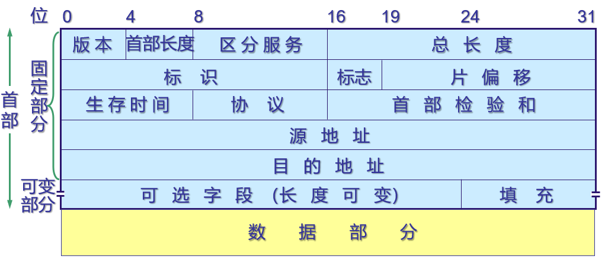

**首部检验和**：16位，只检验数据报的首部。

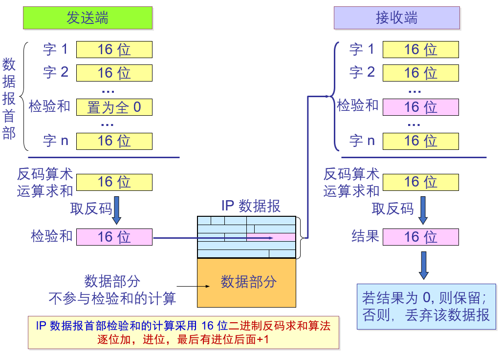

反码算数运算求和：就是求和后取反码

### 3.路由表

​	表项：**（目的网络地址，下一条地址）**

​	默认路由：对某些规则的IP地址设置其跳转到某个地址

路由表的具体运行机制还需要其他协议，具体部分分割到后面。


> 至此，从网络层向下的具体通讯过程：IP数据报填写源地址，目的地址，丢到数据链路层后，由数据链路层的网络接口软件负责将“下一跳的ip地址”转化成MAC地址，然后将IP数据报封装成帧，填写源和目的MAC地址，然后通过链路传输，到达目的之后向上解析。
>
> - 主机或者路由器如何将“下一条的IP地址”转化成MAC地址？
> - 路由器中的路由表是何种运行机制？
>
> 其中第一个问题的答案即ARP协议


## ARP

### 用途

​	从网络层的IP地址解析出在数据链路层应当使用的MAC地址。因此，ARP是工作在数据链路层和网络层间的协议。

### 实现

​	使用ARP catch缓存**局域网**中各主机和路由的IP地址与其MAC地址的映射。既然是查表，那就是使用的时候查呗，应当关注的是表的建立过程：主机(出于需要)在局域网中发送ARP请求分组，内容差不多是*我的IP是：xxx，MAC是：xxx，IP为：yyy的MAC是多少啊*，局域网中只有IP为*yyy*的主机(如果存在)会回复ARP响应分组：*"我的IP是：yyy，MAC是：yyy"*。注意这里请求分组是广播发送，而响应分组是单播(从一个源到一个目的)

​	其他：源和目的主机都会缓存对方的IP与MAC映射。同样有超时失效

​	注意：ARP**是局域网上的**，ARP catch中缓存的也是本局域网内的映射关系。对于跨越局域网的分组，会被发送到另外的路由器(而不是局域网内主机)，通过路由器转发到另一个网段。

> 问题：如果是一个路由器连接着多个路由器，如何确定要把分组发到哪个路由器来实现跨局域网？ -- 路由表配置默认路由
>
> 三层交换机

## ICMP

​	网际控制报文协议，有包括ICMP差错报告报文和ICMP询问报文，它主要是为IP数据报传输提供服务的(为了能更有效地转发IP数据报，提高成功交付的机会)，可以看其具体的服务：

- 报告报文包括了向源点汇报：终点不可达，超时，(首部)参数出错(IP头部检验和)，路由重定向等
- 询问报文包括了：回送请求和回答(询问目标主机是否可达)，时间戳请求和回答(时钟同步等)

### 数据帧

​	ICMP的数据报(**称为ICMP报文会好一点**)装在了IP数据报中，即，**ICMP本身依赖于IP数据报**，但是，ICMP是属于IP层协议的(并不是像IP数据报装在MAC帧中，两者就是不同层) => 装ICMP报文的IP数据报出错后不会发送差错报告

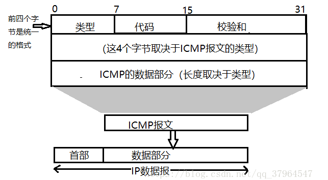

#### 	ICMP差错报告报文

​	差错报告的报文的数据部分是一样的，包含了需要进行差错报告的IP数据报的首部和前8字节，其中，8字节部分是为了获得运输层的端口(TCP, UDP)和发送序号(TCP)

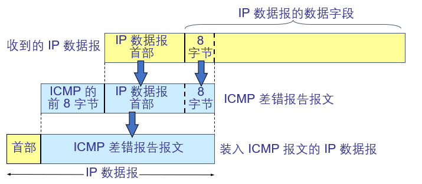

​	

### 应用

*ping*命令和*traceroute*命令

# 路由选择协议

​	关于路由表是怎么得到的，这的确是网络层最核心的地方之一

总的来说，互联网使用的路由选择协议是**分层次的**，**自适应(动态)的**。动态的主要是出于互联网环境的多变性，所以需要一个“自适应”的算法来适应网络环境的变化，而分层的则是出于：

- 互联网规模庞大
- 有些组织不愿公开内部网络结构 => 隐私性

**主要结构**：互联网被分成多个**自治系统(AS)**，每个AS内部使用的路由选择协议族称为内部网关(路由)协议IG(R)P(<=注意这种称呼是一类协议的总称)，通常来说，小范围的网络会使用较为简便的RIP，较大范围的网络会使用OSPF协议。自治系统之间，通**过边缘的路由器**连接，当信息跨越两个AS的时候，使用的路由选择协议族称为外部网关(路由)协议EG(R)P，经常使用的是BGP协议

> 路由选择的三个要点
>
> - 和哪些路由器交换信息 who
> - 交换什么信息 what
> - 在什么时候交换信息 when

## RIP

​	RIP在路由选择的时候只考虑“到目标路由器经过的跳数”，其对“三个要点”的回答：

- 仅和相邻路由器交换信息
- 交换当前路由器的整个路由表
- 按固定时间间隔交换

### 距离向量算法

​	借鉴的是Bellman-Ford算法

**收到一个地址为X的相邻路由器的RIP报文(对方的整个路由表)后，进行处理**：

```python
for 项目 in RIP 报文:
    项目[下一跳] = X
    项目[距离] += 1
for 项目 in 修改后的 RIP 报文:
    if 项目中的目的网络不在路由表中:
        项目加到路由表中
    elif 项目中的距离小于路由表中的距离:
        更新路由表中的距离
if 3 分钟还没有收到相邻路由器的更新路由表:
    则将此相邻路由器记为不可达的路由器，即将距离置为16
```

### RIP报文格式

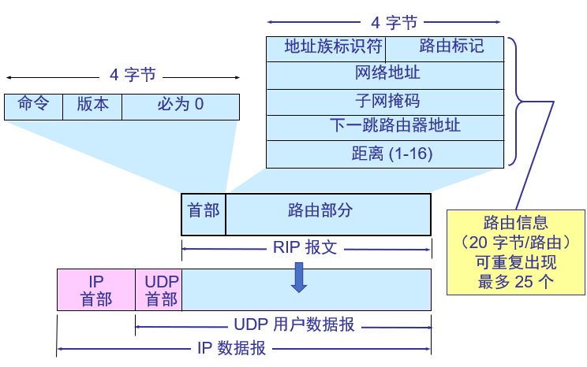

**RIP使用运输层的用户数据报UDP进行传送**，各个字段的具体含义可以看书。在这里，前四个字节后面为0的部分是为了字节对齐。路由部分最多可以放入25个项，每个项4字节

### 问题

1. 只适用于小型网络：

   ​	首先，使用的是“跳数”作为距离度量，在小范围内其他相关因素影响可能较小，但是大范围不合适，再者最长距离为“16跳”(不可达)，可见设计的时候就是为了小范围，最后，像是下面的问题也是一个原因

   2.好消息传得快，坏消息传得慢：

   ​	假设路由$R_1,R_2$和网络$N_1$连接，其中$R_1$直接相连，$R_2$通过$R_1$连接，则它们到$N_1$的距离分别为1，2，当$N_1$掉线后，$R_1$中路由表到$N_1$的距离会设为16，但是$R_2$到$N_1$的距离还是2，这样，$R_2$会反过来更新$R_1$的路由表，使得距离为3，随后$R_1$再去更新$R_2$....

## OSPF

​	开放最短路径优先，路由更新使用的是分布式的**链路状态协议**，其对“三个要点”的回答：

- 向本自治系统的所有路由器发送信息=>洪泛法:接收到信息的路由器会继续转发收到的信息

- 发送的是和本路由器相邻的所有路由器的链路状态 => 本路由器知道的部分(非全部)信息

  > 和谁相连，以及距离度量，这里的度量是综合距离，费用，时延，带宽的一个指标

- 只有链路状态发生变化的时候，才发送消息

### 洪泛法

​	通过这个算法，网络上的路由器都会建立一个全网一致的链路状态数据库，即全网的拓扑结构。通过这个拓扑结构，路由器再构造路由表。

OSPF收敛快

### 分层

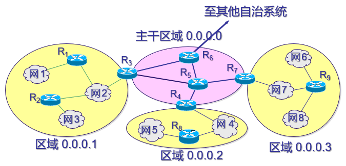

​	OSPF会将一个AS再划分为更小的区域(area)，利用洪泛法交换链路状态只局限于一个区域内。其中会有一个主干区域，区域标识符为0.0.0.0(和IP没关系)，其他区域通过**区域边界路由器**和主干区域相连，主干区域内的路由器称为**主干路由器**，其中还有一个**自治系统边界路由器**和其他AS相连

### OSPF报文格式

​	OSPF直接使用IP数据报传送数据

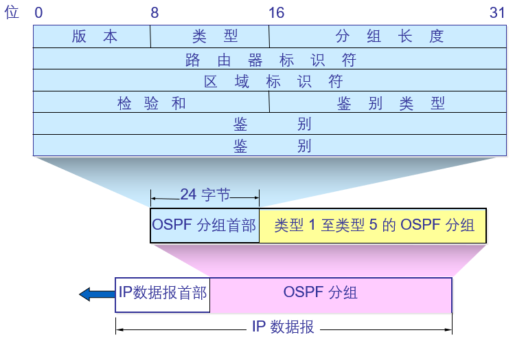

​	五种分组类型：

1. 问候：维持和邻站的可达性
2. 数据库描述：向邻站发送链路状态数据库中链路状态项目的摘要信息
3. 链路状态请求：请求发送某些链路状态的详细信息
4. 链路状态更新：用洪泛法对全网链路状态进行更新
5. 链路状态确认：对更新分组的确认 => **可靠的洪泛法**

有时候会使用**指定的路由器**来代表局域网上所有链路，向连接到该网络的各个路由器发送状态信息

## BGP

​	BGP-4。

- 互联网巨大的规模使得AS间的路由选择异常困难，各个AS使用的度量标准也不一样
- AS间的路由必须考虑有关策略：包括安全性以及一些收付费等问题

目标是找一个**合适的，而非最佳的路由**，BGP采用的是**路径向量路由选择协议**。

每个AS至少要设置一个**BGP发言人**，各个BGP发言人会在TCP连接基础上建立BGP会话，通过这个会话交换可达性信息，各BGP发言人根据得到的信息**寻找较好的路由**，通常会形成一个树状结构

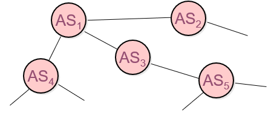

### BGP报文格式

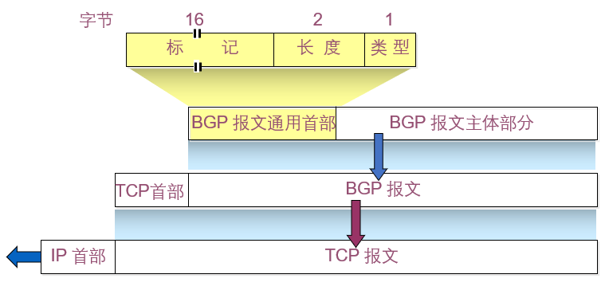

​	4种报文：

- OPEN：和另一个BGP发言人建立连接
- UPDATE：通告某一路由的信息，以及列出要撤销的多个路由
- KEEPALIVE：周期性证实邻站的连通性
- NOTIFICATION(通知)：发送检测到的差错

# 路由器的构成

## 路由器的结构