# 基本概念

## 网络层干了什么

网络层应当向运输层提供怎样的服务，**面向连接还是面向无连接**？

​	面向连接的服务借鉴于电信的电话网，可以建立提供有序，可靠的传输，但是会占用“虚电路”的网络资源

​	面向无连接的方式是将数据分组发送，提供“尽力”的服务。当初提出以及最终应用无连接的方式有原因是：基于计算机很强的差错处理能力，能接受网络层提供这种“尽力”的服务

> 这个问题的实质是：可靠交付应当由谁来负责，网络还是端系统？

​	网络层最首要的问题是**多网络的互联问题**，各种网络可能差异巨大，以太网，卫星链路等。如何将繁多的网络统一，向上提供抽象？对各种网络制定一个标准的方式并不适合，因为各种异构网络差异巨大，后来提供的解决方式是类似“网络层为各种异构网络提供适配器”的方式：使用IP协议让性能各异的网路在网络层上看起来像是一个统一的网络 - 虚拟互联网。

> ​     所谓虚拟互连网络也就是逻辑互连网络，它的意思就是互连起来的各种物理网络的异构性本来是客观存在的，但是我们利用 IP 协议就可以使这些性能各异的网络在用户看来好像是一个统一的网络  

​	这种以IP为连接点的漏斗模型在上一章的例题中已经有讨论过。

## IP协议


​	IP协议的实现还依赖于另外三个协议：

- ARP(address resolution protocol)
- ICMP(internet control message protocol)
- IGMP(internet group management protocol)

  其中，ARP协议工作在数据链路层和网络层之间，为IP协议工作提供支持，而ICMP和IGMP基于IP协议为上层提供服务。

## IP地址

​	网络层既然想解决“多网互联”，那就必须解决“标识”问题，即在庞大的互联网中“谁是谁”的问题，这不只是“identify”，而且需要“location”。在数据链路层中我们使用了MAC地址来解决“identify”，由于局域网规模小，因此使用广播的方式，也避免了“location”问题，但是“广播”明显不能再用在互联网上了，这时候我们需要真正的“地址”，这就是IP地址。

​	IP地址到现在经历过了三个阶段

- 分类的IP地址
- 子网划分 -> 为了拿到网络号的机构能更好地管理以及使用ip
- 构成超网 -> IP地址不够用


# IP协议栈

## IP协议

### 1.IP地址

#### 分类的IP地址


​	前面部分为网络号，后面部分为主机号。其中：

- A类网络有2^7^-2个 ->全0不能用
- B类网络有2^14^-1个
- C类网络有2^21^-1个

对于主机号，全0表示本主机，全1表示本局域网所有主机。

#### 子网划分

​	子网划分发生在一个具体的某类地址下，是对这个网络中主机更加灵活的管理。子网号是借用了几个主机号的位而构成的，因此主机号会变少，其具体的实现是，路由器通过子网掩码来确定子网地址，然后进行转发。


子网划分后，由于全0表示本主机，全1表示本局域网所有主机，因此每个子网下的主机号全0或全1的ip地址都不能用

#### 构成超网

1. 网络前缀

   ​	无分类域间路由选择(CIDR)，去除了A，B，D等的地址分类，同样是两级分址，但是网络号的长度不再是固定的了，这时候网络号称为网络前缀

2. 最长前缀匹配
	​	由于使用CIDR会有“地址聚合”的效果，在路由表中进行匹配的时候应该选择网络前缀最长匹配的IP地址，这样可以尽可能地缩小范围
	
	> 地址聚合(路由聚合)：不再划分A，B，...类网络，网络前缀可以是合法的任意位，从而可以将路由表多个项合并起来，用更短的网络前缀来表示。
	
3. 二叉线搜索

     ​	类似哈夫曼编码所使用的键树

### 2.IP数据报

​	

> 一共20字节

**首部检验和**：16位，只检验数据报的首部。


反码算数运算求和：就是求和后取反码，如果最高位有进位，最后结果要加1

**分片**：

首部有个*flag*字段

​	最低位是 **MF** (More Fragment)，1 -- 后面还有分片，0 -- 最后一个分片

​	中间的一位是 **DF** (Don't Fragment)，只有DF=0才允许分片

还有一个片偏移字段它表示当前这个片是分片前从哪一字节开始的(单位为8字节)，即如果某个分片的数据是从原来数据部分的1480字节开始，那这个字段就填1480/8=185


> ​	至此，从网络层向下的具体通讯过程：IP数据报填写源地址，目的地址，丢到数据链路层后，由数据链路层的网络接口软件负责将“下一跳的ip地址”转化成MAC地址，然后将IP数据报封装成帧，填写源和目的MAC地址，然后通过链路传输，到达目的之后向上解析。
>
> - 主机或者路由器如何将“下一条的IP地址”转化成MAC地址？
> - 路由器中的路由表是何种运行机制？
>
> 其中第一个问题的答案即ARP协议

### 3.路由表

​	表项：**（目的网络地址，下一条地址）**

​	默认路由：对某些规则的IP地址设置其跳转到某个地址

路由表的具体运行机制还是挺复杂的，建立路由表的协议可以统称为路由选择协议。

#### 分组转发算法

> - 从数据报的首部提取目的主机的 IP 地址 *D*, 得出目的网络地址为 *N*  
> - 若网络 *N* 与此路由器直接相连，则把数据报直接交付目的主机 *D*；否则是间接交付，执行下一步
> - 若路由表中有目的地址为 *D* 的特定主机路由，则把数据报传送给路由表中所指明的下一跳路由器；否则执行下一步
> - 若路由表中有到达网络 *N* 的路由，则把数据报传送给路由表指明的下一跳路由器；否则  执行下一步
> - 若路由表中有一个默认路由，则把数据报传送给路由表中所指明的默认路由器；否则执行下一步
> - 报告转发分组出错


## ARP

> ARP和ICMP在实验课的时候进行了具体的抓包分析，可以看实验报告。

### 用途

​	路由转发需要从网络层的IP地址解析出在数据链路层应当使用的MAC地址，RAP即为了给路由器提供这样的信息。ARP是工作在数据链路层和网络层间的协议。另外，应当强调ARP工作在局域网，因此考虑的事情都是局域网内的。

### 实现

​	使用ARP catch缓存**局域网**中各主机和路由的IP地址与其MAC地址的映射。既然是查表，那就是使用的时候查呗，应当关注的是表的建立过程：主机(出于需要)在局域网中发送ARP请求分组，内容差不多是*我的IP是：xxx，MAC是：xxx，IP为：yyy的MAC是多少啊*，局域网中只有IP为*yyy*的主机(如果存在)会回复ARP响应分组：*"我的IP是：yyy，MAC是：yyy"*。注意这里请求分组是**广播**发送，而响应分组是**单播**(从一个源到一个目的)。ARP的这种通讯存在于局域网中主机和路由的四种组合之间。

​	其他：源和目的主机都会缓存对方的IP与MAC映射。同样有超时失效

​	注意：ARP**是局域网上的**，ARP catch中缓存的也是本局域网内的映射关系。对于跨越局域网的分组，会被发送到路由器(而不是局域网内主机)，通过路由器转发到另一个网段。

> 问题：如果是一个路由器连接着多个路由器，如何确定要把分组发到哪个路由器来实现跨局域网？ -- 路由转发算法，路由表会做出决定，转发表只是提供IP地址到MAC地址转换。
>
> 三层交换机

​	课本并没有提到ARP的报文格式，ARP包并不需要借助IP数据报，也不能借助，因为他就是为了IP数据报能正常分发而设计的

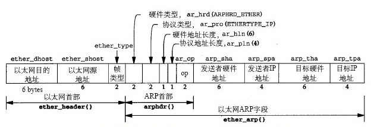

## ICMP

​	网际控制报文协议，有包括ICMP差错报告报文和ICMP询问报文，它主要是为IP数据报传输提供服务的(为了能更有效地转发IP数据报，提高成功交付的机会)，可以看其具体的服务：

- **报告报文**包括了向源点汇报：终点不可达，源点抑制，超时，(首部)参数出错(IP头部检验和)，路由重定向等
- **询问报文**包括了：回送请求和回答(询问目标主机是否可达)，时间戳请求和回答(时钟同步等)

### 数据帧

​	ICMP的数据报(**称为ICMP报文会好一点**)装在了IP数据报中，即，**ICMP本身依赖于IP数据报**，但是，ICMP是属于IP层协议的(并不是像IP数据报装在MAC帧中，两者就是不同层) => 装ICMP报文的IP数据报出错后不会发送差错报告


#### 	ICMP差错报告报文

​	差错报告的报文的数据部分是一样的，包含了需要进行差错报告的IP数据报的首部和前8字节，其中，8字节部分是为了获得运输层的端口(TCP, UDP)和发送序号(TCP)


​	

### 应用

*ping*命令和*traceroute*命令

# 路由选择协议

​	关于路由表是怎么得到的，这的确是网络层最核心的地方之一，因为路由表描述的即网络是如何连接的。

总的来说，互联网使用的路由选择协议是**分层次的**，**自适应(动态)的**。动态的主要是出于互联网环境的**多变性**，所以需要一个“自适应”的算法来适应网络环境的变化，而分层的则是出于：

- 互联网**规模庞大**，节点数目巨大
- 有些组织不愿公开内部网络结构 => 隐私性

**主要结构**：互联网被分成多个**自治系统(AS)**，每个AS内部使用的路由选择协议族称为内部网关(路由)协议IG(R)P(<=注意这种称呼是一类协议的总称)，通常来说，小范围的网络会使用较为简便的RIP，较大范围的网络会使用OSPF协议。自治系统之间，通**过边缘的路由器**连接，当信息跨越两个AS的时候，使用的路由选择协议族称为外部网关(路由)协议EG(R)P，经常使用的是BGP协议

> 路由选择的三个要点
>
> - 和哪些路由器交换信息 who
> - 交换什么信息 what
> - 在什么时候交换信息 when

## RIP

​	RIP在路由选择的时候只考虑“到目标路由器经过的**跳数**”，其对“三个要点”的回答：

- 仅和相邻路由器交换信息
- 交换当前路由器的整个路由表
- 按固定时间间隔交换

### 距离向量算法

​	借鉴的是Bellman-Ford算法

**收到一个地址为X的相邻路由器的RIP报文(对方的整个路由表)后，进行处理**：

```python
for 项目 in RIP 报文:
    项目[下一跳] = X
    项目[距离] += 1
for 项目 in 修改后的 RIP 报文:
    if 项目中的目的网络不在路由表中:
        项目加到路由表中
    elif 项目中的距离小于路由表中的距离:
        更新路由表中的距离
if 3 分钟还没有收到相邻路由器的更新路由表:
    则将此相邻路由器记为不可达的路由器，即将距离置为16
```

### RIP报文格式


**RIP使用运输层的用户数据报UDP进行传送**，各个字段的具体含义可以看书。在这里，前四个字节后面为0的部分是为了字节对齐。路由部分最多可以放入25个项，每个项4字节

### 问题

1. 只适用于小型网络：

   ​	首先，使用的是“跳数”作为距离度量，在小范围内其他相关因素影响可能较小，但是大范围不合适，再者最长距离为“16跳”(不可达)，可见设计的时候就是为了小范围，最后，像是下面的问题也是一个原因
   
2.	好消息传得快，坏消息传得慢：

   ​	假设路由$R_1,R_2$和网络$N_1$连接，其中$R_1$直接相连，$R_2$通过$R_1$连接，则它们到$N_1$的距离分别为1，2，当$N_1$掉线后，$R_1$中路由表到$N_1$的距离会设为16，但是$R_2$到$N_1$的距离还是2，这样，$R_2$会反过来更新$R_1$的路由表，使得距离为3，随后$R_1$再去更新$R_2$....

## OSPF

​	开放最短路径优先，路由更新使用的是分布式的**链路状态协议**，其对“三个要点”的回答：

- 向本自治系统的所有路由器发送信息=>洪泛法:接收到信息的路由器会继续转发收到的信息

- 发送的是和本路由器**相邻**的所有路由器的链路状态 => 本路由器知道的部分(非全部)信息

  > 和谁相连，以及距离度量，这里的度量是综合距离，费用，时延，带宽的一个指标

- 只有链路状态发生变化的时候，才发送消息

### 链路状态协议

​	通过这个算法，网络上的路由器都会建立一个全网一致的**链路状态数据库**，即全网的拓扑结构。通过这个拓扑结构，路由器再构造路由表。

OSPF收敛快

### 分层


​	OSPF会将一个AS再划分为更小的区域(area)，利用洪泛法交换链路状态只局限于一个区域内(减少通讯量)。其中会有一个主干区域，区域标识符为0.0.0.0(和IP没关系)，其他区域通过**区域边界路由器**和主干区域相连，主干区域内的路由器称为**主干路由器**，其中还有一个**自治系统边界路由器**和其他AS相连

### OSPF报文格式

​	OSPF直接使用IP数据报传送数据


​	五种分组类型：

1. 问候：维持和邻站的可达性
2. 数据库描述：向邻站发送链路状态数据库中链路状态项目的摘要信息
3. 链路状态请求：请求发送某些链路状态的详细信息
4. 链路状态更新：用洪泛法对全网链路状态进行更新
5. 链路状态确认：对更新分组的确认 => **可靠的洪泛法**

有时候会使用**指定的路由器**来代表局域网上所有链路，向连接到该网络的各个路由器发送状态信息

> LS和DV
>
> ​	LS和DV的比较即RIP和OSPF的比较。可以从路由选择协议的三个要点出发。即向谁，在什么发送什么消息，另外，还应当注意LS不会有DV的“坏消息传得慢”的问题


><h3>IGP和EGP的不同</h3>
>#### 策略
>
>- AS间的路由跨越不同的管理区域，要控制**流量**如何路由
>- AS内不需要
>
>AS内的路由着重性能，AS间的路由着重策略

## BGP

​	BGP-4。

- 互联网巨大的规模使得AS间的路由选择异常困难，各个AS使用的度量标准也不一样
- AS间的路由必须考虑有关策略：包括安全性以及一些收付费等问题

目标是找一个**合适的，而非最佳的路由**，BGP采用的是**路径向量路由选择协议**。

​	每个AS至少要设置一个**BGP发言人**，各个BGP发言人会在TCP连接基础上建立BGP会话，通过这个会话交换可达性信息，各BGP发言人根据得到的信息**寻找较好的路由**，通常会形成一个树状结构


### BGP报文格式


​	4种报文：

- OPEN：和另一个BGP发言人建立连接
- UPDATE：通告某一路由的信息，以及列出要撤销的多个路由
- KEEPALIVE：周期性证实邻站的连通性
- NOTIFICATION(通知)：发送检测到的差错

# 路由器的构成

## 路由器的结构

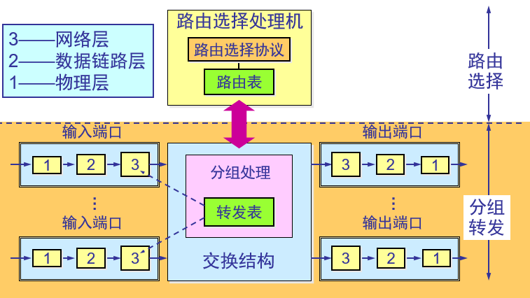

主要分为路由选择和分组转发两个模块。

> ​     “转发”和“路由选择”的区别   
>
> - “转发”(forwarding)就是路由器根据**转发表**将用户的 IP 数据报从合适的端口转发出去。
> -  “路由选择”(routing)则是按照分布式算法，根据从各相邻路由器得到的关于网络拓扑的变化情况，动态地改变所选择的路由，建立**路由表**
> - 路由表是根据路由选择算法得出的。而转发表是从路由表得出的，注意**转发表不是ARP cache**

### 分组转发

​	包含**交换结构，输入，输出端口**。在网络层部分，如果接收到的分组是路由选择协议的，(还)会发送到路由选择处理那边。

​	为避免转发表的查找成为转发的瓶颈，每个输入端口都会复制一份转发表->影子副本

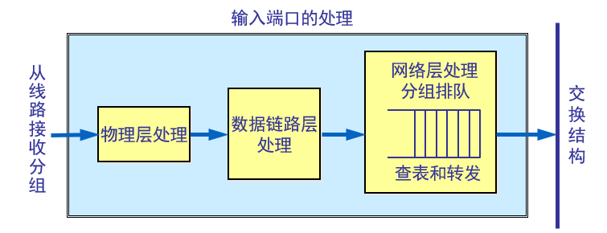

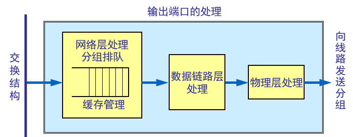

> 分组丢失：路由器种的输入或输出队列产生溢出

**交换结构**：

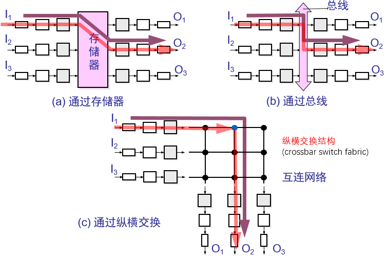

# IPv6

​	协议数据单元通常称为分组，而不是数据报，其组成分为基本首部和有效载荷，有效载荷中允许有多个拓展首部，拓展首部即IPv4的一些选项功能，数据报在传输途中经过的路由器都不处理这些拓展首部，从而提高了传输效率


基本首部和有效载荷：


## 地址

IPv6将目的地址分为三种类型：单播，多播，任播(交付给一组节点中的一个即可)

在表示地址的时候，使用**冒号十六进制**记法，由于地址中间可能出现很多0，可以使用**零压缩**，即将**其中一段0**表示为**::**。

**地址分类**


​	未指明地址只能为还没有配置到一个标准的 IP 地址的主机当作源地址使用。

​	由于IPv4和IPv6会在较长一段时间内共存，因此IPv6有部分地址是保留的，当数据报从IPv4转为IPv6，就需要进行转化


> IPv6到IPv4如何转化？在转化是可逆的吗？如果不可逆，那如何保证数据能正确传输？

**地址划分**

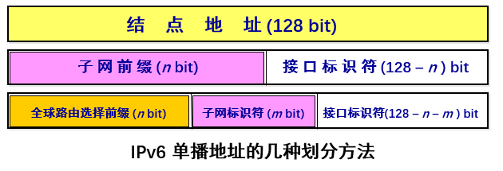

## IPv4到IPv6的过渡

### 双栈协议

​	让部分节点装有双栈协议，能够进行IPv4和IPv6转化。实际上转化不可逆，流标号字段会失效，但这种丢失是可容忍的

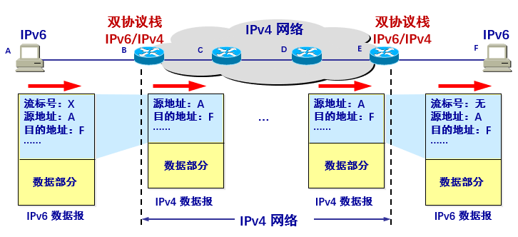

### 隧道技术

​	在IPv6分组通过IPv4网络的时候，直接将IPv6分组装到IPv4分组里面

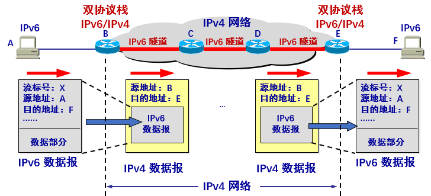

## ICMPv6

​	IPv4有多个辅助协议，而IPv6将辅助协议统一为ICMPv6。它能够报告差错，获取信息，探测邻站或管理多播通信  

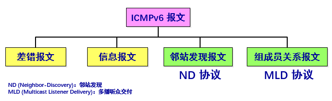

# IP多播

利用IP多播可以节省大量网络资源，尽力交付，不产生ICMP差错报告。使用的是D类地址，只能用于目的地址。

## 局域网上的硬件多播

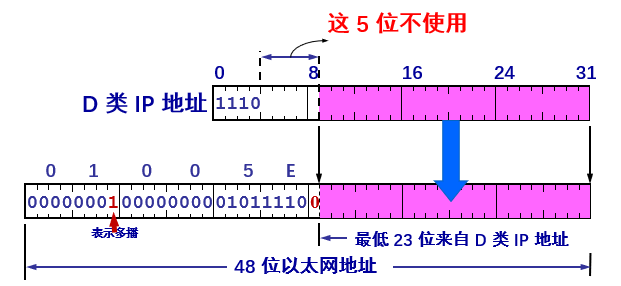

不是很懂工作流程，[附]( https://www.cnblogs.com/iloverain/p/5502165.html )

## IGMP和多播路由选择协议

### IGMP

​	网际组管理协议。解决“如何知道多播组成员”的问题，**只能在本地使用**，让连接在本地局域网的多播路由器知道本局域网**是否有**主机参加或退出某个多播组。

​	使用IP数据报传递其报文

​	其工作可以分成两个阶段：

- 第一阶段
  - 当某个主机加入新的多播组时，该主机应向多播组的多播地址发送 IGMP 报文，声明自己要成为该组的成员  
  - 本地的多播路由器收到 IGMP 报文后，将组成员关系转发给互联网上的其他多播路由器  
  
- 第二阶段
  - 本地多播路由器要周期性地探询本地局域网上的主机，以便知道这些主机是否还继续是组的成员  
  - 只要对某个组有一个主机响应，那么多播路由器就认为这个组是活跃的 
  - 一个组在经过几次的探询后仍然没有一个主机响应，则不再将该组的成员关系转发给其他的多播路由器  
  
  工作机制：利用本地多播进行(硬件多播)，具备多播能力接口上的主机均自动加入224.0.0.1多播组，无需发送IGMP报告，在多播路由器发送查询报文的时候，通过224.0.0.1多播组查询。当主机进行回应的时候，会在0到(询问报文指明的)最长响应时间中随机选择一个时延，然后再发送响应，由于别的主机也在监听，因此如果发现别的主机已经发送响应包，自己就不用再发送了
  
  > IGMP漏洞/炸弹

### 多播路由选择协议

​	把多播数据报用**最小的代价传送给所有组成员** => 寻找多播转发树。

#### 转发多播数据报的方法

​	**泛洪与剪除**：适合较小多播组，反向路径广播 RPB

​	**隧道技术**：适合多播组地理位置分散

​	**基于核心的发现技术**：对每一个多播组 G 指定一个核心(core)路由器，给出它的 IP 单播地址，然后它按照前面讲过的方法创建出对应于多播组 G 的转发树

#### 多播路由选择协议

​	距离向量多播路由选择协议 DVMRP (Distance Vector Multicast Routing Protocol)

​	基于核心的转发树 CBT (Core Based Tree) 

​	开放最短通路优先的多播扩展 MOSPF (Multicast Extensions to OSPF) 

​	协议无关多播-稀疏方式 PIM-SM (Protocol Independent Multicast-Sparse Mode) 

​	协议无关多播-密集方式 PIM-DM (Protocol Independent Multicast-Dense Mode) 

# VPN和NAT

## VPN虚拟互联网

​	在机构中，可能存在部分主机只需要和内部主机通信。通过指定(RFC 1918)部分IP地址作为**专用地址**(互联网中的路由器不转发以这些专用地址为目的地址的数据)，它们专用于内部网络通信，这样可以避免地址的二义性。以此组成的互连网络称为本地互联网(专用网)


​	对于分散在各地，仍有类似需求的组织，可以直接租用通讯线路或者使用VPN技术，VPN基于之前提到过的隧道技术，在上面传输的数据通常会进行加密

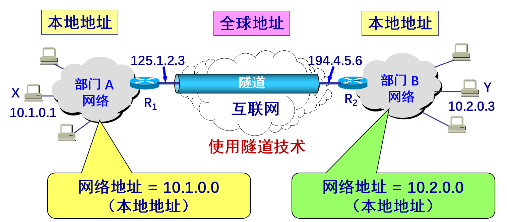

## NAT

​	在局域网中，将内部主机上网请求中的本地IP替换为路由器拥有的全球IP，这个路由器有多少个全球IP就支持多少主机同时上网。但如果加上端口号就能让局域网中更多主机一起上网

# MPLS

