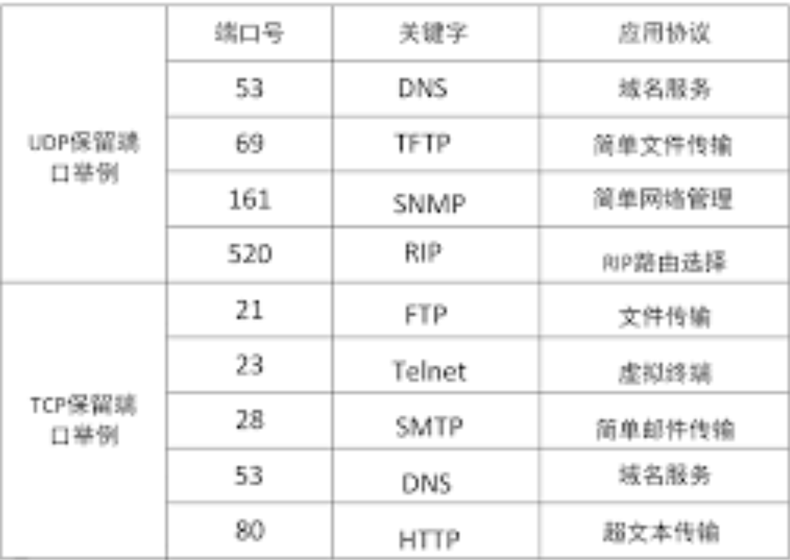
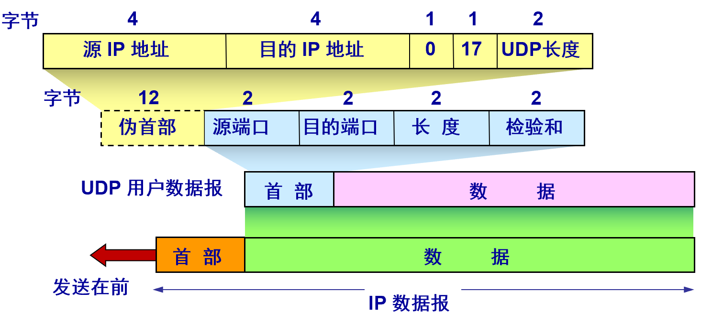
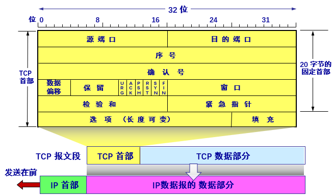
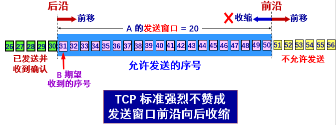
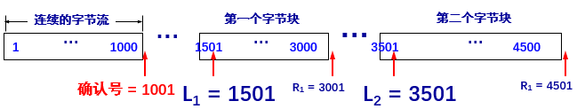
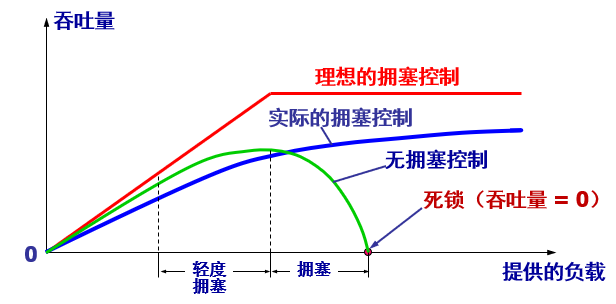

## 运输层干了什么

​	网络层为主机之间提供逻辑通讯，而运输层为应用程序之间提供端到端的逻辑通讯。书上将“从主机到应用程序”的这种拓展称为**multiplexing**和**demultiplexing**，即发送方多个应用进程能用同一个运输层协议传送，接收方能在解析完头部后正确交付数据。

> 逻辑通讯：只要把数据丢给下一层，下一层就可以把数据交付到对方的本层

​	面向通讯的最高层，用户功能的最底层，屏蔽了网络核心部分的细节，提供应用程序间的端到端的“逻辑信道”

### 协议端口号(protocol port number)

​	"协议栈层间的抽象的协议端口，和路由，交换机的硬件端口毫无关系"，可以将这个端口理解为“门牌”，通过IP地址传到本机后通过“门牌”区分应用程序

​	通常端口分为服务器端使用端口和用户端使用端口(49152-65535)，其中服务器端使用端口又分为**系统端口**(0-1023)和登记端口(1024-49151)

### 协议

​	运输层的两个主要协议代表的近乎是两种极端。UDP类似“传输层”实现的**最小集**，即运输层的满足基本要求，而TCP则是加入了对可靠性的要求，相对地也牺牲了一定的性能。

## UDP

​	所谓**最小集**，其实现的基本功能差不多只有**multiplexing**，**demultiplexing**和差错检验。对UDP的理解可以从其特性出发，

- UDP是无连接的，支持单点和多点的任意组合的通讯

- UDP在可靠性上没有付出什么努力，因此依旧是“尽最大努力交付”而且没有拥塞控制

  > 这里所谓拥塞控制，包括了之前ICMP提到的一些功能，比如源点抑制，信道堵塞等
  >
  > UDP不会使用ICMP？ICMP若属于网络层，那为什么说UDP不能提供拥塞控制？

- UDP的“最小集”实现让它的首部只有8字节

- “面向报文”的。不会拆分数据，直接交付来自应用程序的完整报文，报文的长度由应用程序负责控制

### 首部

非常“naive”。这里的伪首部是后面用于计算检验和的时候使用的，实际的UDP并没有这部分。

**检验和计算**

​	检验和的计算和IP头部检验和计算类似，但是会加入伪首部。

## TCP

​	在“最小集”的基础上加入三个基本机制：可靠传输(建立连接)，流量控制，拥塞控制。

> 在讨论TCP的时候，可靠传输指的通常是建立连接。

​	TCP的特点：

- 面向连接的，只能点对点的通讯，支持全双工通信

  > 这里的点(endpoint)是指socket

- 可靠交付

- “面向字节流”。对于TCP来说传输什么无所谓(都是无结构的0，1流)

### 首部

​	选项字段最多为40字节

**序号，确认号**

​	TCP 连接中传送的数据流中的**每一个字节**都有一个序号。序号字段的值指的是本报文段所发送的数据的第一个字节的(在整个要发送的数据的)序号。而确认号是期望收到对方的下一个报文段的数据的第一个字节的序号  

**数据偏移**

​	指出 TCP 报文段的数据起始处距离 TCP 报文段的起始处有多远，单位是32字节。

**几个信息位**

| 名称 | 作用                                                         |
| ---- | ------------------------------------------------------------ |
| URG  | 紧急数据or高优先级                                           |
| ACK  | ACK应答，即确认号                                            |
| PSH  | 目标主机接收到这个数据后应当尽快交付应用程序，而不是等到缓存区填满 |
| RST  | (由于连接崩溃)要求重置连接                                   |
| SYN  | 连接请求或接收连接                                           |
| FIN  | (数据发送完成)要求释放连接                                   |

**窗口**

​	指出发送方的窗口大小 -> 允许对方发送的数据量，可以作为对方设置其窗口大小的依据

**检验和**

​	同样需要加上伪首部

**紧急指针**

​	当设置了URG后，这个字段指出在本报文段中紧急数据共有多少个字节  

**选项**

| 选项                |                                                              |
| ------------------- | ------------------------------------------------------------ |
| MSS(最大报文段长度) | 和接收窗口没有关系。为了增加利用率(IP+TCP头部就40字节了)，也为了避免在网络层分片。通常是一方设定好后通知另一方 |
| 窗口扩大选项        | 把 TCP 首部中的窗口位数增大到 (16 + S)，S最大为14。像是卫星链路，需要大的窗口 |
| 时间戳选项          | 可以计算RTT，用于处理序号绕回                                |
| 选择确认选项        |                                                              |

### 可靠传输(建立连接)

#### 1.连接

​	TCP经常会被称为“TCP连接”，因为TCP最大的特点就是这个连接。TCP既然是连接，那第一个问题就是连接的是什么 -- endpoint，它是IP和protocol port的结合，称为socket
$$
TCP\ conn ::=\{socket_1, socket_2\}::=\{(IP_1:port_1),(IP_2,port_2)\}
$$

#### 2.滑动窗口

​	**单位为字节**。只有在窗口内的数据允许发送和接收。TCP头部的窗口字段会协助双方窗口大小的配置，大部分情况下双方窗口大小是一样的，但是由于窗口值传输存在滞后，网络拥塞可能导致发送方减小窗口大小。

​	实际使用的缓存区会设计为环形队列

​	TCP要求**必须实现累计确认功能**，这样可以减少传输开销。

#### 3.重传时间确认

​	**计算方式**: 基本思想是利用TCP数据报中的时间戳选项计算RTT，然后估算一个超时计时器的时间，超时后再重新发送。

- 报文段的往返时间，使用滑动平均计算

$$
(RTT_s)_{new}=(1-\alpha)×(RTT_s)_{old}+\alpha×(RTT)_{new}
$$

​	$RTT_s$称为平滑的往返时间，第一次计算时取值为$RTT_{new}$，推荐取值：$\alpha=0.125$

- 超时计时器设置的超时重传时间RTO

$$
RTO=RTT_s+4×RTT_D
$$

​	其中$RTT_D$是$RTT$的偏差的加权平均值，第一次测量时取为$RTT$的一半，之后的计算：
$$
(RTT_D)_{new}=(1-\beta)×(RTT_D)_{old}+\beta×|(RTT_s)_{new}-RTT_{new}|
$$
​	推荐$\beta=0.25$。

**问题**

​	这种计算方式遇到的最大的问题是，当一个帧重传后收到确认消息，无法判断确认消息属于前面哪个帧。

- 有一个策略(**Karn算法**)是只要报文重传，就不使用这个报文进行$RTT$的计算。但是这样的话，当超时报文突然增多的时候就无法及时更新$RTT$
- 因此需要对**Karn算法**进行修正，当报文重传的时候就增大RTO(而不是不变)，增大的方式是×2

#### 选择确认SACK

​	经过前面的讨论，一个比较可能有的想法是“能不能设法只重传缺少的数据”。SACK就是干这事的，它用TCP的选项字段描述需要重传的**帧范围**，由于选项字段最多为40字节，而且需要占用两个字节描述SACK，因此最多能描述4个缺失范围

​	缺失范围的描述使用的是边界描述。

### 流量控制

​	“发送方的发送速率不要太快，要让接收方来得及接收”，寻找合适的发送策略，使得

#### 基于滑动窗口的流量控制

​	通过滑动窗口的机制就能实现流量控制了。有可能出现接收方的缓存满了，将接收窗口调整为0，而之后重新调整接收窗口的帧丢失而引起死锁，因此当发送方收到0窗口通知后会启动持续计时器，计时到达后会发送探测报文询问接收方。

#### 传输效率问题

​	滑动窗口回答了怎么发送数据的问题，还有另一个问题是何时发送？因为较差的发送策略可能导致一个IP数据报中带了40字节控制信息，而只有几字节的数据。三个基本机制：

- 当缓存的数据量达到最大报文长度
- 当设置的计时器期限到达后
- 应用程序要求push

##### 发送方糊涂窗口综合症

​	发送方 TCP 每次接收到一字节的数据后就发送  

**Nagle算法**

- 若发送应用进程把要发送的数据逐个字节地送到 TCP 的发送缓存，则发送方就把第一个数据字节先发送出去，把后面到达的数据字节都缓存起来  
- 当发送方收到对第一个数据字符的确认后，再把发送缓存中的所有数据组装成一个报文段发送出去，同时继续对随后到达的数据进行缓存  
- 只有在收到对前一个报文段的确认后才继续发送下一个报文段  
- 当到达的数据已达到发送窗口大小的一半或已达到报文段的最大长度时，就立即发送一个报文段  

##### 接收方糊涂窗口综合症  

​	当接收方的 TCP 缓冲区已满，接收方会向发送方发送窗口大小为 0 的报文  

**solution**：启发式

​	让接收方等待一段时间，使得或者接收缓存已有足够空间容纳一个最长的报文段，或者等到接收缓存已有一半空闲的空间  

### 拥塞控制

​	注意区分拥塞控制和流量控制。流量控制描述的是端和端之间的问题，属于局部问题。而拥塞控制描述的是整个互联网的问题，是一种全局过程，指的是防止过多的数据注入互联网，避免网络核心部分过载。但是两者的解决方式类似，都是通过向发送端发送控制报文来缓解。

​	出现拥塞的条件可以描述为：
$$
\sum{对资源的需求} > 可用资源
$$
**拥塞控制的作用**

