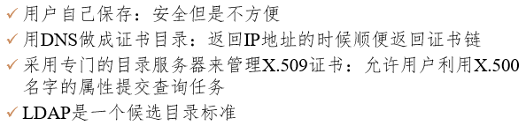

## 两类威胁

​	被动攻击中，攻击者只是观察和分析某一个协议数据单元(PDU)而不干扰信息流。而主动攻击指的是攻击者对某个连接中通过的PDU进行各种处理，DoS也属于主动攻击。

**安全的计算机网络的目标**

- 保密性：传输的数据本身的保密
- 端点鉴别：验证通讯对方的真实身份
- 信息的完整性：发送的信息完整且没有被篡改
- 运行的安全性：遭受DoS攻击之类的时候的稳健性；(多级)访问控制

## 密码体制

​	无条件安全(获得多少密文都没有足够信息来唯一确定明文)和计算安全。

### 对称密钥

​	数据加密标准 DES，分组密码。对明文进行64位长的分组，分别加密后串接。密钥长度 56 位，有 8 位用于奇偶校验。

​	保密性仅取决于对密钥的保密

高级加密标准AES

### 公钥

公钥密码体制的产生主要是因为两个方面的原因

- 由于常规密钥密码体制的密钥分配问题
- 由于对数字签名的需求

基于数论中的大数分解问题，计算缓慢，经常用于分发密钥而不是加密。

### 数字签名

- 报文鉴别：能够核实发送者对报文的签名
- 报文完整性：发送者无法抵赖其签名
- 不可否认：接收者不能伪造对报文的签名

具有保密性的数字签名：

### 鉴别

对付被动攻击的重要措施是加密，而对付主动攻击中的篡改和伪造则要用鉴别。

#### 1. 报文鉴别

​	对很长的报文进行签名计算负担太大，通常是对报文摘要(Message Digest)进行签名。

> 报文摘要算法
>
> ​	单向散列函数。可以很容易地计算出一个长报文 *X* 的报文摘要 *H*，但要想从报文摘要 *H* 反过来找到原始的报文 *X*，则实际上是不可能的。

#### 2. 实体鉴别

​	报文鉴别是对每一个收到的报文都要鉴别报文的发送者，而实体鉴别是在系统接入的全部持续时间内对和自己通信的对方实体只需验证一次。

##### 重放攻击

​	攻击者C将A发送给B的报文截获并自己发送给B，使得B以为C就是A。C 甚至还可以截获 A 的 IP 地址，然后把 A 的 IP 地址冒充为自己的 IP 地址( IP 欺骗)。

​	使用**不重数(nonce)**对付：不重复使用的大随机数。不重数的使用将无状态的通讯变成有状态的通讯。

##### 中间人攻击

​	上图的攻击过程中最有问题的是B请求A“将公钥发过来”。对付中间人攻击需要寻找获取对方公钥的可信方式。

## 密钥分配

### 对称密钥分配

​	通过密钥分配中心(KDC)进行密钥分配，其任务是给需要进行通讯的用户临时分配一个会话密钥(一次性)，其要求通讯双方都必须在KDC事先进行登记

用于服务器和客户端之间鉴别的[Kerberos](https://www.anquanke.com/post/id/171552#h3-5)：

​	AS认证了A的身份，而TGS认证了B的身份，合起来就是KDC。

其中$K_{TG}$是A需要转发给TGS(票据授予服务器)的票据，$K_S$是和TGS通讯的(临时)密钥，$T$是时间戳(防止重放攻击)。AG(鉴别服务器)负责了身份鉴别，通过鉴别A可以得到一个一次性的TGT，TGT可以在TGS处换取和B通讯的票。

### 公钥的分配

需要有一个值得信赖的机构，**认证中心CA**，它将公钥与其对应的实体（人或机器）进行绑定(binding)。每个实体都有CA的公钥，因而信任来自CA的信息，CA则负责实体的公钥的发送。

#### X.509

​	     ITU设计的专门针对证书的标准，核心是一种描述证书的格式  

#### 层级结构

​	最顶级的CA，即层次的根，它的责任是证明第二级的CA，RA的责任是证明下一级CA的真实性，这些下级CA真正为组织和个人颁发证书。

​	根CA授权一个新的RA时，它生成一个X.509证书，声明它批准了这个RA并在证书中包含该RA的公钥。根CA用私钥签名之后，将证书颁发给该RA

##### **PKI工作方式**

**信任链**(证书路径)：Bob可以收集CA5和RA2的证书，然后将自己的证书和这两个证书一起发送给Alice。

**信任锚**：浏览器中通常会安装多个CA的公钥

**PKI目录**：在哪里存放证书和证书链

## 网络层安全协议

### IPsec

​	IP数据报中的数据部分是加密的，首部部分没有加密。

- 鉴别首部 AH (Authentication Header)： AH鉴别源点和检查数据完整性，但不能保密

- 封装安全有效载荷 ESP (Encapsulation Security Payload)：ESP 比 AH 复杂得多，它鉴别源点、检查数据完整性和提供保密。 

#### 安全关联(Security Association)

​	在使用AH或者ESP之前，需要先建立源主机到目的主机的一条网络层逻辑连接，称SA。安全关联是一个单向连接。它由一个三元组唯一地确定：
$$
\{安全协议标识符(AH/ESP),单向连接的源IP,安全参数索引(SPI,一个32位的连接标识符)\}
$$
​	对于一个给定的安全关联 SA，每一个 IPsec 数据报都有一个存放 SPI 的字段。通过此 SA 的所有数据报都使用同样的 SPI 值。  

#### AH & ESP

​	只有目的主机会查看AH首部。下一个首部：标志紧接着本首部的下一个首部的类型  

AH:

ESP:

​	在原 IP 数据报后面增加了两个字段，即 ESP 尾部和 ESP 数据。ESP 尾部和原来数据报的数据部分一起进行加密，因此攻击者无法得知所使用的运输层协议。ESP 鉴别和 AH 中的鉴别数据是一样的，所以也可以进行完整性鉴别。

#### IPsec传输模式和隧道模式

传输模式：

​	IPSec头插入到IP头和上层协议之间，只保护IP包中的上层协议部分。

隧道模式：

​	当一个加密端点是安全网关的时候，应当使用隧道模式。会对整个IP包进行封装和保护。但是保护的终点是安全网关。

## 传输层安全协议

​	安全套接层(SSL)，可对万维网客户和服务器之间传送的数据进行加密和鉴别，在建立阶段商定加密算法和密钥，是运输层安全协议(TLS)的基础。

### SSL提供的功能

- SSL 服务器鉴别：允许用户证实服务器的身份  
- 加密的 SSL会话  
- SSL 客户鉴别：允许服务器证实客户的身份  

## 应用层安全协议

### PGP

​	电子邮件安全软件包。

## 防火墙

### 网络级防火墙

​	用来防止整个网络出现外来非法的入侵。属于这类的有分组过滤和授权服务器。前者检查所有流入本网络的信息，然后拒绝不符合事先制订好的一套准则的数据，而后者则是检查用户的登录是否合法。

### 应用级防火墙

​	从应用程序来进行接入控制。通常使用应用网关或代理服务器来区分各种应用。例如，可以只允许通过访问万维网的应用，而阻止 FTP 应用的通过。  

