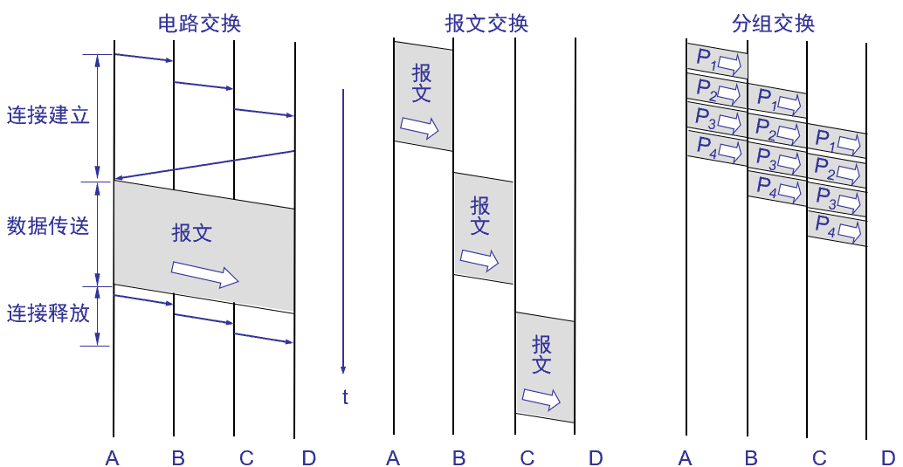
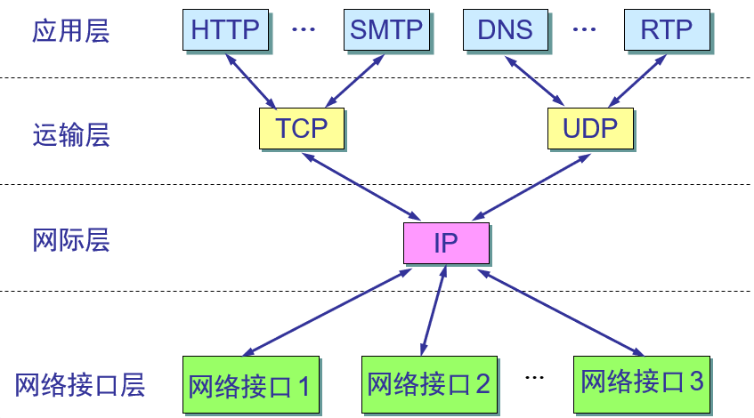

# 第一章

## 1-10 

### 题目

​	试在下列条件下比较电路交换和分组交换。要传送的报文共x(bit)。从源点到终点共经过k段链路，每段链路的传播时延为d(s)，数据率为b(b/s)。在电路交换时电路的建立时间为s(s)。在分组交换时分组长度为p(bit)，且各结点的排队等待时间可忽略不计。问在怎样的条件下，分组交换的时延比电路交换的要小?

### 解答

​	由总时延的计算方式，有：
$$
总时延 = 发送时延 + 传播时延 + 处理时延 + 排队时延
$$
其中排队时延=0，将电路交换中的电路建立时间归为处理时延，有：

| 类型     | 电路交换 |     分组交换      |
| -------- | :------: | :---------------: |
| 发送时延 |  *x/b*   | *(p/b)×(x/p+k-1)* |
| 传播时延 |  *d×k*   |       *d×k*       |
| 处理时延 |   *s*    |                   |

所以
$$
T_{电路交换}=\frac{x}{b}+d*k+s \\
T_{分组交换}=\frac{p}{b}*(\frac{x}{p}+k-1)+d*k
$$

要求，分组交换的时延比电路交换的要小，则需要
$$
\frac{p}{b}*(k-1) < s
$$
即，在链路数目确定的情况下，增加带宽(提高数据率)或者减少分组长度，但过细的分组会带来更多的处理时延，这部分在题目中没有体现出来

## 1-15

### 题目

​	假定网络利用率达到了90%。试估计一下现在的网络时延是它的最小值的多少倍

### 解答

$$
\begin{split}
由&:D=\frac{D_0}{1-U}, 其中:\\
D_0 &: 网络空闲时的时延\\
D &: 网络当前时延\\
U &=0.9
\end{split}
$$

所以，现在的网络时延是它的最小值的10倍

## 1-17

### 题目

​	收发两端之间的传输距离为1000km，信号在媒体上的传播速率为2×10^8^m/s。试计算以下两种情况的发送时延和传播时延

-  数据长度为10^7^bit,数据发送速率为100kb/s
-   数据长度为10^3^bit,数据发送速率为1Gb/s

### 解答

​	传输时延是一样的都为$\frac{10^6}{2*10^8}=0.005s$，第一种情况，发送时延为100s，第二种情况，发送时延为$10^{-6}s$。可以看出对于数据量较小，数据发送速率高的网络，传输时延在网络延迟中占了较大部分，但即使对于1000km的距离，传输时延依旧很小。

## 1-27

### 题目

​	试解释everything over IP和IP over everything的含义

### 解答

IP作为唯一的中间人，对上面的应用级别业务来说，IP如同最底层的接口(Adaptor)，即everything over IP，而对于底层的部分，IP可以用在各式各样的网络中,以太网，卫星网....，即IP over everything。

## 1-28

### 题目

​	上传1.5MB的文件，设分组长度1KB，RTT=80ms。TCP建立时间为2RTT。在不同情况下计算接受完整文件需要的时间。

解答

​	10Mbit/s=1.25×10^3^B/s，每个1KB分组的发送时延为$\frac{2^{10}}{1.25×10^3}=8.192×10^{-4}s=0.8192ms$，一共有3×2^9^=1536个分组。传播时延为RTT/2=40ms。

#### 1. 发送速率10Mbit/s，可以分组连续发送

​	由于可以连续发送，所以，总时间：
$$
\begin{split}
T&=2*RTT+0.8192×1536+\frac{RTT}{2}\\ 
 &=1458.2912ms
\end{split}
$$

#### 2. 发送速率10Mbit/s，发送完一个分组要等待一个RTT

​	

​	如图所示，除了最后一个分组，其他都需要在发送后跟着一个RTT，所以，总时间：
$$
\begin{split}
T&=2*RTT + (0.8192+RTT)*1535+0.8192+\frac{RTT}{2}\\ 
 &=124258.291ms
\end{split}
$$

#### 3. 不考虑数据发送时间，但是每个RTT只能发送最多20个分组

​	前76个RTT时间发送了1520个分组，最后16个分组发送后只需要RTT/2即可接收到所有分组，所以，总时间：
$$
\begin{split}
T&=2*RTT + 76*RTT+\frac{RTT}{2}\\ 
 &=6280ms
\end{split}
$$

#### 4.不考虑数据发送时间，每个RTT时间内分别可发送1，2，4，8...个分组

1+2+4+...+512(2^9^)=1023<1536<1+2+4+...+1024(2^10^)=2047，所以需要11个RTT时间发送，同样，类似上一种情况，最后一个分组发送到接受只需要RTT/2，所以，总时间：
$$
T=2*RTT + 10*RTT+\frac{RTT}{2}=1000ms
$$

# 第二章

## 2-6

### 题目

	### 解答

​	数据在信道中的传播速率主要受信道本身能够通过的频率范围以及信噪比影响。信噪比是无法任意提高的，它受信道本身以及环境因素的影响。

​	香农公式指出了信息传输速率的上限，其主要意义在于：只要信息传输速率低于信道的极限信息传输速率，就一定存在某种方法来实现无差错的传输。

> ​	百度百科给出的码元的定义：在数字通信中常常用时间间隔相同的符号来表示一个二进制数字，这样的时间间隔内的信号称为(二进制)码元。

​	换句话说，码元应该是在通讯中表示信息的最小单位，它是由二进制的bit组成的序列。就像bit和ASCII编码一样，8bit构成一个字节，才能表示某个ASCII码，所以"bit/s"描述的是一种偏向物理层次的数据流速度，而"码元/s"描述的更偏向(有意义的)信息流动的速率

## 2-9

### 题目

### 解答

​	由香农公式：
$$
C=Wlog_{2}(1+S/N)(bit/s)
$$
​	题目中$W=3100Hz$,$C_0=35×10^3bit/s$，取$C_1=C_0×1.6=5.6×10^4bit/s$

​	所以：
$$
\begin{split}
C_0&=3.5×10^4bit/s\\
&=3100Hz×log_{2}(1+(S/N)_0)(bit/s)\\
C_1&=5.6×10^4bit/s\\
&=3100Hz×log_{2}(1+(S/N)_1)(bit/s)
\end{split}
$$
所以：
$$
\begin{split}
\frac{(S/N)_1}{(S/N)_0}&=\frac{2^\frac{5.6×10^4}{3100}-1}{2^\frac{3.5×10^4}{3100}-1}\\
&=2^\frac{3.5×10^4 - 5.6×10^4}{3100}\\
&≈109.498
\end{split}
$$
即信噪比增大到约109.498倍。当：

$(S/N)_2=(S/N)_0×10=10×2^\frac{3.5×10^4}{3100}-1$，有：
$$
\begin{split}
C_2&=3100Hz×log_{2}(1+10×2^\frac{5.6×10^4}{3100}-1)(bit/s)\\
&≈66297.96
\end{split}
$$
由于$\frac{66297.96}{56000}≈1.1839<1.20$，所以不行。

## 2-13

### 题目

### 解答

​	为了节约成本，如果复用信道数量较大，虽然有复用器，分用器，但是总体上可能会比较合算。

​	常见的有时分复用，频分复用，波分复用，码分复用。

## 2-16

### 题目

### 解答

| 基站 | 乘积结果 | 描述     |
| ---- | -------- | -------- |
| A    | 1        | 发送1    |
| B    | -1       | 发送-1   |
| C    | 0        | 没有发送 |
| D    | 1        | 发送1    |

# 补充题

## 1  根据端对端的观点，差错控制应该放在哪一层实现？但现行网络体系为什么把它放到多个层上实现（包括链路层、IP层和传输层）

​	对于端到端传输来讲，经过建立两端之间的通讯链路后，中间的节点以及链路是透明的，其传输就如同两个点一样能直接通讯，因此，对于端到端来讲，差错控制应该放在数据链路层。而在实际通讯中，链路层的差错控制是用于确保"每个比特都传输正确"的，只考虑“帧错误”，不考虑“帧丢失”。而IP是“尽最大努力交付”，不可靠传输，也因此，需要TCP(传输层协议)采用确认重传机制，即确认数据在传输过程中有没有丢失。利用每个层的特点将错误重传机制分布在多个层，有助于整体效率的提高。

参考：

[博客1](https://blog.csdn.net/S_gy_Zetrov/article/details/79088752)，[博客2](https://blog.csdn.net/gao1440156051/article/details/9122207)，[博客3](https://blog.csdn.net/u013657981/article/details/46481295)

## 2  给定波特率为8000码元/秒，请计算BPSK、QPSK和16-QAM调制的位速率。

参考[这篇文章](https://www.mobibrw.com/2018/12118)对BPSK、QPSK和16-QAM调制做出的解释。

​	BPSK调制每个码元有一位，因此位速率为：8000bit/s

​	QPSK调制每个码元有两位，因此位速率为：16000bit/s

​	16-QAM, 16=2^4^，每个码元有四位，因此位速率为：32000bit/s

## 3 OFDM技术的主要特点是什么？为什么4G选用OFDM而不是CDMA？

- OFDM特点：

  - 频谱效率高
  - 带宽可灵活配置，可扩展性强
  - (缺点)OFDM峰均比过高，所要求的系统线性范围宽

- 为什么4G选用OFDM：

  - LTE采用OFDM，空中接口的处理相对简单，有利于设计全新的物理层架构，有利于使用更大的带宽，有利于更高阶的MIMO技术实现，降低终端复杂性，方便实现LTE确定的演进目标
  - 其次CDMA属于高通专利，每年需要向其支付高额专利费用
  - CDMA在大带宽时，扩频实现困难，器件复杂度增加

  参考自：

  [知乎问题](https://www.zhihu.com/question/26546705/answer/33165896)

  [文章](https://blog.csdn.net/jyqxerxes/article/details/78981109)