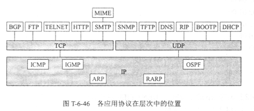

# 第六章(续)

## 6-32

### 题目

 DHCP 协议用在什么情况下？ 当一台计算机第一次运行引导程序时，其 ROM 中有没有该主机的 IP 地址、子网掩码，或某个域名服务器的 IP 地址？ 

### 解答

​	 DHCP 提供了即插即用连网机制，能帮助主机自动获取ip以及dns，路由等信息。当一台计算机第一次运行引导程序时，其 ROM 中**没有**该主机的 IP 地址、子网掩码，或某个域名服务器的 IP 地址。

## 6-37

### 题目

​	 SNMP 使用哪几种操作? SNMP 在 Get报文中设置了请求标识符字段，为什么？ 

### 解答

​	有两种，分别是读(GET)和写(SET)。Get报文中的请求标识符字段是用于标识被管理主机的，这样管理者。

## 6-46

### 题目

​	 图表示了各应用协议在层次中的位置。 

1. 简单讨论一 下为什么有的应用层协议要使用 TCP, 而有的却要使用 UDP? 
2. 为什么 MIME 画在 SMTP 之上？ 
3. 为什么路由选择协议 RIP 放在应用层？

### 解答

1. 相对UDP，TCP付出了性能的代价换来了可靠传输，有的应用层协议可能不需要完全的可靠传输，但是对实时性要求较高，因此会使用UDP。
2. MIME不是新的邮件传传送协议，而是对原有的SMTP协议的补充。
3. 因为RIP帧使用UDP传输

​	

# 第七章

## 7-9

### 题目

​	 公钥密码体制下的加密和解密过程是怎样的？为什么公钥可以公开？如果不公开是否可以提高安全性？ 

### 解答

​	用户A生成私钥-公钥对，私钥自己保存，公钥则进行分发。当其他用户向其发送数据时，用公钥进行加密，然后发送给用户A，用户A用私钥加密即可还原原来消息

​	拥有公钥的用户无法将加密后的密文恢复，也不能推测出私钥，因此可以公开。所谓公开即分发，如果公钥不进行分发，则其他用户就不能加密消息，因此需要进行公开。

## 7-11

### 题目

​	 为什么需要进行报文鉴别？鉴别和保密、授权有什么不同？报文鉴别和实体鉴别有什么区别？ 

### 解答

​	鉴别是验证通讯的对方是否是自己需要的通讯对象。而授权是通讯的对方有没有相应的权限进行其想要的操作。

​	报文鉴别是通过发送者发送的报文进行鉴别，而实体鉴别是通过个体，比如人或进程进行鉴别。

## 7-13

### 题目

​	 A 和 B 共同持有一个只有他们二人知道的密钥（使用对称密码）。 A 收到了用这个密钥加密的一份报文。 A 能否出示此报文给第三方，使 B 不能否认发送了此报文？ 

### 解答

​	不能。向第三方出示B发来的报文后，A无法证明这份报文来自B，也无法否认这份报文是其通过密钥伪造的。

## 7-17

### 题目

​	 报文的保密性与完整性有何区别？什么是 MD5? 

### 解答

​	保密性指的是对未授权的访问者的访问拒绝，而完整性是指不让未授权的对方修改报文内容，但是并不对其保密。

# 补充题

### 如果你发送一封电子邮件让朋友阅读，会涉及什么样的实体和协议？ 

​	涉及发送者(我)，中间的SMTP(POP)服务器和接收者(朋友)。发送者使用SMTP将文件传输给服务器，接收者通过POP(或IMAP)从服务器读取邮件。