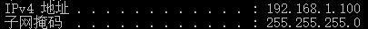
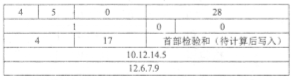
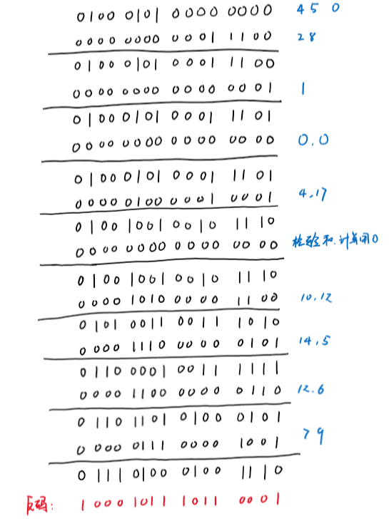
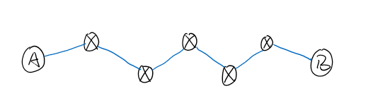
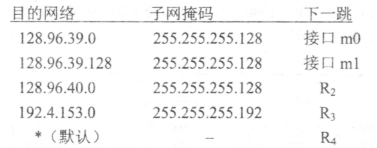
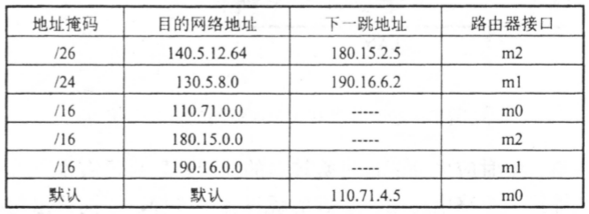
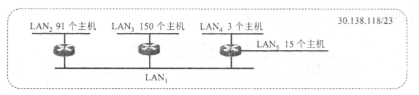

# 第四章

## 4-9

### 题目

1. 子网掩码为 255.255.255.0 代表什么意思？ 
2.  一网络现在的掩码为 255.255.255.248, 问该网络能够连接多少个主机？ 
3.  一A 类网络和一 B 类网络的子网号 subnet-id 分别为 16 个 1 和 8 个 1, 问这 两个网络的子网掩码有何不同？
4.  一个 B 类地址的子网掩码是 255.255.240.0, 试问在其中每一个子网上的主机数最多是多少？ 
5.  一A 类网络的子网掩码为 255.255.0.255, 它是否为一个有效的子网掩码？ 
6.  某个 IP 地址的十六进制表示是 C2.2F.14.81. 试将其转换为点分十进制的形 式。这个地址是哪一类 IP 地址？ 
7. C 类网络使用子网掩码有无实际意义？为什么？

### 解答

1. 对于A类地址，表示从8-23位为子网号，24-32位为主机号；对于B类地址，表示从16-23位为子网号，24-32位为主机号；对于C类地址，表示24-32位为主机号，没有划分子网
2. 子网掩码最后8位：1111 1000，一共有8个空位，扣除不能使用的全0和全1的主机号，该网络能连接6个主机
3. 首先，A类网络的网络号为8位，B类网络的网络号为16位，这两类网络中的主机容量不同，A类加入16位的子网号，B类加入8位的子网号后，两类网络所能容纳的子网数量不同，但是对于一个具体的子网，主机号位数一样，即能容纳的主机数相同。
4. 子网掩码的16-32位：1111 0000 0000 0000，即取4位作为子网号，剩下12位为主机号，所以一个子网上能有$2^{12}-2$个主机
5. 是有效的子网掩码，但是按课本说法“极力推荐使用连续的1”
6. 194.47.20.129。194D=1100 0010，所以是C类地址。
7. 有，虽然说C类网可以容纳的主机数很少，但依旧可以划分子网。不过像是通常使用的路由器，子网掩码都是255.255.255.0

## 4-13

### 题目

​	 设 IP 数据报使用固定首部，其各字段的具体数值如图 所示（除 IP 地址外，均为十进制表示）。试用二进制运算方法计算应当写入到首部检验和字段中的数值（用二进制表示）。

### 解答

​	按计算法则，每16位相加，最后取反码：

## 4-17

### 题目

​	 一个 3200 位长的 TCP 报文传到 IP 层，加上 160 位的首部后成为数据报。下面 的互联网由两个局域网通过路由器连接起来，但第二个局域网所能传送的最长数据帧中的数据部分只有 1200 位，因此数据报在路由器必须进行分片 。 试问第二个局域网向其上层要传送多少比特的数据（这里的“数据“ 当然指的是局 域网看见的数据）？ 

### 解答

​	第二个局域网所能传送的最长数据帧中的数据部分只有 1200位，其中必须留160位给IP协议的首部，所以留给IP分组的数据部分的长度只有1040位。由于要传送3200位的数据，3200=1040+1040+1040+80，所以要分成4片，每片都带有头部，所以第二个局域网向其上层要传送3200+160*4=3840bit数据

> 注：此题类似课本例题4-1

## 4-19

### 题目

​	 主机 A 发送 IP 数据报给主机 B, 途中经过了 5 个路由器。试问在 IP 数据报的发送过程中总共使用了几次 ARP? 

### 解答

​	

如图，从A到B一共经过6条链路，如果主机A或者路由器的ARP catch都没有下一条的地址，则需要使用6次ARP

## 4-20

### 题目

​	 设某路由器建立了如下路由表：

现在共收到5个分组：试分别计算其下一跳。 

-  128.96.39.10 
-  128.96.40.12 
-  128.96.40.151 
-  192.4.153.17 
- 192.4.153.90 

### 解答

​	通过ip及子网掩码计算网络号再和目标网络对比

1. 接口m0
2. $R_2$
3. $R_4$
4. $R_3$
5. $R_4$

## 4-22

### 题目

​	 一个数据报长度为 4000 字节（固定首部长度）。现在经过一个网络传送，但此 网络能够传送的最大数据长度为 1500 字节。试问应当划分为几个短些的数据报片？各数据报片的数据字段长度、片偏移字段和 MF 标志应为何数值？ 

### 解答

​	分片的时候每个分片都需要携带20字节的IP报头，因此，实际每个分片能携带的数据长度为1480。一个数据报长度为 4000 字节（固定首部长度），即数据部分长度3980，3980 = 1480 + 1480 +1020，即应该分3片，长度分别为1480， 1480， 1020，片偏移分别为0，1480/8=185，2960/8=370。前两片的MF=1，最后一片MF=0

## 4-28

### 题目

​	已知路由器 R1 的路由表如表所示

​	试画出各网络和必要的路由器的连接拓扑，标注出必要的 IP 地址和接口 。 对不 能确定的情况应当指明。 

### 解答

## 4-29

### 题目

​	 一个自治系统有 5 个局域网，其连接图如图所示。 $LAN_2$至$LAN_5$上的主机数分别为：91, 150,3 和 15 。 该自治系统分配到的 IP 地址块为 30.138.118/23。 试给出每一个局域网的地址块（包括前缀）。

### 解答

​	每个局域网全0和1的地址是不能用的，且$LAN_1$至少需要3个地址用来连接三个路由器，所以 $LAN_1$至$LAN_5$分别至少需要5，93，152，5，17个地址，按最小满足的方式配置：

| 网络    | 地址块            | 实际可用地址数 |
| ------- | ----------------- | -------------- |
| $LAN_1$ | 30.138.118.0/29   | 6              |
| $LAN_2$ | 30.138.118.128/25 | 126            |
| $LAN_3$ | 30.138.119.0/24   | 254            |
| $LAN_4$ | 30.138.118.8/29   | 6              |
| $LAN_5$ | 30.138.118.32/27  | 30             |

## 4-33

### 题目

​	 下面的前缀中哪一个和地址 152.7.77.159 及 152.31.47.252 都匹配？请说明理由:

1. 152.40/13
2. 153.40/9
3. 152.64/12
4. 152.0/11 

### 解答

152.7 = 1001 1000 0000 0111

152.31 = 1001 1000 0001 1111，以下#前为网络前缀

1. 152.40/13 = 1001 1000 0010 1#000  都不匹配
2. 153.40/9 = 1001 1001 0#010 1000 都不匹配
3. 152.64/12 = 1001 1000 0100# 0000 都不匹配
4. 152.0/11 = 1001 1000 000#0 0000 都匹配

只有152.0/11都匹配

## 4-37

### 题目

​	某单位分配到一个地址块 136.23.12.64/26。现在需要进一步划分为 4 个一样大 的子网。试问： 

1. 每个子网的网络前缀有多长？ 
2. 每一个子网中有多少个地址？ 
3.  每一个子网的地址块是什么？
4. 每一个子网可分配给主机使用的最小地址和最大地址是什么？

### 解答

1. 每个子网的网络前缀为28位

2. 32-28=4，所以每个子网内有$2^4=16$个地址

3. 及4

   | #    | 地址块           | 最大地址      | 最小地址      |
   | ---- | ---------------- | ------------- | ------------- |
   | 1    | 136.23.12.64/28  | 136.23.12.65  | 136.23.12.78  |
   | 2    | 136.23.12.80/28  | 136.23.12.81  | 136.23.12.94  |
   | 3    | 136.23.12.96/28  | 136.23.12.97  | 136.23.12.110 |
   | 4    | 136.23.12.112/28 | 136.23.12.113 | 136.23.12.126 |

# 补充题

## 1

### 题目

​	当两台主机使用相同的IP地址而忽略了彼此的存在，将会发生什么问题？该如何解决？

### 解答

​	当两个主机位于同一个局域网，使用相同的地址会导致连接到这两个主机的路由器的ARP catch不断更新，当有请求到达，就看ARP cath中是谁的MAC地址了，如果接受的是错误的主机，在等待的主机可能会发送未收到之类的错误报告，使得发送数据的主机再次发送。

​	当两个主机位于不同的局域网，如果是公网IP，则会导致互联网中的路由器数据不断刷新，接受起来和局域网中的主机一样。如果是私有IP，那是可以的，通过VPN技术，两个主机都能正常上网。

问题的解决：当然是分配不同的ip地址了，如果真的出现这种问题，可以在路由器的管理者界面进行配置，或者重置路由器。至于公网IP，运营商会保证不出这种错的。

## 2

### 题目

​	当一个IP分组分段时，丢失一个分段将导致整个分组被丢弃。考虑一个包含4800字节数据（来自上层）的IP分组，使用18字节的头部并有1518字节MTU的链路层技术，将它发送到直接连接的目的地。假设帧的丢失率为0.01，请计算分组丢失率。（如果没有计算器，可以給计算公式）

### 解答

​	扣去IP数据报头部，每个IP数据报能传输1500字节的数据，因此4800字节的数据会被分成4个帧，4800=1500+1500+1500 + 300。所以分组丢失率：
$$
P=1-(0.99)^4 \approx 0.0394
$$

## 3

### 题目

​	假设本机IP地址是192.168.0.38，在本机上运行Wireshark捕获报文，使用ip.addr==192.168.0.38作为过滤条件，能否过滤出本机发出/收到的ARP报文？为什么？

### 解答