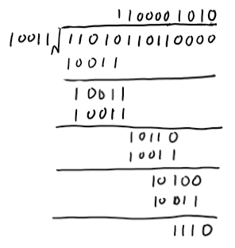
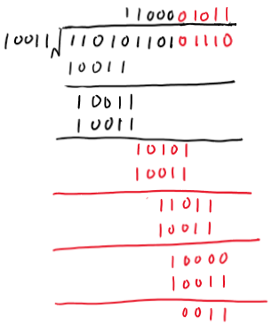
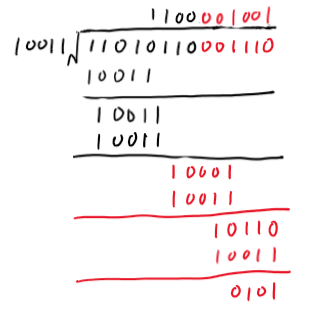
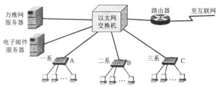
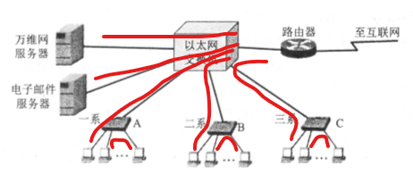
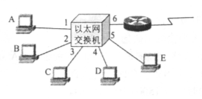

# 第三章

## 3-4

### 题目

​	数据链路层的三个基本问题（封装成帧、透明传输和差错检测）为什么都必须 加以解决？

### 解答

​	题目本身也有提到，封装成帧，透明传输，差错检验是数据链路层的**基本问题**，或者说是**基本的机制**，他们解决的是数据链路层的**可用性**问题，所以必须加以解决。其中：

​	封装成帧是对来自网络层的数据进行封装，帧包含了数据在数据链路层传输必须携带的信息，这个不同的协议会有不同，比如以太网中的MAC帧包含了源地址和目的地址，这样帧才能直到从哪来，到哪去。另外，帧也是另外两个机制的基础，像是对于差错检验，就是以帧为单位进行的。

​	差错检验，在课本中具体介绍的是CRC，在解决了“数据能传输到接收者那里”这个问题后，必须解决的是**明确接受到的信息是正确的**，不然建立起的通讯毫无意义，这个问题也可以在更上层协议中进行解决，但是出于各层不同的特性，将差错检验部分放置于数据链路层，鉴别错误的数据并丢弃，算是**部分地**解决了这个问题，对于缺失数据的问题，放到了网络层进行解决。

​	透明传输是基于分层模型而产生的机制，数据链路层再为网络层提供传输数据的服务时，不应当对来自网络层的数据提出限制，即使是数据链路层本身用于作为帧分隔符的数据。

## 3-7

### 问题

​	要发送的数据为 1101011011 。 采用 CRC 的生成多项式是 P(X) = x^4^ + X + 1 。 试求应添加在数据后面的余数。 

- 数据在传输过程中最后一个 1 变成了 O, 问接收端能否发现？ 
- 若数据在传输过程中最后两个 1 都变成了 0, 问接收端能否发现？ 
- 采用 CRC 检验后，数据链路层的传输是否就变成了 可靠的传输？

### 解答

​	由多项式可以直到P = 10011。原序列左移四位并除以P，有：

因此，帧检验序列：FCS = 1110

对于最后一个1变成0：能发现

对于最后两个1变成0：能发现

CRC只是在“一定概率上”确保传输的正确性，并不能确保完全的正确

## 3-20

### 题目

​	假定 I km 长的 CSMA/CD 网络的数据率为 I Gbit/s。设信号在网络上的传播速 率为 200 000 km/s。求能够使用此协议的最短帧长。 

### 解答

​	$\tau=\frac{1km}{200000km/s}=5×10^{-6}s$，

​	所以最短帧长为：$1Gbit/s×2\tau=1×10^{4}bit=10Mbit$

## 3-24（非作业，25题用到）

### 题目

​	 假定站点 A 和 B 在同一个 10 Mbit/s 以太网网段上。这两个站点之间的传播时 延为 225 比特时间。现假定 A 开始发送一帧，并且在 A 发送结束之前 B 也发 送一帧。如果 A 发送的是以太网所容许的最短的帧，那么 A 在检测到和 B 发 生碰撞之前能否把自己的数据发送完毕？换言之，如果 A 在发送完毕之前并没有检测到碰撞，那么能否肯定 A 所发送的帧不会和 B 发送的帧发生碰撞？（提 示：在计算时应当考虑到每一个以太网帧在发送到信道上时，在 MAC 帧前面 还要增加若干字节的前同步码和帧定界符。） 

## 3-25

### 题目

​	 在上题中的站点 A 和 B 在 t = 0 时同时发送了数据帧。当 t = 225 比特时间， A 和 B 同时检测到发生了碰撞，并且在 t = 225 + 48 = 273 比特时间完成了干扰信 号的传输。 A 和 B 在 CSMA/CD 算法中选择不同的 r 值退避。 假定 A 和 B 选 择的随机数分别是 r~A~ =0 和 r~B~= 1 试问 A 和 B 各在什么时间开始重传其数据帧? A 重传的数据帧在什么时间到达 B? A 重传的数据会不会和 B 重传的数据 再次发送碰撞? B 会不会在预定的重传时间停止发送数据？ 

### 解答

​	由3-24可知，10Mbit以太网基本退避时间2$\tau$=512bit时间

​	以开始发送数据为0bit时间点，在273bit时间，A, B都完成了最后一个干扰bit发送，由于重传所需的时延就是 *r* 倍的基本退避时间，因此，A，B分别在273bit时间和273+512=785bit时间重新检测信道

​	A在273bit时间开始检测信道，发现不为空闲，直到在273+225=498bit时间，B的干扰信号结束，信道空闲，A等待96bit时间(帧最小间隔)，开始发送，即A经过498+96=594bit时间后开始重传其帧，此时B还未开始检测信道

​	A发送的信息经过225传播时延在819bit时间到达B，而在到达之前，B已经开始检测信道，但是需要检测96bit时间，但是在819bit时间信道忙，因此B未开始发送数据，不会碰撞

​	所以B未能在预定的时间发送数据，若A没有其他信号，再接受完A的信号后再次检测到信道空闲，经过96bit时间再开始发送，由于A发送的帧长未知，因此无法计算

## 3-26

### 题目

​	 以太网上只有两个站，它们同时发送数据，产生了碰撞。于是按截断二进制指 数退避算法进行重传。重传次数记为 i, i=1,2,3, ... 。试计算第 1 次重传失败的概率、第 2 次重传失败的概率、第 3 次重传失败的概率，以及一个站成功发送数据之前的平均重传次数 I。 

### 解答

​	第 1 次重传失败的概率$P_1=1/2$，第 2 次重传失败的概率$P_2=1/4$，第 3 次重传失败的概率$P_3=1/8$。实际上，假设两个站分别为A，B站，第i次重传j= Min[i, 10]。A站在0...2^j^中抽中k，若发生碰撞，则B也在0...2^j^中抽中k，概率为
$$
P_i=C_{2^j}^1=\frac{1}{2^j}
$$
所以:
$$
\begin{split}
I=&1×(1-\frac12)×\frac1{2^0}+2×(1-\frac14)×\frac1{2^1}+...+10×(1-\frac{1}{2^{10}})×\frac1{2^{1+...+9}}\\
&+11×(1-\frac{1}{2^{10}})×\frac1{2^{1+...+10}}+...+i×(1-\frac{1}{2^{10}})×\frac1{2^{1+...+j}}\\
=&....
\end{split}
$$

## 3-30

### 题目

​	某学院的以太网交换机有三个接口分别和学院三个系的以太网相连，另外三个接口分别和电子邮件服务器、万维网服务器以及一个连接互联 网的路由器相连。图中的 A,B 和 C 都是 100 Mbit/s 以太网交换机。假定所有链路的速率都是 100 Mbit/s, 并且图中的 9 台主机中的任何一个都可以和任何一个服务器或主机通信。试计算这 9 台主机和两个服务器产生的总的吞吐量的最大值。 为什么？

### 解答

​	所有链路都为100Mbit/s，则三个系内两个主机互相通讯吞吐量为600Mbit/s，三个系内各剩余一台主机和学院的两个服务器直接连接互联网，吞吐量有500Mbit/s。所以系统总吞吐量能达到1100Mbit/s。

## 3-33

### 题目

​	在图中，以太网交换机有 6 个接口，分别接到 5 台主机和一个路由器 。在下面表中的“动作“ 一栏中，表示先后发送了 4 个帧。 假定在开始时，以太网交换机的交换表是空的。试把该表中其他的栏目都填写完。

### 解答

| 动作     | 交换表状态 | 向哪些接口转发帧 | 说明 |
| -------- | ---------- | ---------------- | ---- |
| A发送给D | 记录A:1    | 所有             |      |
| D发送给A | 记录D:4    | 1                |      |
| E发送给A | 记录E:5    | 1                |      |
| A发送给E | 无         | 5                |      |

**说明**：由于放入表格不好排版，所以写在这里

- A发送给D： 一开始交换表为空，接收到A的帧后能知道A来自1，由于不知道D在哪里，因此向所有端口发送数据

- D发送给A：表中没有D的记录，因此会记录D来自4，查询交换表后知道A在1，所以发到1
- E发送给A：表中没有E的记录，因此会记录E来自5，查询交换表后知道A在1，所以发到1
- A发送给E：A在交换表已经有记录，因此交换表不变，查询交换表后知道E在5，所以发到5

## 3-34

### 题目

​	有两台主机 A 和 B 接在 800m 长的电缆线的两端，并在 t= 0 时各自向对方发送一个帧，长度为 1500 bit (包括首部和前同步码）。假定在 A 和 B 之间有 4 个转发器，在转发帧时会产生 20 比特的时延。设传输速率为 100 Mbit/s, 而 CSMA/CD 的退避时间是随机数 r 倍的争用期，争用期为 512bit, 在发生第一 次碰撞后，在退避时 A 选择 r=0 而 B 选择 r=l 。忽略发生碰撞后的人为干扰信号和帧间最小间隔。

1. 设信号的传播速率是 2 × 10^8^ m/s。试计算从 A 到 B（包括 4 个转发器）的 传播时延。 
2. 在什么时间（以秒为单位） B 完全收到了 A 发送的帧？ 
3. 现在假定只有 A 发送帧，帧长仍为 1500 bit，但 4 个转发器都用交换机来 代替。交换机在进行存储转发时还要产生额外的 20 bit 的处理时延。在什么时间（以秒为单位） B 完全收到了 A 发送的帧？ 

### 解答

1. 传播时延为电磁波在信道中传播花费的时间，所以
   $$
   \begin{split}
   传播时延 =& \frac{信道长度(m)}{电磁波在信道上的传播速率(m/s)}\\
   =& \frac{800m}{2×10^8m/s}\\
   =& 4×10^{-6}s\\
   \end{split}
   $$

2. 第一个bit从发出到接收的时延：
   $$
   \begin{split}
   t_1 =& 传播时延 + 处理时延 + 排队时延\\
   =& \frac{800m}{2×10^8m/s}+4×\frac{20bit}{1×10^8bit/s}\\
   =& 4.8×10^{-6}s
   \end{split}
   $$
   

   A，B间发送的总时延(1500bit长的数据)：

$$
\begin{split}
t_2 =& 发送时延 + 传播时延 + 处理时延 + 排队时延\\
=& \frac{1500bit}{1×10^8bit/s}+\frac{800m}{2×10^8m/s}+4×\frac{20bit}{1×10^8bit/s}\\
=& 1.98×10^{-5}s
\end{split}
$$

​	因此A，B站在$t=0+t_1=4.8×10^{-6}s$的时候检测到冲突，都停止数据发送，在退避时 A 选择 r=0 而 B 选择 r=l ，所以A立即开始检测信道，由于忽略发生碰撞后的人为干扰信号和帧间最小间隔，所以A在B发送的最后一个bit传送完成后立即开始发送，经过$t_2$后B完成接收，即在$t=t_1+t_1+t_2=2.94×10^{-5}s$的时候B完成接收。

3. 使用交换机后不需要处理冲突，但是交换机本身接收和发送数据需要时间：

$$
\begin{split}
t =& 发送时延 + 传播时延 + 处理时延 + 排队时延\\
=& 5×\frac{1500bit}{1×10^8bit/s}+\frac{800m}{2×10^8m/s}+4×\frac{20bit}{1×10^8bit/s}\\
=& 7.98×10^{-5}s
\end{split}
$$

​	其中发送时延由于主机本身加4个交换机，所以乘以5，其他不变

# 补充题

## 1

### 题目

​	为什么在链路层使用CRC-32而不是校验和来计算FCS？

### 解答

​	这里的校验和并没有说明是哪个，而且根据[维基百科]([https://zh.wikipedia.org/wiki/%E6%A0%A1%E9%AA%8C%E5%92%8C](https://zh.wikipedia.org/wiki/校验和))，“计算机领域常见的校验和的方法有[循环冗余校验](https://zh.wikipedia.org/wiki/循环冗余校验)（CRC）、[MD5](https://zh.wikipedia.org/wiki/MD5)、[SHA家族](https://zh.wikipedia.org/wiki/SHA家族)等”。故题目表述并不清晰。

​	如果题目想说的是奇偶校验：奇偶校验不仅实现上比CRC麻烦，而且只能校验出奇数个位错误的情况，而CRC，按课本说法，能在大概率上检测出错误，虽然CRC也会有出错的时候。

​	询问助教后，助教表示可能是IP数据报的校验和字段，但是题目既然限制在链路层，应该不会是IP数据报的校验和。

## 2

### 题目

​	在交换机转发前，是否应该重新计算到达帧的FCS？

### 解答

​	会重新计算FCS。FCS属于数据链路层部分，包含在数据链路层的帧中，用于差错检验，所以在数据链路层中必须计算FCS，但是有两种方式：在终点计算FCS，或在每个交换机都计算FCS。在实际应用中选择了在每个交换机计算FCS([参考](https://wizardforcel.gitbooks.io/network-basic/1.html)对交换机的介绍)，关于具体的原因，猜测可能是：FCS计算简单，不论是电路实现(参考PPT)还是时间复杂度，但如果让错误的数据只在终点检测，可能会浪费大量网络资源传输已经出错的数据。

​	[交换机介绍](https://wizardforcel.gitbooks.io/network-basic/1.html)

## 3

### 题目

​	为什么既需要MAC地址，又需要IP地址呢？可以只使用一种地址么？

### 解答

​	虽然两者都是“地址”，但是书本有提到，MAC地址更像是“名字”，而非“地址”。MAC地址是和具体的设备绑定的，像是路由器，手机等有网卡的设备，都会有MAC地址，但是IP是没有和具体设备绑定的，它比较像平时理解的地址，可以用它来大致定位到主机位置。

​	可以理解为MAC地址用于“identify”，IP地址用于“location”。他们属于两个不同层的内容，都是所属层次能正确工作的必要的信息。按目前的网络结构(课上学到的)，没有MAC地址，IP地址是无法建立起来的。

​	综上，两者不可互相替代，不能只有一个地址。

## 4

### 题目

​	 在一个网段内广播ARP请求可以获得同一网段内主机的MAC地址。使用ARP请求获得网段外的一台远程主机的MAC地址是否有意义？

### 解答

​	MAC地址用于交换机建立交换表，当直到某外网主机的MAC地址与IP，就有可能实现将数据报直接通过一定的机制在第二层中转发到目标主机。具体地，像是三层交换机：对“处于同一个局域网中的各个子网的互联以及局域网中VLAN间的路由”用三层交换机来代替路由器能够实现这样的转换。

​	[三层交换机](http://dongdongdong.me/2017/11/05/Network/Hardware/switch-router/)

