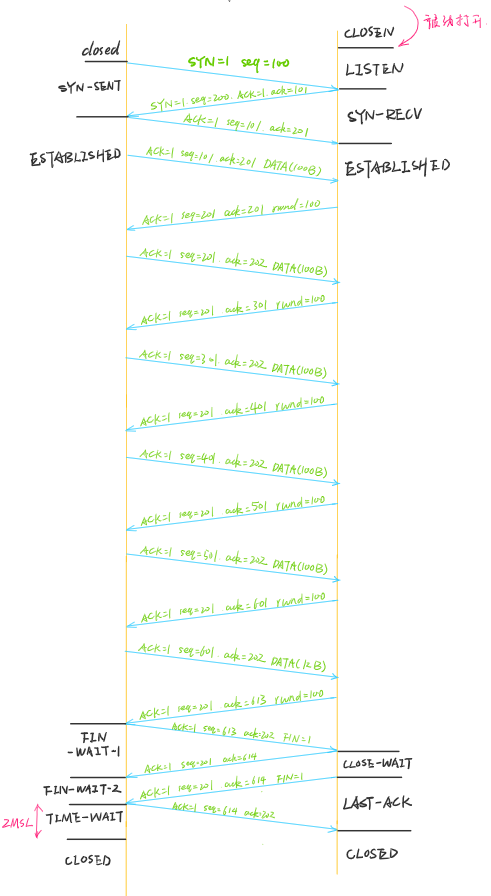
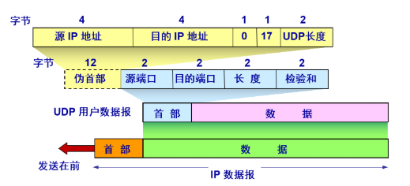

# 第五章

### 5-11

#### 题目

​	某个应用进程使用运输层的用户数据报 UDP, 然后继续向下交给 IP 层后，又封装成 IP 数据报。既然都是数据报，是否可以跳过 UDP 而直接交给 IP 层？哪些功能 UDP 提供了但 IP 没有提供？

#### 解答

​	当然不行了，都是数据报只是因为都按本层的协议封装，才称为数据报，数据报是个抽象的概念，和哪一层没有关系。两一方面，IP数据报所在的网络层负责的是主机间的通讯，而UDP所在的运输层负责的是主机内进程的通讯。

​	UDP实现的基本功能是运输层必须实现的功能：**multiplexing**，**demultiplexing**和差错检验。这三个功能都是IP没有提供的，其中IP的差错检验检验的是IP数据报头，UDP的差错检验包含了部分IP数据报头的信息。

### 5-12

#### 题目

​	 一个应用程序用 UDP, 到了 IP 层把数据报再划分为 4 个数据报片发送出去。 结果前两个数据报片丢失，后两个到达目的站。过了 一段时间应用程序重传 UDP, 而 IP 层仍然划分为 4 个数据报片来传送。结果这次前两个到达目的站而 后两个丢失。试问：在目的站能否将这两次传输的 4 个数据报片组装成为完整的数据报？假定目的站第一次收到的后两个数据报片仍然保存在目的站的缓存中。 

#### 解答

​	这个关系到的是IP协议的分片问题，和UDP并没有多大关系。IPv4协议中，进行分片的时候，各个子片的标识字段是相同的，因此目的站不可能将其组装成完整的数据。

### 5-21

#### 题目

​	假定使用连续 ARQ 协议，发送窗口大小是 3, 而序号范围是[0, 15), 而传输媒体保证在接收方能够按序收到分组。在某一时刻，在接收方，下一个期望收到的序号是 5。试问： 

1.  在发送方的发送窗口中可能出现的序号组合有哪些？
2.  接收方已经发送出的、但仍滞留在网络中（即还未到达发送方）的确认分组，可能有哪些？说明这些确认分组是用来确认哪些序号的分组。 

#### 解答

1. 有可能为：[2,3,4]，[3,4,5]，[4,5,6]，[5,6,7]。
2. 首先，5以后的确认分组肯定未发出，5以前的的确认分组肯定已经发出。由1可知，序号为1的分组的确认分组肯定接收到了，因此不能确认的为2，3，4分组的确认分组。

### 5-22

#### 题目

​	 主机 A 向主机 B 发送一个很长的文件，其长度为 L 字节 。假定 TCP 使用的 MSS 为 1460 字节。 

1. 在 TCP 的序号不重复使用的条件下， L 的最大值是多少？
2. 假定使用上面计算出的文件长度，而运输层、网络层和数据链路层所用的首部开销共 66 字节，链路的数据率为 10 Mbit/s, 试求这个文件所需的最短传输时间。

#### 解答

1. 课本中已经计算过这个最大文件长度，它是由TCP数据报的序号字段决定的，为$2^{32}=4GB$.
2. 只考虑链路的数据率。由于每个帧最多携带1460字节，且必须加上66字节的首部，则实际传输的数据量为：

$$
D=2^{32}+66×\lceil \frac{2^{32}}{1460} \rceil Byte
$$

​		传输数据率：
$$
V=10Mbit/s=10^{7}bit/s
$$
​		所以所需时间：
$$
\begin{split}
T=\frac DV&=\frac{(2^{32}+66×\lceil \frac{2^{32}}{1460} \rceil)×8}{10^7}\\
&≈3591.30s
\end{split}
$$

### 5-23

#### 题目

​	 主机 A 向主机 B 连续发送了两个 TCP 报文段，其序号分别是 70 和 100。试问： 

1.  第一个报文段携带了多少字节的数据？ 
2. 主机 B 收到第一个报文段后，发回的确认中的确认号应当是多少？ 
3.  如果 B 收到第二个报文段后，发回的确认中的确认号是 180, 试问 A 发送 的第二个报文段中的数据有多少字节？ 
4. 如果 A 发送的第一个报文段丢失了，但第二个报文段到达了 B。 B 在第二 个报文段到达后向 A 发送确认。试问这个确认号应为多少？ 

#### 解答

1. 携带30字节数据
2. 确认号应当是100
3. 80字节
4. 70

### 5-32

#### 题目

​	什么是 Karn 算法？在 TCP 的重传机制中，若不采用 Kam 算法，而是在收到确认时都认为是对重传报文段的确认，那么由此得出的往返时间样本和重传时间 都会偏小。试问：重传时间最后会减小到什么程度？ 

#### 解答

​	Karn解决的是，当一个帧重传后收到确认消息，无法判断确认消息属于前面哪个帧的问题。其策略是：只要报文重传，就不使用这个报文进行$RTT$的计算，同时增大RTO(而不是不变)，增大的方式是×2。

​	对网络层中应该是小到它能接收的最小时间，因为随着重传时间变小，发送端会在帧发送完成后马上重传。

### 5-33

#### 题目

​	 假定 TCP 在开始建立连接时，发送方设定超时重传时间 RTO = 6 秒。 

1.  当发送方收到对方的连接确认报文段时，测量出 RTT 样本值为 1.5 秒。 试计算现在的 RTO 值。
2.  当发送方发送数据报文段并收到确认时，测量出 RTT 样本值为 2.5 秒。试 计算现在的 RTO 值。 

#### 解答

1. $RTT_s=RTT_{new}=1.5s$，$RTT_D=0.5*RTT_{new}=0.75s$，所以:

$$
RTO=RTT_s+4×RTT_D=4.5s
$$

2. $\alpha和\beta$按推荐取值，计算：

$$
(RTT_s)_{new}=(1-\alpha)×(RTT_s)_{old}+\alpha×(RTT)_{new}=1.625s
$$

$$
(RTT_D)_{new}=(1-\beta)×(RTT_D)_{old}+\beta×|(RTT_s)_{new}-RTT_{new}|=0.78125
$$

​		所以：
$$
RTO=RTT_s+4×RTT_D=4.75s
$$

### 5-41

#### 题目

​	用 TCP 传送 512 字节的数据。设窗口为 100 字节，而 TCP 报文段每次也是传送 100 字节的数据。 再设发送方和接收方的起始序号分别选为 100 和 200, 试画出类似于教材图 5-28 的工作示意图。从连接建立阶段到连接释放都要画上。 

#### 解答

### 5-45

#### 题目

​	解释为什么突然释放运输连接就可能会丢失用户数据，而使用 TCP 的连接释放方法就可保证不丢失数据 。 

#### 解答

​	突然释放连接可能存在用户数据发送后在网络中丢失，而没来得及重传的情况，而TCP连接的方式在客户端进入四次挥手第一阶段的时候说明客户端已经完成了数据发送，因此不存在数据丢失。

### 5-49

#### 题目

​	下面是以十六进制格式存储的一个 UDP 首部：
$$
CB84000D001C001C 
$$
试问：

1. 源端口号是什么？ 
2.  目的端口号是什么？
3.  这个用户数据报的总长度是多少？ 
4.  数据长度是多少？ 
5.  这个分组是从客户到服务器方向的，还是从服务器到客户方向的？ 
6. 客户进程是什么？ 

#### 解答

​	先把UDP的数据报格式摆出来

​	所以，源端口=0xCB84=52100，目的端口=0x000D=13，数据报长度=0x001C=28字节，所以数据部分长度=20字节。

​	目的端口为系统服务端口，所以是从客户端到服务端。13号端口的服务为daytime，但是不能知道客户进程是什么。

# 补充题

### 1

#### 题目

​	 TCP为什么要把TCP的端口号放入首部最开始的4个字节？它是如何进行校验的？ 

#### 解答

​	在ICMP的差错报文中要包含紧随IP头部后面的8个字节的内容，让在TCP头部最开始的4个字节是TCP的端口号，就可以在ICMP的差错报文的上述8个字节中有TCP的源端口和目的端口。当发送IP分组的源收到ICMP差错报文时需要用这两个端口来确定是哪个应用的网络通信出了差错

​	TCP数据报的校验方式和IP数据报头部校验方式一样，称为反码运算求和，在计算的之后还会加入伪首部信息

### 2

#### 题目

​	  请比较数据链路层、IP层和传输层之间差错控制的作用。  

#### 解答

​	这几层提供的差错控制都是差错检验，会丢弃出错的报文，数据链路层的差错控制检验方式是CRC，相对较复杂，而IP层和传输层的检验方式都是通过反码运算求和的方式，计算比较简单，但是检错能力不如CRC。这样设计是有原因的，数据链路层的检错主要是在局域网，数据量也不会很大，采用的是CRC。IP层使用反码运算求和，是因为路过的每个路由器都要计算，而且在交付前会经过数据链路层的CRC校验，运输层使用反码运算校验的主要是IP数据报中的数据部分，即在IP层没有校验到的部分。

