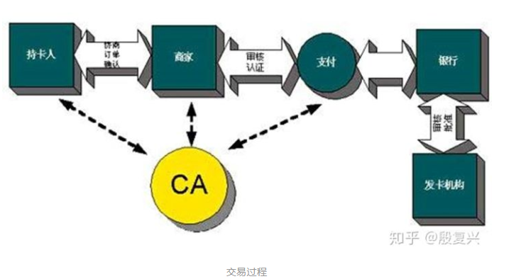

# 第七章(续)

## 7-19

### 解答

​	按教材的说明，“ A 和 B 对不同的会话必须使用不同的 不重数集。”，因此A发现收到的报文中不重数和自己发送的一样，就知道受到攻击了。

## 7-20

### 解答

​	即教材图7-10，中间人介于通讯双方之间，通过截获通讯双方发送的消息并欺骗通讯双方自己是通讯对方，从而获取信息。中间人攻击需要依靠公钥的认证，比如借助KDC

## 7-23

### 解答

​	不需要，一个安全SA既可以发送所有分组。

## 7-25

### 解答

##### 	SSL工作过程：

- 协商加密算法：浏览器向服务器发送ssl版本和支持的一些加密算法，服务器从其中进行选择

- 服务器鉴别：服务器向浏览器发送包含RSA公钥的数字证书，浏览器通过CA的公钥进行验证

- 会话密钥计算：浏览器产生秘密数并用服务器公钥加密并发送给服务器，双方通过协商的算法产生共享的对称会话密钥

- 安全数据传输：双方用密钥进行会话

  ##### set工作过程：[参考](https://zhuanlan.zhihu.com/p/52020176)

  

- 持卡人使用浏览器在商家的web主页上查看在线商品目录浏览商品。

- 持卡人选择要购买的商品。

- 持卡人填写定单，包括：项目列表、价格、总价、运费、搬运费、税费。定单可通过电子化方式从商家传过来，或由持卡人的电子购物软件(wallet)建立。有的在线商场可以让持卡人与商家协商物品的价格(例如出示自己是老客户证明，或给出了竞争对手的价格信息)。

- 持卡人选择付款方式。**此时set开始介入。**

- 持卡人发送给商家一个完整的定单及要求付款的指令。在set中，定单和付款指令由持卡人进行数字签名。同时利用双重签名技术保证商家看不到持卡人的帐号信息。

- 商家接受定单后，向持卡人的金融机构请求支付认可。通过gateway到银行，再到发卡机构确认，批准交易。然后返回确认信息给商家。

- 商家发送定单确认信息给顾客，顾客端软件可记录交易日志，以备将来查询。

- 商家给顾客装运货物，或完成订购的服务。到此为止，一个购买过程已经结束。商家可以立即请求银行将钱从购物者的帐号转移到商家帐号，也可以等到某一时间，请求成批划帐处理。

- 商家从持卡人的金融机构请求支付，在认证操作和支付操作中间一般会有一个时间间隔，例如，在每天的下班前请求银行结一天的帐

## 7-26

### 解答

​	到第四步，浏览器用CA的公钥鉴别证书的时候会发现公钥不属于经销商。

## 7-27

### 解答

​	对于发送的邮件，首先经过MD5提取**摘要**，然后发送方用密钥对摘要进行**数字签名**，然后整体用一次性密钥进行**加密**，再用接收方的公钥对一次性密钥**加密**，然后再发送出去，而接收方按顺序进行解密和验证。

​	PGP由于要求发送方和接收方都由对方的公钥，因此需要一个**第三方验证机构**，这个机构可以是CA，也可以是双方都信任的另一个第三方。

## 7-28

### 解答

​	防火墙主要用于实施访问控制，使用者通过制定相应的策略对网络访问实现控制，一般都把防火墙里面的网络称为“可信的网络＂，而把防火墙外面的网络称为“不可信的网络”。

​	它的主要功能包括：祖师和允许，即是否允许流量通过，不过在大多数情况下，防火墙的主要功能是阻止。 

​	网络级防火墙是用来防止整个网络出现外来非法的入侵。分组过滤即属于这类，它检查所有流入本网络的信息，然后拒绝不符合事先制定好的一套准则的数据。

​	应用级防火墙是从应用程序来进行访问控制，每种应用都需要一个不同的应用网关。