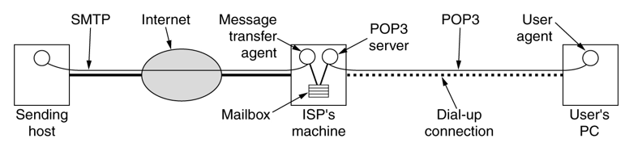

# 第五章(续)

## 5-39

### 题目

 TCP 的拥塞窗口 cwnd 大小与传输轮次 n 的关系如表 T-5-39 所示：

### 解答

1. 试画出如教材的 图 5-25 所示的拥塞窗口与传输轮次的关系曲线

2. 指明 TCP 工作在慢开始阶段的时间间隔 。

   ​	如图，1-6和23-26

3. 指明 TCP 工作在拥塞避免阶段的时间间隔。

   ​	6-16和17-22

4. 在第 16 轮次和第 22 轮次之后发送方是通过收到三个重复的确认，还是通过超时检测到丢失了报文段？

   ​	在第 16 轮次之后发送方收到三个重复的ACK，检测到报文丢失，在第 22 轮次发送方检测到丢失了报文段。

5. 在第 1 轮次、第 18 轮次和第 24 轮次发送时，门限 ssthresh 分别被设置为多大？

   ​	第 1 轮次：32，第 18 轮次：20，第 24 轮次：13	

6. 在第几轮次发送出第 70 个报文段？

   ​	前6轮发送了63个报文段，第 70 报文段在第 7 轮次发送。

7. 假定在第 26 轮次之后收到了三个重复的确认，因而检测出了报文段的丢失， 那么拥塞窗口 cwnd 和门限 ssthresh 应设置为多大？

   ​	全部会设置为当前窗口的一半，即4

## 5-61

### 题目

​	在本题中列出的 8 种情况下，画出发送窗口的变化，并标明可用窗口的位置。 已知主机 A 要向主机 B 发送 3 KB 的数据。在 TCP 连接建立后， A 的发送窗口大小是 2 KB。 A 的初始序号是 0。 

1. 一开始 A 发送 1 KB 的数据 。
2. 接着 A 就一直发送数据，直到把发送窗口用完 。
3. 发送方 A 收到对第 1000 号字节的确认报文段。
4. 发送方 A 再发送 850 B 的数据 。
5. 发送方 A 收到 ack = 900的确认报文段。
6. 发送方 A 收到对第 2047 号字节的确认报文段。
7. 发送方 A 把剩下的数据全部都发送完。 
8. 发送方 A 收到 ack == 3072 的确认报文段。

### 解答

## 5-69

### 题目

​	现在假定使用类似 TCP 的协议（即使用滑动窗口可靠传送字节流），数据传输速率是 1 Gbit/s, 而网络的往返时间 RTT = 140 ms。假定报文段的最大生存时间是 60 秒。如果要尽可能快地传送数据，在我们的通信协议的首部中，发送窗口和序号字段至少各应当设为多大？ 

### 解答

​	理想情况下，发送窗口应当能容纳RTT时间内发送的数据，即
$$
size=1.4*10^{-1}s*10^9bit/s=1.75*10^7byte
$$
​	所以，发送窗口的大小必须大于
$$
log_2(1.75*10^7)≈24.06
$$
​	即，发送窗口至少需要25位。

​	序号字段得容纳最大生存时间内发送的数据，即：
$$
size=60s*10^9bit/s=7.5*10^9
$$
​	所以，序号的大小必须大于
$$
log_2(7.5*10^9)≈32.80
$$
​	即，序号至少需要33位。

# 第六章

## 6-4

### 题目

​	设想有一天整个互联网的 DNS 系统都瘫痪了 （这种情况不大会出现），试问还有可能给朋友发送电子邮件吗？ 

### 解答

​	域名系统用于域名解析，如果能知道朋友的IP，通过直接发送的方式还是可以的。

## 6-5

### 题目

​	文件传送协议 FTP 的主要工作过程是怎样的？为什么说 FTP 是带外传送控制信息？主进程和从属进程各起什么作用？

### 解答

​	 FTP 使用客户服务器方式。FTP 的服务器进程由两大部分组成： 一个主进程，负责接受新的请求；另外有若干个从属进程，负责处理单个请求。

​	客服端和服务器都有两个从属进程：控制进程和数据传送进程。FTP 客户所发出的传送请求，通过 控制连接发送给服务器端的控制进程，所以说 FTP 是带外传送控制信息。

​	工作过程：

1. 打开熟知端口21
2. 等待客户进程发出连接请求
3. 启动从属进程处理客户端发过来的请求，从属进程在处理结束后即关闭
4. 主进程回到监听状态2

## 6-13

### 题目

​	 浏览器同时打开多个 TCP 连接进行浏览的优缺点如何？请说明理由。 

### 解答

​	对用户来说等同于在“单核CPU上的多线程并行”，“单核”是指用户网络速率本身受限，增加连接并不能改变，但是就像“单核下的多线程利于处理IO密集型任务”，多个TCP连接能以类似流水线一样的方式利用资源，整体上还是会加快数据传输的。另一方面过多的连接可能对服务器造成巨大的压力

## 6-15

### 题目

​	假定你在浏览器上点击一个 URL, 但这个 URL 的 IP 地址以前并没有缓存在本地主机上。因此需要用 DNS 自动查找和解析。假定要解析到所要找的 URL 的 IP 地址共经过 n 个 DNS 服务器，所经过的时间分别为 RTT1, RTT2, ... ,RTTn。假定从要找的网页上只需要读取一个很小的图片（即忽略这个小图片的传输时间）。 从本地主机到这个网页的往返时间是 RTTw。试问从点击这个 URL 开始， 一直到本地主机的屏幕上出现所读取的小图片，一共要经过多少时间？ 

### 解答

​	不论使用迭代查询还是递归查询，总的IP查询时间为RTT1+ RTT2+ ... +RTTn。得到目标IP后如果通过UDP传输则需要增加一个RTTw，如果通过TCP传输则需要建立连接，但是在三次握手最后一阶段，可以符加图片请求，所以一共需要增加2\*RTTw。

​	综上：UDP：RTT1+ RTT2+ ... +RTTn+\*RTTw，TCP：RTT1+ RTT2+ ... +RTTn+2\*RTTw

## 6-18

### 题目

​	一个万维网网点有 1000 万个页面， 平均每个页面有 10 个超链。 读取一个页面平均要 100 ms。 问要检索整个网点所需的最少时间

### 解答

​	一共需要：
$$
1*10^7*1*10^{-1}=10^6s
$$

## 6-24

### 题目

​	试述邮局协议 POP 的工作过程。在电子邮件中，为什么需要使用 POP 和 SMTP 这两个协议? IMAP 与 POP 有何区别？ 

### 解答

​	POP 的工作过程：客户端和服务器都要运行相应的软件，当客户端连接服务器的时候需要输入鉴别信息，之后可以进行邮件读取，而服务器在客户读取邮件之后会将该邮件删除。

​	SMTP 协议是用来发送电子邮件的，而 POP 协议是用户读取电子邮件的协议， 因此，这两个协议都是电子邮件系统必不可少的。

## 6-30

### 题目

​	电子邮件系统使用 TCP 传送邮件。 为什么有时我们会遇到邮件发送失败的情况？为什么有时对方会收不到我们发送的邮件？ 

### 解答

​	TCP只是保证了传输的可靠性，从上图可以知道，邮件会在ISP的服务器上驻留，邮件发送失败可能是邮件服务器已经满了或者对方的服务器不在工作，而收不到邮件通常是ISP服务器的问题。

# 补充题

##  在确定TCP发送端的可用窗口时，应该考虑哪些因素？ 