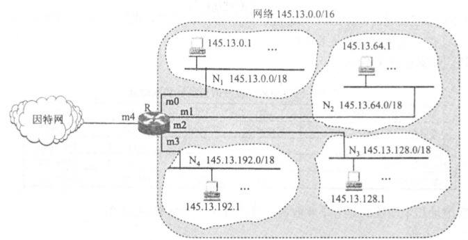
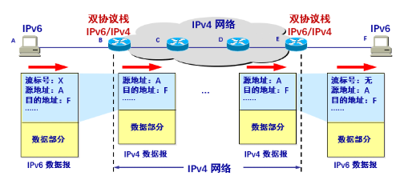
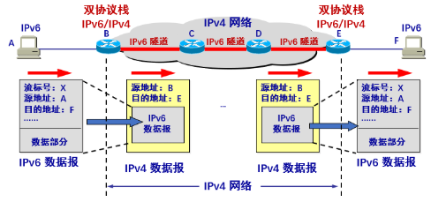

# 第九章

# 第四章(续)

## 4-40

### 题目

​	 RIP 使用 UDP, OSPF 使用 IP, 而 BGP 使用 TCP。这样做有何优点？为什么 RIP 周期性地和邻站交换路由信息而 BGP 却不这样做？ 

### 解答

**有何优点**

​	[文章]( https://www.jianshu.com/p/67c8750b21cb )提到，RIP协议采用UDP是因为RIP每周期需全网组播路由信息，路由信息数目较大，故使用UDP协议可以提高效率。而RIP使用UDP还有另一方面是历史原因： 1982年，伯克利发布的UNIX4.2BSD版本中，一个为“routed”的守护进程实现了rip协议，很多后来的UNIX版本都是基于UNIX4.2BSD版本，并且通过一个成为“routed“或”gated“的进程支持rip协议，但是直到1988年才发布了一个rip协议的标准(来自[百度问答]( https://zhidao.baidu.com/question/584500168.html ))

​	OSPF本身提供主从协商机制，可以保证可靠的传输。另一方面，全网路由器保持着同样的一个链路状态数据库，当拓扑发生变化时，通过协商后才进行更新，因此需要携带的变更信息较少。而且，按分层模型的设计，OSPF应当是属于网络层部分的内容，而不是运输层。

​	BGP需要跨不同AS传送路由信息，这个协议本身设计是“为了提供一个切实可行的路由方案”，因此为了保证可靠性使用了TCP协议。

**为什么BGP不周期性地交换和邻站的路由信息**

​	就像上面所说，BGP本身设计是“为了提供一个切实可行的路由方案”，AS之间的路由信息量巨大，而且情况较为复杂，特别是不同AS间的策略差异，因此并不需要像RIP那样通过周期性的交换来寻找“最佳路由”

## 4-41

### 题目

​	 假定网络中的路由器 B 的路由表有如下的项目

| 目的网络 | 距离 | 下一条路由器 |
| -------- | ---- | ------------ |
| $N_1$    | 7    | A            |
| $N_2$    | 2    | C            |
| $N_6$    | 8    | F            |
| $N_8$    | 4    | E            |
| $N_9$    | 4    | F            |

现在B收到C发来的路由信息

| 目的网络 | 距离 |
| -------- | ---- |
| $N_2$    | 4    |
| $N_3$    | 8    |
| $N_6$    | 4    |
| $N_8$    | 3    |
| $N_9$    | 5    |

试求出路由器 B 更新后的路由表（详细说明每一个步骤）。 

### 解答

**下一条地址**：收到的路由表下一条地址统一改为C

| 目的网络 | 距离 | 下一条路由器 |
| -------- | ---- | ------------ |
| $N_2$    | 4    | C            |
| $N_3$    | 8    | C            |
| $N_6$    | 4    | C            |
| $N_8$    | 3    | C            |
| $N_9$    | 5    | C            |

**修改距离**：距离全部加1

| 目的网络 | 距离 | 下一条路由器 |
| -------- | ---- | ------------ |
| $N_2$    | 5    | C            |
| $N_3$    | 9    | C            |
| $N_6$    | 5    | C            |
| $N_8$    | 4    | C            |
| $N_9$    | 6    | C            |

**更新路由表**：更新B的路由表，算法可以描述为：

```python
for 项目 in 修改后的 RIP 报文:
    if 项目中的目的网络不在路由表中:
        项目加到路由表中
    elif 项目中的距离小于路由表中的距离 or 下一条路由相同:
        更新路由表中的距离
```

| 目的网络 | 距离 | 下一条路由器 |
| -------- | ---- | ------------ |
| $N_1$    | 7    | A            |
| $N_2$    | 5    | C            |
| $N_3$    | 9    | C            |
| $N_6$    | 5    | C            |
| $N_8$    | 4    | E            |
| $N_9$    | 4    | F            |

## 4-54

### 题目

​	 某单位分配到一个起始地址为 14.24.74.0/24 的地址块。该单位需要用到三个子网，他们的三个子地址块的具体要求是：子网 $N_1$ 需要 120 个地址，子网 $N_2$ 需 要 60 个地址，子网 $N_3$ 需要 10 个地址。请给出地址块的分配方案。 

### 解答

​	和4-29类似，考虑到全0的环回地址和全1的广播地址，三个子网分别需要的地址数目为122，62，12。分配如下

| 子网  | 地址块          |
| ----- | --------------- |
| $N_1$ | 14.24.74.0/25   |
| $N_2$ | 14.24.74.128/26 |
| $N_3$ | 14.24.74.192/26 |


## 4-55

### 题目

​	 如图所示，网络 145.13.0.0/16 划分为四个子网 N1, N2, N3 和 N4。这四个子网与路由器 R 连接的接口分别是 m0, m1, m2 和 m3。路由器 R 的第五个接口 m4 连接到互联网。



1. 试给出路由器 R 的路由表。 
2. 路由器 R 收到一个分组，其目的地址是 145.13.160.78。试解释这个分组是怎样被转发的。 

### 解答

1. 路由表

   | 目的地址     | 子网掩码      | 出口  |
   | ------------ | ------------- | ----- |
   | 145.13.0.0   | 255.255.192.0 | $m_0$ |
   | 145.13.64.0  | 255.255.192.0 | $m_1$ |
   | 145.13.128.0 | 255.255.192.0 | $m_2$ |
   | 145.13.192.0 | 255.255.192.0 | $m_3$ |
   | else         |               | $m_4$ |

2. 145.13.160.78和路由表的每一项的子网掩码相乘，再和目的地址对比。相乘后得到145.13.128.0，只有对比到第三项的时候匹配，则这个数据报就从$m_2$发出去

## 4-56

### 题目

 收到一个分组，其目的地址 D = 11.1.2.5。要查找的路由表中有这样三项： 

​	路由 1 到达网络 11.0.0.0/8 

​	路由 2 到达网络 11.1.0.0/16 

​	路由 3 到达网络 11.1.2.0/24

试问在转发这个分组时应当选择哪一个路由？

### 解答

​	CIDR进行路由的时候应当遵循最长浅缀匹配原则，因此应当发送到路由3

## 4-62

### 题目

​	 IPv6 只允许在源点进行分片。这样做有什么好处？ 

### 解答

​	IPv6尽力地减少网络核心部分路由器的工作，将IPv4的一些选项功能移动到了拓展字段，而“只允许在源点分片”这样的操作同样是为了减少网络核心部分路由器的工作，加快传输速率

## 4-66

### 题目

​	从 IPv4 过渡到 IPv6 的方法有哪些？ 

### 解答

​	这个是书上一个小节的内容，主要有以下两种方式：

##### 双栈协议

​	让部分节点装有双栈协议，能够进行IPv4和IPv6转化。实际上转化不可逆，流标号字段会失效，但这种丢失是可容忍的



##### 隧道技术

​	在IPv6分组通过IPv4网络的时候，直接将IPv6分组装到IPv4分组里面。



# 补充题

###   一

​	设A是一台具有私有IP的主机，通过NAT服务器连接到互联网上。请问主机A所在子网以外的主机能够远程登陆（telnet）到A么？ 

#### 解答

​	可以。telnet是建立TCP连接，而NAT映射在网络层做了IP(或者包括端口)的映射，并不会影响到telnet的使用。

​	如果自家路由器使用的IP是公网IP，则可以再路由器上设置端口映射，从而实现在外地远程连接到家中的主机，可惜宿舍用的校园网不能这样做，不过还是有一些软件能提供“内网穿透”的功能

### 二

​	 路由器如何通过IGMP知道在其子网中的主机是否已经加入多播组中？ 

#### 解答

​	通过发出询问广播即可，连接到多播组的主机会自动加入224.0.0.1的多播组中，IGMP通过向这个组的所有成员发出查询信息，而有加入其他某个多播组的主机会回复多播路由器相应的信息，但是一个多播组只能保证会有一个成员有回复，因此无法知道多播组的具体成员数。

### 三

​	 一台攻击设备通过变化的MAC地址不断地从一台真正的DHCP服务器请求IP地址，是否可行？（提示：DHCP饥饿攻击） 

#### 解答

> **DHCP**
>
> ​	DHCP（动态主机配置协议）是一个局域网的网络协议。指的是由服务器控制一段lP地址范围，客户机登录服务器时就可以自动获得服务器分配的lP地址和子网掩码， 通常被应用在大型的局域网络环境中，主要作用是集中的管理、分配IP地址，使网络环境中的主机动态的获得IP地址、Gateway地址、DNS服务器地址等信息，并能够提升地址的使用率 。

​	DHCP饥饿攻击可以通过利用伪造的 MAC 地址来广播 DHCP 请求的方式来进行。

​	利用诸如 gobbler 之类的攻击工具就可以很容易地造成这种情况。如果所发出的请求足够多的话，网络攻击者就可以在一段时间内耗竭向 DHCP 服务器所提供的地址空间。结果当合法用户请求一个 DHCP IP 地址的时候也会被拒绝，并因此而不能访问网络 。

参考：[百科]( https://zhidao.baidu.com/question/166852859.html )