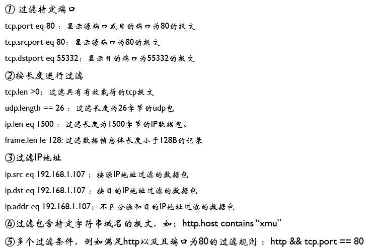
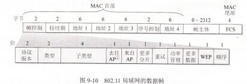
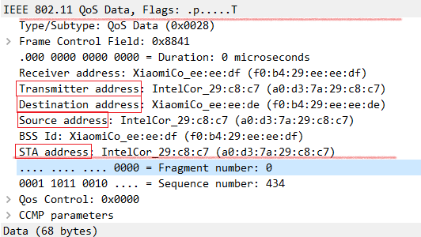
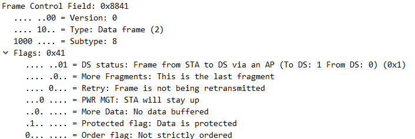
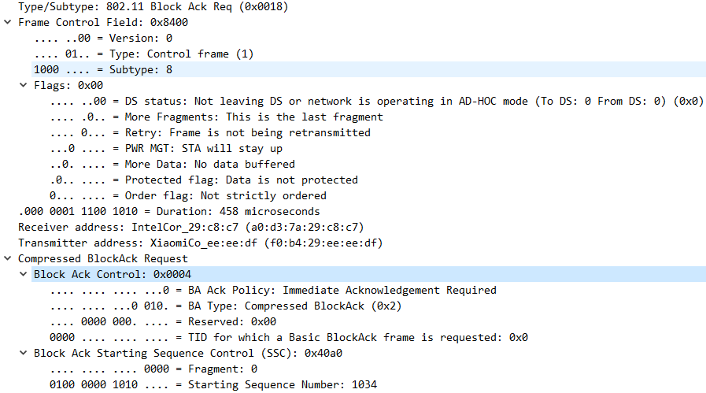
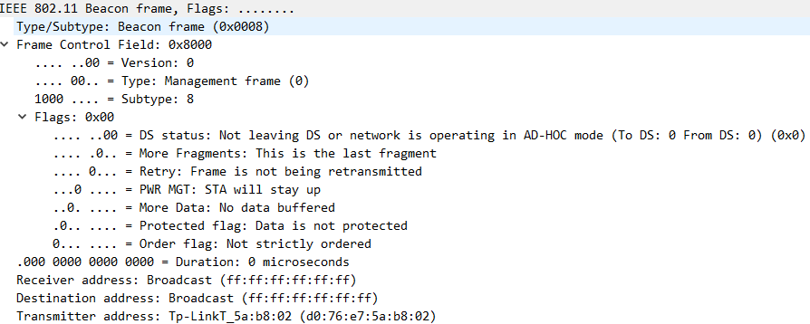
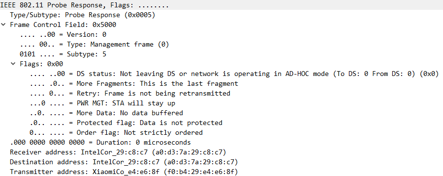

# 数据帧和IP包分析

## 目录
[TOC]

## 个人信息

​			姓名：林逸泰

​			学号：22920162203859

## 实验目的

- [x] 捕获和分析网络数据

- [x] 掌握以太网MAC帧、 802.11数据帧和IPv4数据包的构成，了解字段含义

- [x] 掌握ICMP和ARP协议的请求/响应机理

- [x] 掌握ping、arp和tracert指令

## 实验感想

​	实验不难，但是报告实在是花了好多时间。

​	对于课内学习到的协议，第一次有了直观的感受，特别是几个数据报的具体格式。虽然是在网络传播，但是数据的接收还是和C++中数据流的概念一样的，具体地比喻一下，win10经典的位图结构bmp，其文件一开始也有信息头，描述的整个文件的结构信息，通过对头部按规则读取，就能得到整个文件结构，从而解析之后的数据部分。在计算机网络中这种规则被描述为协议，但是其要点依旧是**语义，语法，同步**，抓住这三点，不论数据从硬盘里来还是网络上来，都不会有大的区别。其流的形式没有变，甚至解析方式也是类似的。

​	不得不佩服网络的设计者，以及*IP*以下的通讯工作者，即使一个很小的个人电脑，开始抓包，数据都和瀑布一样，能以无线的方式传输互联网巨量的信息，作为新手程序员依旧“手足无措”。

## 相关代码与数据

​	没有相关代码，附件只保留了部分在宿舍抓取的802.11数据报。


# 实验内容与分析

## 一. Wireshark的过滤

#### 1.参考



#### 2.常见过滤方式

**arp**


**端口**


尝试使用**流追踪**，可以发现一次TCP会话的建立与释放，释放过程应该缺少一个包：


**按长度过滤**


**搜索域名中的字符串**

访问之前筛选"xmu"，发现没有数据包符合要求，然后访问[course网](http://course.xmu.edu.cn)，再进行过滤：


**过滤目标地点为course网IP**


## 二. 捕获，分析MAC帧和IPv4数据包

让Wireshark重新开始捕获。

#### 1. 命令以及输出：

```shell
ping www.baidu.com
# outputs:
正在 Ping www.a.shifen.com [182.61.200.6] 具有 32 字节的数据:
来自 182.61.200.6 的回复: 字节=32 时间=49ms TTL=48
来自 182.61.200.6 的回复: 字节=32 时间=50ms TTL=48
来自 182.61.200.6 的回复: 字节=32 时间=50ms TTL=48
来自 182.61.200.6 的回复: 字节=32 时间=49ms TTL=48

182.61.200.6 的 Ping 统计信息:
数据包: 已发送 = 4，已接收 = 4，丢失 = 0 (0% 丢失)，
往返行程的估计时间(以毫秒为单位):
最短 = 49ms，最长 = 50ms，平均 = 49ms
```
#### 2.  捕获数据报

​	在wireshark中使用*icmp*筛选可以直接得到：

   可以看到，一共有8个请求和回应帧，其中每两个为“一对请求与应答”

#### 3. 帧分析：

   选取上面编号为66的帧，整个帧长度为74字节，包括了从MAC到ICMP所有数据。用wireshark可以直接查看MAC帧头部，IP帧头部，ICMP数据报三部分信息。其中MAC帧中头部14字节，数据部分60字节(IP头部的**总长度**)。

​	以下进行具体分析：

   **a. MAC帧头部**：

   在wireshark中查看MAC帧头部：

   

   可以看到MAC帧头部记录了MAC帧的源MAC地址，目的MAC地址以及类型(IPv4)。头部一共14字节，和上面例图是一样的。   

**b. IP数据报头部**

  	 IP数据报格式：

   

   在wireshark中查看：

   可以看到IP数据报头部长度为20字节，展开IP头部字段：

   

   可以看到协议字段是ICMP，头长度是20字节，使用IPv4，TTL为64，还有校验和。源IP和目的IP。

**c. ICMP包**

   	ICMP数据报格式：

   

   在wireshark中查看：

   

   这部分包含了整个ICMP数据包，包括头部与数据字段

   **首部字段**包含的信息和上面例图给出的一致，其中类型标出了这个数据报来自*ping*命令

   **数据字段**长度为32字节，其实际信息为上图的字母部分，从"abc..."开始，最后有一个"hi"，在终端中的信息也佐证了长度为32字节：

   

#### 4. 比较请求帧和回应帧的结构和IP头部变化

   切换到回应帧，可以看到MAC帧的源地址与目的地址以及发生翻转：

   

   展开IP头部：

   

仔细对比两张截图变化：

| 字段         | 请求帧 | 回应帧 |
| ------------ | ------ | ------ |
| Time to live | 64     | 48     |
| checksum     | 0xcf52 | 0xdf52 |
| 源IP和目的IP |        |        |

#### 5. 改变发送数据的长度

​	当发送数据的长度过长，会导致请求超时


​	为了尝试发送较长的数据报，尝试*ping*网关：


​	可以看到，由于ip数据报默认长度1500字节，ip头部20字节，因此每个数据报长度最多为1480字节，又由于ICMP数据报头部有8字节，因此ip数据报中的数据字段一共为4008字节，所以分成了3个片。

## 三.ARP协议工作原理分析

重新开始捕获，然后使用*arp -d*清空ARP缓存，可以看到主机马上询问网关，而且马上得到回复

之后主机不断发起ARP请求，可以看到一小段时间后，序号已经非常大：


> 发起网络活动：*ping*内外网地址，浏览网站。

#### 1. 尝试*ping*外网：

​	[小破站](www.bilibili.com)


​	发现什么信息都没有，因为ARP缓存中已经有相应的路由器的MAC地址，这是因为即使ARP缓存清空，路由表也会马上开始建立，发向外网的数据报会被发送到默认网关(即路由器)。因此，在wireshark中看不到ARP请求。

​	打开浏览器，访问[小破站](www.bilibili.com)，同样不会有ARP请求。

2. #### 尝试*ping*同一局域网主机

   尝试*ping*一下局域网中的主机：

```shell
ping 10.30.22.146
```

​	马上会有相应的ARP请求发出


#### 3. ARP报文分析：

​	尝试连接手机热点，得到本机IP:*192.168.43.237*，同时，可以看到ARP请求和回应：


​	尝试分析热点建立时候的ARP请求和回复

​	请求的ARP：


​	回复的ARP：


​	仔细对比上面的字段，按题目要求整理如下：

| 字段          | 请求ARP        | 回复ARP        | 长度 |
| ------------- | -------------- | -------------- | ---- |
| 硬件类型      | 以太网         | 以太网         | 2    |
| 协议类型      | IPv4           | IPv4           | 2    |
| 硬件地址长度  | 6              | 6              | 1    |
| 协议地址长度  | 4              | 4              | 1    |
| OPcode        | 2              | 1              | 2    |
| 发送方MAC地址 | ...            | ...            | 6    |
| 发送方IP地址  | 192.168.43.237 | 192.168.43.1   | 4    |
| 接受方MAC地址 | ...            | ...            | 6    |
| 接受方IP地址  | 192.168.43.1   | 192.168.43.237 | 4    |

​	其中， *OPcode* 是*ARP* 报文的类型，其他字段的名字已经很好地解释了其意义。

#### 4. 每个捕获的ARP报文的作用

​	捕获的ARP报文中，可以分为两种，一种是请求，一种是应答，可以看到请求的ARP包数量较多


这是因为ARP请求使用的是广播，而回应使用的是端到端的方式。

## 四. tracrt分析

为了减少经过的跳数，目的地址设为[course网]( course.xmu.edu.cn)：


#### 1. 在wireshark中的记录：


​	可以看到，从源主机到目的地址一共经过了3个路由，主机向每个中间路由器都发送了三个ICMP包，除了最后到达的目的地址，其他几个包的回复都是出错。

#### 2. 数据报分析

展开其中*10.30.0.1*回复的第一个包，直接查看其ICMP回复


​	可以看到回复的数据报的*Type*字段为11(Time-to-live exceeded)，即超时，而*Code*字段为0直接表明了生存时间超时，其他字段前面以及重复过，不再细分。这个ICMP数据报的数据段中还包含了接收到的IP数据报的前28字节，其中20字节为IP数据报头部，8字节为ICMP数据报。

​	从其数据部分包含的数据来看，发送的IP请求数据报中Time to live设置为1，从而目标路由器立即回复了这个ICMP数据报。再继续往下看，所有数据包的Time to live都是1，从而证实了*tracert*的工作原理

#### 3. tracert工作原理

​	从上面的分析能看到，*tracert*通过将IP数据报的*Time to live*设置为1，2，3...，使得从本及到目标路由器的所有中间路由器都回复一个超时的ICMP数据报，实现了跟踪链路上所有路由器的功能，要求作图如下，在时间情况中每个*Time to live*都会发送3个ICMP数据报


##  四. 抓取802.11数据报并分析  

虚拟网卡的设置[参考]( https://blog.csdn.net/siaspedro/article/details/45647383 )

```shell
iw dev wlan0 interface add mon0 type monitor
ifconfig mon0 up
sudo wireshark
```

#### 1.帧格式

​	课本给出的802.11数据帧格式：



在wireshark中抓取包，然后查看其中一个：



​	两条红线之间的为帧头部分，蓝色的部分开始的*Fragment number & Sequence number*在书本给出的帧格式中没有说明。四个地址都用红色框标出

#### 2.帧分析

**数据帧**

​	继续展开，能看到控制字段的具体内容



​	比如上面这个帧，类型字段为*10*，即数据帧。再看*flags*字段，为01，即属于来自AP的帧，倒二位的保护位设置为1，即数据进行了加密。更加具体地，所有接收到的数据帧都是*QoS data*类型，QoS的目的在于区分不同报文的优先级并保证高优先级的报文被优先转发，其机制的介绍可以参考[这篇文章]( https://blog.csdn.net/eydwyz/article/details/53320483 )。

​	刚才的这个帧是数据帧，应当是所有包中数量最多的帧。不怎么使用网络的时候，数据帧大部分为115字节长，当开启视频之类的时候数据帧基本都是1584字节长。

>  继续搜寻其他类型的帧

**控制帧**

​	在经过很长时间的捉获，发现控制帧只有ACK类型，并没有发现RTS/CTS帧。以下为ACK帧：

*Block ACK request*类型：但是并没有相应的*Block ACK*帧



ACK主要用于数据传输的帧的确认。

**管理帧**

​	经过搜索，发现*Beacon*帧，它主要用于声明某个网络的存在.可以看到，它在一个AD的范围内传播，没有加密。



*Probe Response*帧，并没有发现*Probe Request*帧，但是有*Probe Response*帧，这两个帧的作用在下面给出。可以发现管理帧似乎都没有进行加密，传播的帧控制类型都是*00*



#### 3. 802.11各种帧的作用

​	除了数据帧以外，主要有管理帧和控制帧两种

**控制帧**

| 类型      | 作用                                                         |
| --------- | ------------------------------------------------------------ |
| RTS帧     | 用来取得媒介的控制权，用于传送分段帧，分段由网卡驱动程序     |
| CTS帧     | 用于回复RTS帧，没有RTS就没有CTS。                            |
| ACK帧     | MAC及任何数据的传送（包括一般传送，RTS/CTS交换之前的帧、帧片段）所需要的肯定确认 |
| PS-POLL帧 | 移动式工作站从省电模式苏醒后，回向AP传送一个PS-POLL帧用于获得缓存帧 |

**管理帧**

| 类型                                 | 作用                                                         |
| ------------------------------------ | ------------------------------------------------------------ |
| Beacon（信标）帧                     | 主要用于声明某个网络的存在                                   |
| Probe Request 帧                     | 移动式工作站用于扫描所在区域内有哪些802.11网络               |
| Probe Resonse帧                      | 如果Probe Request所检查的网络与之兼容，该网络用Probe Request响应 |
| IBSS ATIM帧                          | IBSS without AP,无法依赖AP缓存帧，IBSS工作站为处于休眠状态的接收者缓存帧，就会在传递期间送出一个ATIM帧通知对方有消息待传 |
| Disassociation帧与Deauthentication帧 | 用于结束一段认证关系                                         |
| Association Request帧                | 移动式工作站找到兼容网络并通过身份验证，便发送Association Request帧以试图加入网络 |
| Reassociation Request 帧             | 位于相同扩展服务区域，但在不同基本服务区域间游走的移动式工作站，再次使用分布式系统时，必须与网络重新关联 |

