# 实验报告一

## 数据包过滤

**arp**

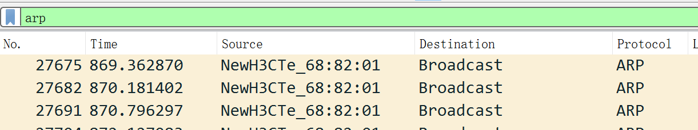

**端口**

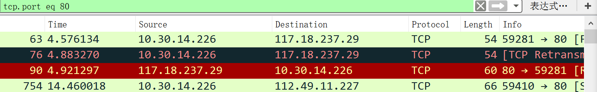

尝试使用流追踪，可以发现一次TCP会话的建立与释放，释放过程应该缺少一个包：

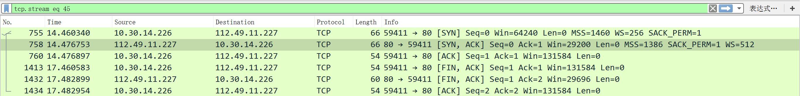

**按长度过滤**

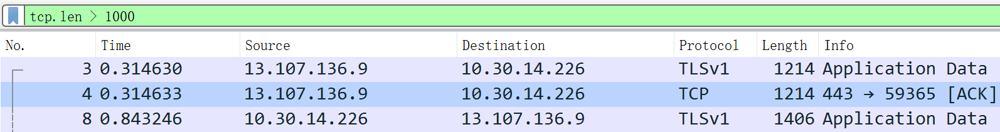

**搜索域名中的字符串**

访问之前筛选"xmu"，发现没有数据包符合要求，然后访问[course网](http://course.xmu.edu.cn)，再进行过滤：

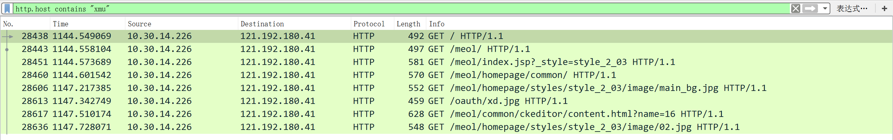

**过滤目标地点为course网IP**

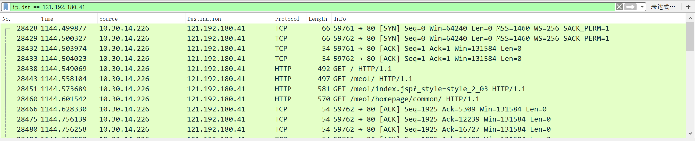

## 捕获，分析MAC帧和IPv4数据包

重新开始捕获。

1. #### 命令以及输出：

```shell
ping www.baidu.com
# outputs:
正在 Ping www.a.shifen.com [182.61.200.6] 具有 32 字节的数据:
来自 182.61.200.6 的回复: 字节=32 时间=49ms TTL=48
来自 182.61.200.6 的回复: 字节=32 时间=50ms TTL=48
来自 182.61.200.6 的回复: 字节=32 时间=50ms TTL=48
来自 182.61.200.6 的回复: 字节=32 时间=49ms TTL=48

182.61.200.6 的 Ping 统计信息:
    数据包: 已发送 = 4，已接收 = 4，丢失 = 0 (0% 丢失)，
往返行程的估计时间(以毫秒为单位):
    最短 = 49ms，最长 = 50ms，平均 = 49ms
```

2. #### 再wireshark中使用*icmp*可以直接搜索到：

   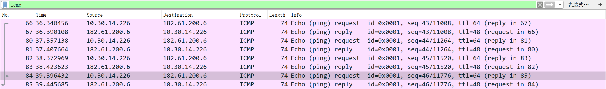

   可以看到，一共有8个请求和回应帧，其中每两个为一对

3. #### 帧分析：

   ​	选取上面编号为66的帧，整个帧长度为74字节，包括了从MAC到ICMP所有数据。wireshark从上到下提供了MAC帧头部，IP帧头部，ICMP数据报三部分信息，以下进行具体分析：

   **MAC帧头部**：

   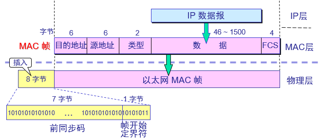

   在wireshark中查看具体信息：

   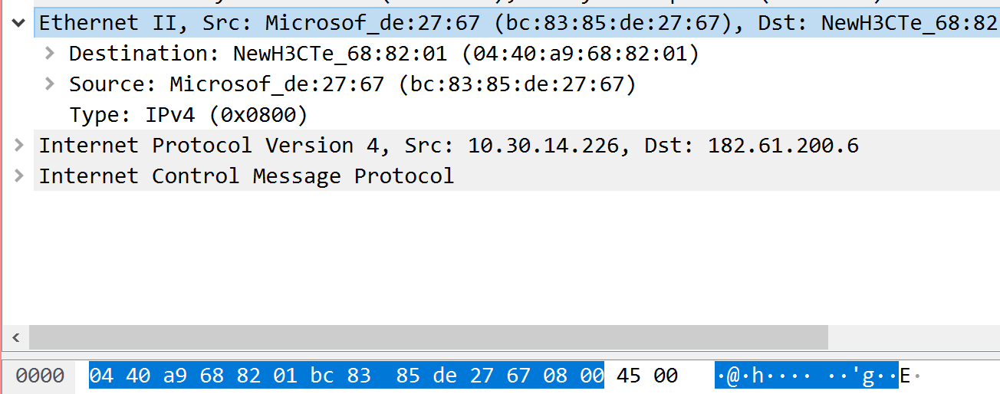

   可以看到MAC帧头部记载了MAC帧的：源MAC地址，目的MAC地址以及类型(IPv4)。查看MAC帧头部长度，点击MAC帧头部，可以看到其对应14字节的数据，和上面例图是一样的，即在MAC帧中头部14字节，数据部分60字节(这个在之后IP头部的总长度可以看到)：

   

   **IP数据报头部**

   帧格式：

   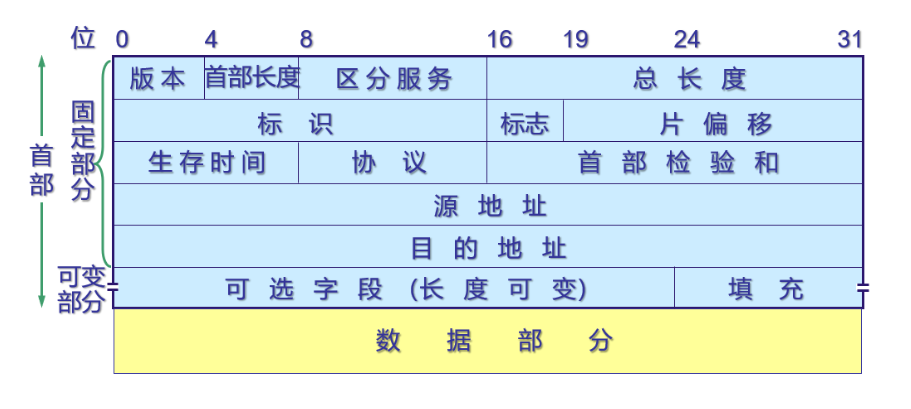

   在wireshark中查看具体信息：

   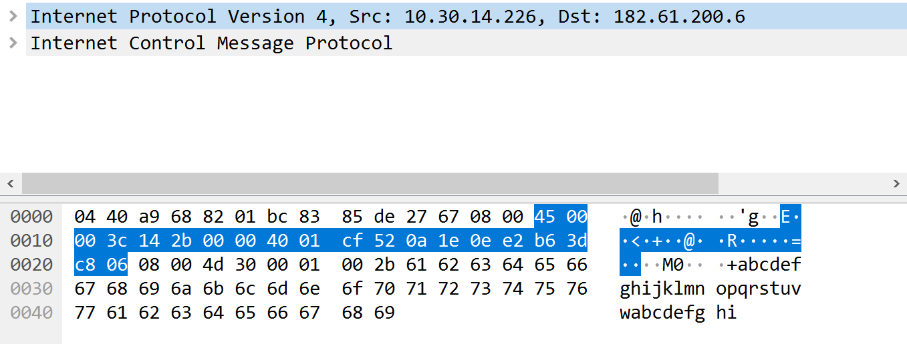

   可以看到IP数据报头部长度为20字节，展开IP头部字段：

   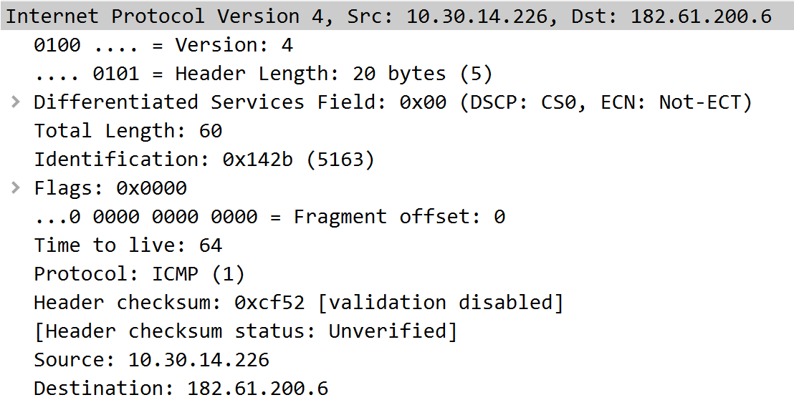

   和上面的例图中的字段一致，具体信息可以直接看上图，各个字段都在。

   **ICMP包**

   帧格式：

   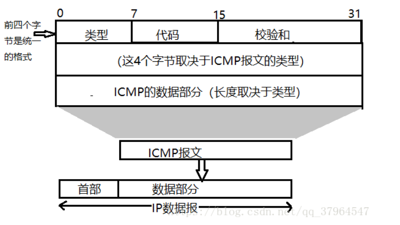

   

   在wireshark中查看具体信息：

   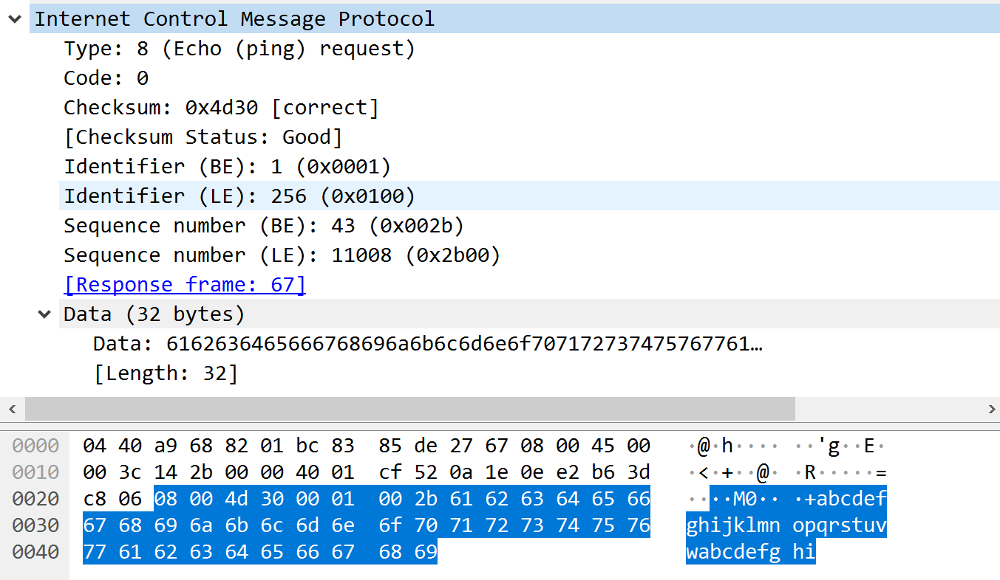

   这部分包含了整个ICMP数据包，包括头部与数据字段

   **首部字段**包含的信息和上面例图给出的一致，其中类型标出了来自*ping*命令

   **数据字段**长度为32字节，其实际信息为上图的字母部分，从"abc..."开始，最后有一个"hi"，在终端中的信息也佐证了长度为32字节：

   

4. #### 比较请求帧和回应帧的结构和IP头部变化

   切换到回应帧，可以看到MAC帧的源地址与目的地址以及发生翻转：

   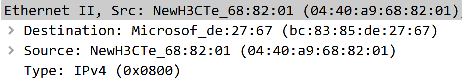

   展开IP头部：

   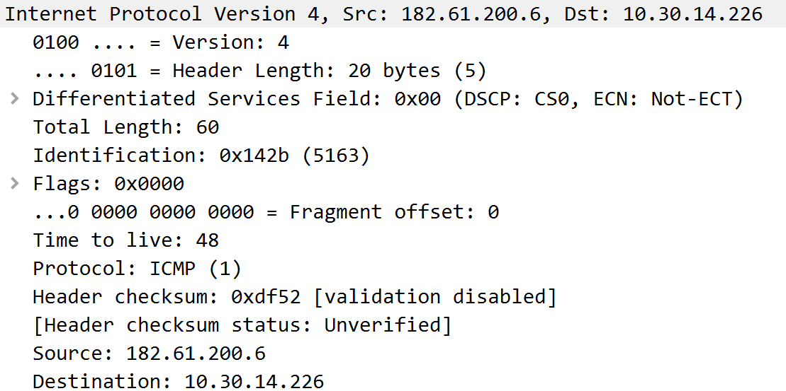

仔细对比两张截图变化：

| 字段         | 请求帧 | 回应帧 |
| ------------ | ------ | ------ |
| Time to live | 64     | 48     |
| checksum     | 0xcf52 | 0xdf52 |
| 源IP和目的IP |        |        |

### 改变*ping*参数，继续分析

#### 改变发送数据的长度

​	当发送数据的长度过长，会导致请求超时

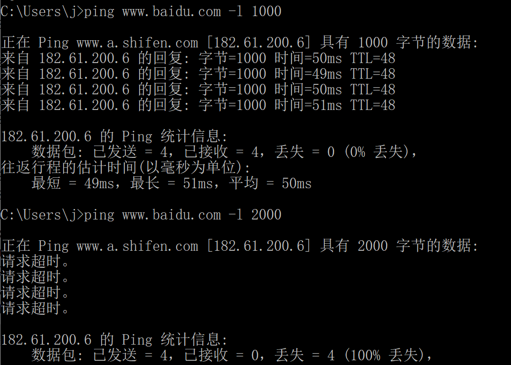


尝试*ping*网关：

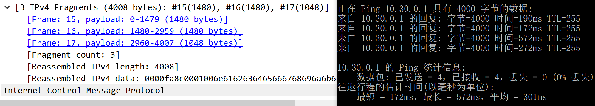

可以看到ip数据报默认长度1500字节，ip头部20字节，因此每个数据报长度最多为1480字节，又由于ICMP数据报头部有8字节，因此ip数据报中的数据字段一共为4008字节

## ARP协议工作原理分析

重新开始捕获，然后使用*arp -d*清空ARP缓存，可以看到主机马上询问网关，而且马上得到回复

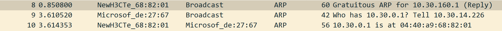之后主机不断发起ARP请求，可以看到一小段时间后，序号已经非常大：

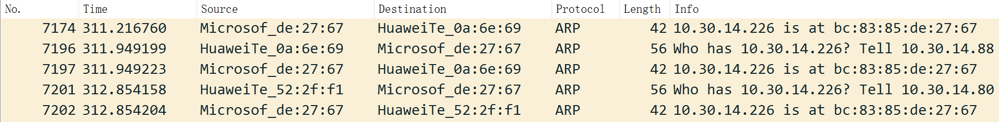

发起网络活动：*ping*内外网地址，浏览网站。

#### 尝试*ping*一下[小破站](www.bilibili.com)：

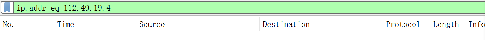

发现什么信息都没有，因为ARP缓存中已经有相应的路由器的MAC地址(马上建立)，因此，数据报会直接通过路由器转发，所以不需要ARP请求。同样的，打开浏览器，访问[小破站](www.bilibili.com)，同样不会有相关的请求。因此，尝试*ping*一下局域网中的主机：

```shell
ping 10.30.22.146
```

马上会有相应的ARP请求发出

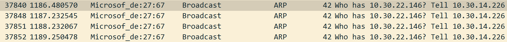

#### 尝试*ping*同一局域网主机

尝试连接手机热点，得到本机IP:*192.168.43.237*，同时，可以看到ARP请求和回应：

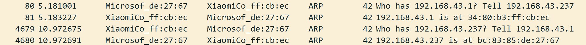

尝试分析热点建立时候的ARP请求和回复

请求的ARP：

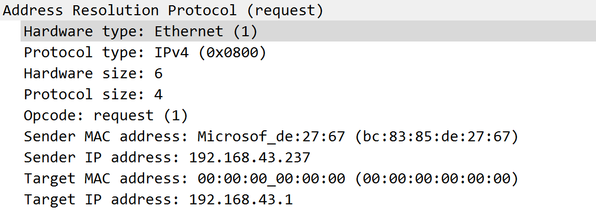

回复的ARP：

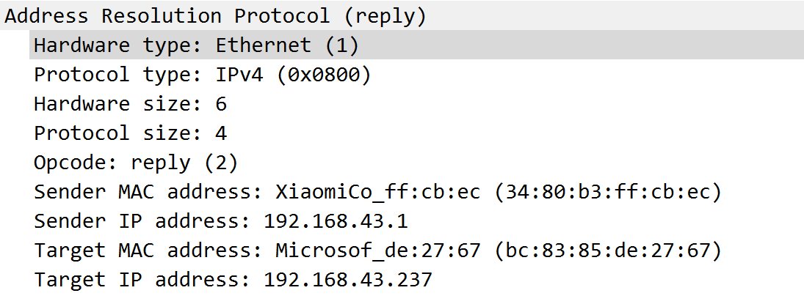

#### ARP报文分析：

| 字段          | 请求ARP        | 回复ARP        | 长度 |
| ------------- | -------------- | -------------- | ---- |
| 硬件类型      | 以太网         | 以太网         | 2    |
| 协议类型      | IPv4           | IPv4           | 2    |
| 硬件地址长度  | 6              | 6              | 1    |
| 协议地址长度  | 4              | 4              | 1    |
| OPcode        | 2              | 1              | 2    |
| 发送方MAC地址 | ...            | ...            | 6    |
| 发送方IP地址  | 192.168.43.237 | 192.168.43.1   | 4    |
| 接受方MAC地址 | ...            | ...            | 6    |
| 接受方IP地址  | 192.168.43.1   | 192.168.43.237 | 4    |

其中， *OPcode* 是*ARP* 报文的类型，其他字段的名字已经很好地解释了其意义。

#### 每个捕获的ARP报文的作用

​	捕获的ARP报文中，可以分为两种，一种是请求，一种是应答，可以看到请求的ARP包数量较多

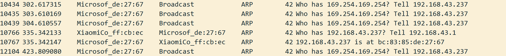

这是因为ARP请求使用的是广播，而回应使用的是端到端的方式。

## tracrt分析

为了减少经过的跳数，目的地址设为[course网]( course.xmu.edu.cn)：


### 在wireshark中的记录：

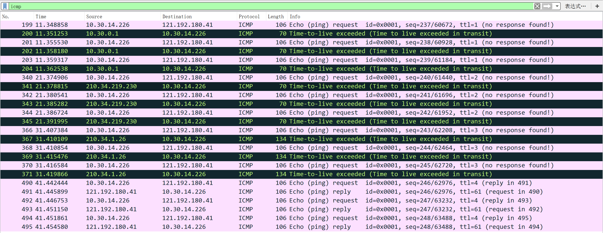

可以看到，为了到达目的地址，一共经过了3个路由，主机向每个中间路由器都发送了三个ICMP包，除了最后到达的目的地址，其他几个包的回复都是出错。

### 数据报分析

展开其中*10.30.0.1*回复的第一个包，直接查看其ICMP回复

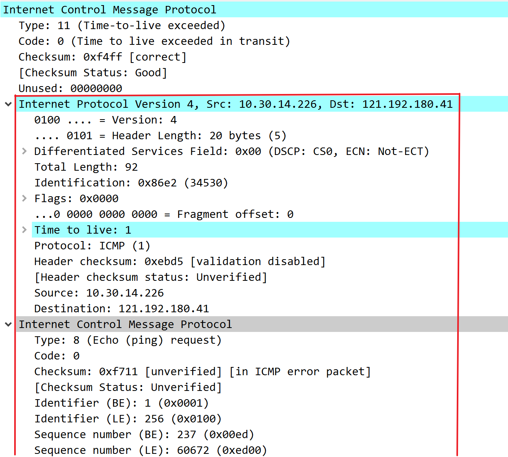

​	可以看到回复的数据报的*Type*字段为11(Time-to-live exceeded)，即超时，而*Code*字段为0直接表明了生存时间超时，其他字段前面以及重复过，不再细分。这个ICMP数据报的数据段中还包含了接收到的IP数据报的前28字节，其中20字节为IP数据报头部，8字节为ICMP数据报。

​	从其数据部分包含的数据来看，发送的IP请求数据报中Time to live设置为1，从而目标路由器立即回复了这个ICMP数据报。再继续往下看，所有数据包的Time to live都是1，从而证实了*tracert*的工作原理

### tracert工作原理

​	从上面的分析能看到，*tracert*通过将IP数据报的*Time to live*设置为1，2，3...，使得从本及到目标路由器的所有中间路由器都回复一个超时的ICMP数据报，实现了跟踪链路上所有路由器的功能，要求作图如下，在时间情况中每个*Time to live*都会发送3个ICMP数据报

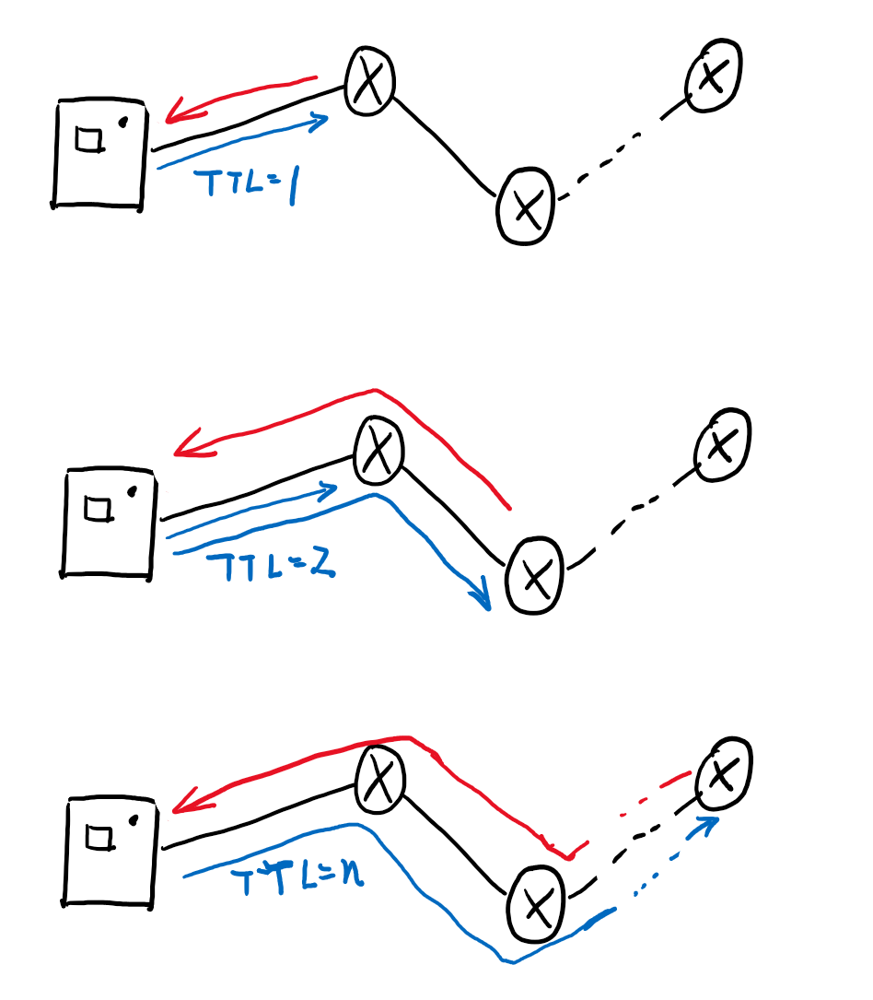


添加 监工 网卡 monitor

ifconfig xx up