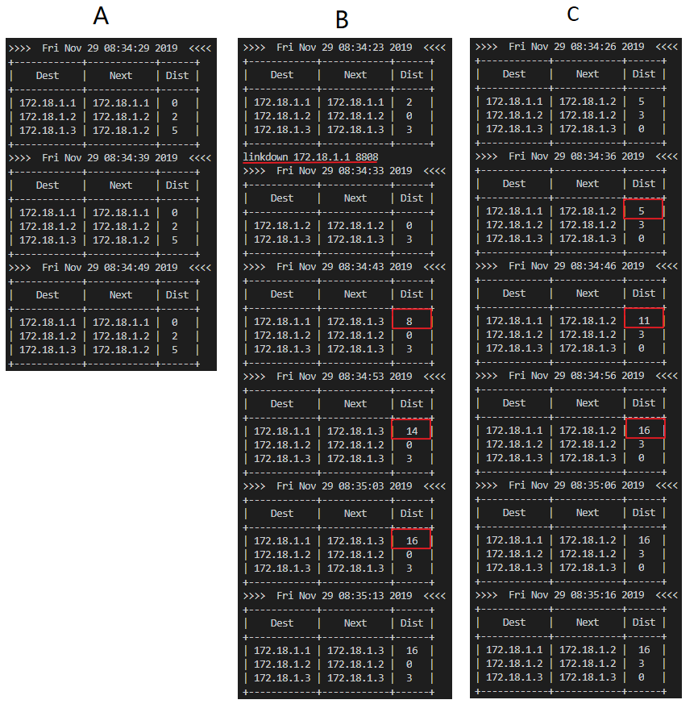

# 路由算法实验

## 目录
[TOC]

## 个人信息

​			姓名：林逸泰

​			学号：22920162203859

## 实验目的

- [x] ​     学习和掌握距离向量算法  


## 实验感想

​	本次实验模拟了距离向量路由算法，课本已经明确地给出了这个算法，但是实现的时候总有很多的细节出bug，比如源地址和下一条地址的更新，当将路由表发送给相邻路由器的时候，相邻路由器在接收到后对下一条地址应该进行更新。还有一些细节部分的，比如路由表的具体数据结构不用非得是线性表，实际中为了加快查找可能用键树，在代码中使用的是哈希表，从而加快查找速度，由于使用了哈希表，因此输出路由表的时候要进行格式调整。

​	另外由于是模拟，因此有些地方和实际的算法还是有出入的。

​	比如缺少很多计时器，特别是失效计时器，导致模拟的时候不得不加入一些额外的操作，像是删除不可达的路由项等。或由于难以模拟大规模网络，因此直接用距离代替实际跳数，因此当这个模拟的距离变化的时候应当使用旧距离还是新距离执行DV算法？

​	从实验中还体会到的是分布式系统中程序调试的困难，而且对于更大的系统可能由于顺序问题而出现难以复现的错误，调试就更加麻烦了

**不足之处**

​	路由表部分并没有实现加锁，在多线程下这是十分危险的，但是由于测试条件下多次实验并没有出现不同步问题，因此后来并没有加上。

## 相关代码与数据

​	相关代码全部打包在文件夹里面

# 实验内容与分析

### 实验环境说明

​	由于电脑之前安装了Docker，因此无法运行VMware，因此就直接用docker。使用镜像为ubuntu: 16.04。python版本3.5.2。其中python额外安装prettytable。

```shell
pip3 install prettytable
```

## 一. 模拟路由收敛


### 环境准备

按要求各个主机需要对应.1, .2, .3, ...固定地址，因此建立新虚拟网段*172.18.0.0/16*

```shell
docker network create --subnet=172.18.0.0/16 CNexp
```

​	按要求添加5个容器

```shell
docker run 	--name="test{x}" \								#名称
			-v /d/docker_dir/ubuntu_16:/home/out_world \	#目录映射，运行同一个router.py
		 	--net CNexp --ip 172.18.1.{x} \					#配置
		 	-it ubuntu:CNtest /bin/bash						#启动shell
```

​	得到的容器以及IP：

| 容器     | IP         | 启动脚本 |
| -------- | ---------- | -------- |
| A(test1) | 172.18.1.1 | A.sh     |
| B(test2) | 172.18.1.2 | B.sh     |
| C(test3) | 172.18.1.3 | C.sh     |
| D(test4) | 172.18.1.4 | D.sh     |
| E(test5) | 172.18.1.5 | E.sh     |

### 测试

> 实验设置30秒一次迭代

​	按顺序开启路由器A-D，命令格式依据PPT，可以查看脚本文件。程序输出如下：


​	可以看到，在三次迭代的时候，所有路由表都已经收敛。注意，此处每次输出安排在更新之前，即打印第三张路由表的时候是进行了两次更新。

## 二.模拟拓扑变化  

### 测试


在上一任务基础上，等待路由表收敛，在B路由器输入*linkchange 172.18.1.5 8808 2*，等待其再次收敛


从输出可以看出，A，C没有变化，而其他三个路由器的路由表都变化了

## 三. 制造路由回路  

### 环境准备

​	使用同样的容器，但是启动脚本不同

| 容器     | IP         | 启动脚本 |
| -------- | ---------- | -------- |
| A(test1) | 172.18.1.1 | A2.sh    |
| B(test2) | 172.18.1.2 | B2.sh    |
| C(test3) | 172.18.1.3 | C2.sh    |

### 测试

> 测试时，路由信息发送时间隔调整为10s


启动三个路由器，等待路由表收敛，然后输入*linkdown 172.18.1.1 8808*，断开B和A的连接。

**为了模拟A断开**：

- B路由不再接收A的信息，也不再向A发送信息
- 在路由表中删除A项 -- 由于路由并没有设置路由超时，因此如果不删除，则旧信息会停留在网络中

另外，在路由表中将不可达设置为16，因此最远距离为16，同时到达16之后，为了展示，不删除路由项。

#### 运行结果



路由器A不会受到影响，但是路由器B和C会出现震荡的情况，直到最后都认为A不可达

## 四. 解决路由回路  

使用逆向毒化技术，重新模拟A和B链接断开所导致的重新收敛过程。

**是否逆向毒化硬编码在程序中**，若需要开启，则需要重新运行代码


## 五. 思考题

#### 请举例说明为什么逆向毒化不能杜绝回路生成  

​	参考[RFC1058]： 带逆向毒化的水平分割可以避免两个网关之间的路由回路。但在三个网关的情况时，还会出现相互欺骗。例如A认为可以从B得到路径，B认为从C得到路径，而C认为从A得到路径。水平分割不能解决这样的回路。

## 六. 实验代码结构

```python
""" 路由表格式
    |   dest    |   next    |   port    |   dist    |
    -------------------------------------------------
    |           |           |           |           |
    实际打印的时候省略了port部分

设计结构
    将路由表封装为类，数据收发使用多线程的方式，其中发送部分使用定时发送
- RAII
    RouteTable：封装了路由表，为了编码方便，实际使用的是字典
        add         添加表项
        set_dist    设置到某路由距离
        get_table   获取整个路由表
        print_table 打印路由表
        remove_item 删除表项
- DV算法
    UDPlink：   封装了UDP连接，提供了send，recv等基本方法以及查询自身的socket描述符的方法
    RecvThread  接收消息
                实现DV算法
    sender      定时发送消息
                实现逆向毒化
"""

class UDPLink:

class RouteTable:

class RecvThread(threading.Thread):
    # 路由算法
    def run(self):
        ...
        for item in data["msg"]:    # (dest, next, port, dist)
            iam = link.whoiam()[0]
            # 对方路由器到本路由器的距离 -- 一定更新
            if item[0] == iam and item[1] == iam:
                # and route_table.get_dist(data["from"][0]) > item[3]:
                item[0] = item[1] = data["from"][0]
                item[2] = data["from"][1]
                route_table.set_dist(item)
                # 经对方路由器到其他路由器的距离更小
            elif route_table.get_dist(item[0]) > base_dist + item[3] \
                or route_table.get_dist(item[0]) == 16:
                item[1] = data["from"][0]
                item[2] = data["from"][1]
                route_table.set_dist(item, base_dist)
                # 本路由器经过对方路由器到另一个路由器 -- 一定更新
            elif route_table.get_next(item[0]) == data["from"][0]:
                item[1] = data["from"][0]
                item[2] = data["from"][1]
                route_table.set_dist(item, base_dist)

def sender():
    ...
    # 毒化
    if poison:
        send_table = route_table.get_table()
        for idx in range(len(send_table)):
            if send_table[idx][1] == nex and send_table[idx][0] != nex:
                send_table[idx][3] = 16
    ...
    # 定时
    t=threading.Timer(interval,sender,())
    t.start()

# 构造新消息
def new_msg(from_, msg = None):
# 解析收到的数据
def parse_recv_data(data):
# 编码数据以发送
def encode_data(data):
# 解析启动参数
def arg_parser():
# 解析运行过程的输入参数
def input_parser():

if __name__ == "__main__":
    # 参数配置
    poison = True   # 逆向毒化
    interval = 30   # 发送间隔
    host = ''       # 接收来自所有ip的消息
    # 获取本机ip
    ip = socket.gethostbyname(socket.gethostname())
    # 禁止列表 -- 用于模拟断开和其他路由器的连接
    forbidden_list = []
    # 解析输入参数
    port,route_table = arg_parser()

    # 构造路由表，创建socket
    route_table.append([ip, ip, port, 0, ip])
    route_table = RouteTable(route_table)
    link = UDPLink(host, port)
    link.iam(ip, port)

    # 启动接收和发送线程
    recv_thread = RecvThread(link)
    t=threading.Timer(0,sender,())
    t.start()
    recv_thread.start()

    # 获取执行过程中的用户命令并执行
    while True:
        input_parser()

    recv_thread.join()
```


