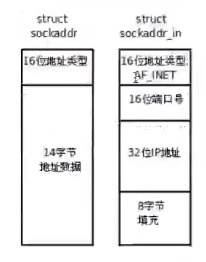

# 数据帧和IP包分析

## 目录
[TOC]

## 个人信息

​			姓名：林逸泰

​			学号：22920162203859

## 实验目的

- [x] 掌握TCP和UDP协议主要特点和工作原理

- [x] 理解socket的基本概念和工作原理

- [x] 编程实现socket网络通信（C++ & Python）


## 实验感想

​	这次实验主要学习了利用socket通讯实现简单的C/S结构。之前稍有看过相关内容，因此完成较为顺利，不过在实验的时候依旧遇到了不少问题，通过搜索，也获得了相关解答。

​	另一方面，我的计网大作业也会基于Unix提供的socket API完成，因此，这次作业算是一个很好的开头，提前熟悉了一下服务器结构，对之后设计的时候提供了不少参考。

## 相关代码与数据

​	此次实验代码较多，因此部分主体代码放在另一个pdf中，而实际使用的所有代码则打包在文件夹内。实验所用环境为Ubuntu16.04，python为3.5，C程序若在其他环境无法运行可以考虑重新编译。

```shell
gcc ./SocketFunc.c ./error.c ./server_2.c
```

# 实验内容与分析

## 一. 字符串转换-网络服务  

​	socket函数的出错检查封装在SocketFunc类中，可以简化使用

```C
#ifndef SOCK_FUNC_H
#define SOCK_FUNC_H
#include"../apue.h"
/*
 *  对socket连接需要的函数的简单封装
 *      如果出错，都是直接exit，因为socket连接会建立失败
 *      不过accept出错，如果对于多进程可以exit，但线程应该使用pthread_exit()
 *      
 *      Note:   这里封装的函数大写首字母是因为在vim中可以用shift+k查看manpage(大小写不敏感)
*/
int Socket(int domain, int type, int protocol);
int Bind(int sockfd, const struct sockaddr *addr, socklen_t addrlen);
int Listen(int sockfd, int backlog);
int Accept(int sockfd, struct sockaddr *addr, socklen_t *addrlen);
int Connect(int sockfd, const struct sockaddr *addr, socklen_t addrlen);
#endif
```

### a. 运行测试 -- server主动关闭

​	启动server_1，然后启动两个客户端client_1，其中一个发送消息*hello*，收到*olleh*，另一个发送*world*，但是没有收到消息：


查看8800端口的网络占用情况：


> 第二列的数据不清楚是什么，因此查询了一下。命令输出的每一列的表头
>
> | Proto | Recv-Q | Send-Q | Local-Addr | Forg-Addr | State |
> | ----- | ------ | ------ | ---------- | --------- | ----- |
> |       |        |        |            |           |       |
>
>  其中"Recv-Q"和"Send-Q"指接收or发送队列的缓存

**分析**

​	所有连接都是tcp连接，只有一个连接处于*LISTEN*状态，这是server用于监听的socket，另外四个连接两两成对，由于连接已经建立，所以全部处于*ESTABLISHED*状态，其中有一个接收队列有缓存，即之前第二个客户端发送的*world*，刚好5字节。此时*server*还在处理第一个客户端的请求。

客户端1继续发送请求，然后用*bye*退出，此时，客户端2马上收到了回复*dlrow*


​	立即查看网络状态，可以发现server有一个连接处于TIME_WAIT状态，说明连接由server主动关闭，因为**server_1的实现中，收到*bye*后会主动断开，然后client再退出**。TEIME_WAIT是主动关闭者为了防止帧丢失导致死锁而设置的等待状态。

​	从结果可以看到，TCP状态转化图中，并不是“客户端会进入TIME_WAIT”，而是“主动断开者会进入TIME_WAIT”。

> 设置server主动断开是因为下面的题目中有测试server和client各自主动断开会发生什么事，可以作为对比。


第二个客户端继续请求，然后关闭连接，最后只剩下server的LISTEN


### b. 测试backlog

​	测试listen函数的参数backlog为0和1对server的影响。

> 先查看manpage对backlog的解释：
>
> ​	The  backlog  argument  defines the maximum length to which the queue of pending connections for sockfd may grow.  If a connection request arrives when the queue is full, the client may receive  an error with an indication of ECONNREFUSED or, if the underlying protocol supports retransmission, the request may be ignored so that a later reattempt at connection succeeds.

**backlog=0**，这时候尝试连接三个客户端，出现：


​	第三个客户端处于SYN_SENT状态，经过一段时间后超时，结合*manpage*的解释，可以发现，这是由于等待队列已经满了，server不会再接收新的请求，即不会发送ACK，自身也不会进入SYN_RECV

**backlog=1**，为了测试，开启四个客户端：


​	即，**backlog=0允许有一个ESTABLISHED，但是还没有accept的连接，backlog=1允许有两个ESTABLISHED，但是还没有accept的连接**

### c. 为什么客户机不建议bind固定端口？

> 在a部分已经包含了server主动断开的逻辑，这里将程序修改为client主动断开，然后进行测试。

​	按题目要求，不绑定固定端口，在客户端连接上后主动关闭，并重启客户端，下面为客户端关闭，再重启。截图：


​	可以看到新的客户端使用了新的端口，而原来的端口依旧**处于TIME_WAIT状态**，这个时候是无法使用的，下面将客户端端口绑定，再次测试，*bind*会有报错：


​	服务端先行关闭连接，客户端重新连接的情况下不会出现这个问题(在前面a部分已经展示过)。

​	查阅了一下程序结束后依旧会占用端口的问题，发现可以利用**端口复用**技术来避免这个问题：

```C
/* 开启端口复用 */
int opt = 1;
// sockfd为需要端口复用的套接字
setsockopt(sockfd, SOL_SOCKET, SO_REUSEADDR, (const void *)&opt, 
           sizeof(opt));
```

​	经过测试，使用端口复用后，不会出现需要等待两倍RTT的情况。最后的代码中客户端没有绑定固定端口。因此没有开启端口复用。

**结论**：由上面的分析可知，客户端正常不会绑定固定端口，因为这样会导致自身重启的时候必须等待两倍RTT时间，而服务端必须有确定端口，否则客户端难以确定连接到哪里，另外，服务端通常不会经常重启。这个问题也可以使用端口复用技术解决。

### d. IP地址和端口并没有作为数据传入send()/recv()，为什么也要进行字节顺序转换？不转换会有什么后果？

​	因为标准就是这样定的，使用*man 7 ip*查看对这个结构体的说明：


​	*manpage*里面明确要求需要以网络字节序的方式赋值(in network byte order)。另外，关于使用*bind*的时候必须进行类型转化，这是由于历史遗留问题，一开始设计的*sockaddr*并不包含端口，地址等几个划分：



​	如果不进行转化，那肯定和预期结果不同，Intel家的CPU是按小端存储，而网络字节序是按大端存储，比如一个32bit宽的数0x12345678


所以可以预见如果不转化，ip地址都会乱掉，而且不是逆序。

## 二. 多进程服务器

server_2主要代码

```C
#define PROTOCOL AF_INET

/* 处理SIGCHLD信号 */
void pr_exit(int status);
void sigchld_handler(int signo);
/* >>>>> MAIN <<<<< */
int main(int argc, char *argv[]) {
  ...	// 变量定义

  /*
   * 使用sigaction注册SIGCHLD处理函数
   *  目的是获取结束的子进程的结束状态从而判断执行结果
   */
  sigemptyset(&sigchld_mask);
  child_act.sa_handler = sigchld_handler;
  child_act.sa_mask = sigchld_mask;
  child_act.sa_flags = 0;
  if (sigaction(SIGCHLD, &child_act, NULL) == -1) {
    err_sys("sigaction error");
    exit(1);
  }

  /* 解析参数 */
  if (argc != 2) {
    printf("usage: server_1.exe <port>\n");
    exit(1);
  }
  port = atoi(argv[1]);

  /*
   *  创建socket
   *  socket初始化，错误处理封装在SocketFunc
   */
  server_sock_listen = Socket(PROTOCOL, SOCK_STREAM, 0);
  server_addr.sin_family = PROTOCOL;
  server_addr.sin_port = htons(port);
  server_addr.sin_addr.s_addr = htonl(INADDR_ANY);
  memset(&server_addr.sin_zero, 0, sizeof(server_addr.sin_zero));
  Bind(server_sock_listen, (struct sockaddr *)&server_addr,
       sizeof(server_addr));
  Listen(server_sock_listen, 0);

  /*
   *    服务器处理循环
   *    外层循环保证能接收多个客户端的连接
   *    内层循环处理一个客户端的多个请求
   */
  while (1) {
    server_sock_data = Accept(server_sock_listen, NULL, NULL);
    printf("new client connected\n");
    /* 接收并显示消息 */
    memset(recv_msg, 0, sizeof(recv_msg));

    /*
     * 使用fork产生子进程，关闭不需要的描述符
     */
    if ((child_id = fork()) < 0) {
      printf("fork new process error\n");
      close(server_sock_data);
    } else if (child_id == 0) {
      // 子进程关闭server_sock_listen
      close(server_sock_listen);
    } else if (child_id > 0) {
      // 父进程关闭server_sock_data
      close(server_sock_data);
    }
    /*
     *   子进程和客户端进行交互
     *   任务结束后关闭连接然后子进程终止，调用exit(0);
     */
    if (child_id == 0) {
      while (recv(server_sock_data, recv_msg, sizeof(recv_msg), 0)) {
        printf("Recv: %s\n", recv_msg);
        /* 处理消息 */
        msg_len = strlen(recv_msg) - 1;
        for (i = msg_len / 2; i >= 0; --i) {
          tmp = recv_msg[i];
          recv_msg[i] = recv_msg[msg_len - i];
          recv_msg[msg_len - i] = tmp;
        }
        /* 发送消息 */
        printf("Send: %s\n", recv_msg);
        send(server_sock_data, recv_msg, strlen(recv_msg), 0);
        memset(recv_msg, 0, sizeof(recv_msg));  //接收数组置零
      }
      /* 关闭数据socket */
      close(server_sock_data);
      exit(0);
    }
  }
  /* 关闭监听socket */
  close(server_sock_listen);
  return 0;
}

void pr_exit(int status) {
  // 这个函数的编写参考自APUE
  if (WIFEXITED(status)) {
    printf("normal termination, exit status: %d\n", WEXITSTATUS(status));
  } else if (WIFSIGNALED(status)) {
    printf("abnormal termation, signal number = %d\n", WTERMSIG(status));
  }
}

void sigchld_handler(int signo) {
  pid_t pid;
  int status;
  /*
   *   注意：这里使用while而非if
   *       当信号已经进入处理的时候，可能会有多个信号发生，由于是不可靠信号
   *       因此可能出现信号发生多次而只进入处理函数处理一次
   *       好在可以使用waitpid循环处理，从而避免僵尸进程
   */
  while ((pid = waitpid(0, &status, WNOHANG)) > 0) {
    pr_exit(status);
    sleep(2);
  }
}
```

### a. 运行以及分析

​	使用sigaction注册SIGCHLD处理函数，目的是获取结束的子进程的结束状态从而判断执行结果。其他执行按照任务要求完成。

**测试**

​	连接3个客户端到服务器，三个客户端分别发送消息验证并发性：

​	**server：**


​	**client：**


查看端口使用，可以发现没有缓存的信息，即第二列都是0：


### b. 父子进程是否需要关闭不再使用的socket描述符

​	fork子进程后，父进程不再访问客户端的socket，而子进程不再访问服务端的监听socket，因此当然要关闭，留着它们就是隐患，同时，对父进程则是“描述符泄露”，因为会累积打开的描述符。

​	socket描述符其实只是一个句柄，使用close并不意味着关闭连接，而是在本进程中关闭了它而已，不知道准不准确，它的行为有点像C++的*shared_ptr*，只有所有程序关闭它之后，才会真正关闭socket

​	若要直接关闭socket，应当使用shutdown

```C
int shutdown(int socket, int how);

//	The shutdown() function shall cause all or part of a full-duplex connection on the socket associated with the file descriptor socket to be shut down.
```

**测试**

​	将close去掉，再次运行三个客户端，可以看到：


​	因为进程复制连接的时候，类似对文件使用*dup*，只是某个连接的句柄增加了，即“有多个进程拥有这个连接”，连接数目不会有变化。

​	为了验证前面说的“文件描述符会增加”的说法，查看一下进程打开的文件描述符：

> 查看进程打开的文件描述符
>
> ```shell
> lsof -p <PID>
> ```


​	可以清楚地看到，父进程除了本身一个LISTEN状态的描述符外，还有三个客户端的连接，可以想象如果客户端数目众多，由于LInux进程打开的文件描述符是有上限的，所以肯定会崩，即使通常不能创建这么多子进程。把close重新加回去，再次查看父进程的文件描述符打开状态：


同样是三个客户端，但是server明显少了几个不需要的socket文件描述符。


## 三. 基于UDP socket的聊天室   

### a. 设计与主要代码

​	python的全局一致性锁使得其多线程执行效率不尽人意，因此使用的是多进程的方式。

​	server设计：多个进程共享的资源主要是用户和连接(因为只有一个连接)，进程间的通讯使用消息队列的形式，除了父进程，一共有四个子进程，分别负责(1.)接收连接，(2.)解析数据与任务分发，(3.)有效性验证以及存活验证，(4.)消息广播。

​	client的设计依旧是多进程，父进程负责接收用户的输入并发送到服务器，两个子进程：(1.)负责按一定间隔发送心跳包探测服务器存活，(2.)负责接收服务端的消息，按控制信息不同进行处理，比如心跳包的存活确认，收到广播消息

​	下面代码为server的主要结构，client的主要代码在另一个文件中，为了说明程序结构，函数只保留了函数名，实际的代码请查看附件。

```python
# server_4.py

"""
三个类
    ShareManager    用于注册进程共享的类
    Users           用于管理用户 用户数据包括地址和用户名
    UDPLink         用于管理UDP连接，即server_link
                        提供send，recv以及广播等基本方法
"""
class ShareManager(BaseManager):
    pass

class Users:
    def __init__(self):
    def user(self, addr):
    def is_name_used(self, name):
    def regist(self, cli, name):
    def name(self, addr):
    def leave(self,addr):
    def get_users(self):

class UDPLink:
    BUFSIZ = 1024
    def __init__(self, ip, port):
    def send(self, to_, msg):			# 发送数据给指定用户
    def recv(self): 					# 接受数据
    def boardcast(self, users, msg):	# 广播数据

"""
    ShareManager    Users和UDPLink注册到共享类中，实现进程间共享
    msg_            向客户端发送的几类消息
"""
ShareManager.register('Users', Users)
ShareManager.register('UDPLink', UDPLink)

msg_ = {
    "welcome": "    欢迎 {} 进入聊天室",
    "msg": "{}\t: {}",
    ...
}

""" 
工具类函数包括了：
    初始化manger
    发送数据的编码和解码
    发送具体的消息，比如心跳包，认证用户名，广播消息等
"""
def init_manager():					# 初始化manager
def new_msg(tp, msg = None):		# 构造新消息
def parse_recv_data(data):			# 解析收到的数据
def encode_data(data):				# 编码数据以发送
def conform_link(link, addr):		# 认证client的连接请求
def conform_name(link, addr):		# 注册用户名
def heart_beat(link, addr):			# 心跳包
def bad_name(link, addr):			# 让用户重新指定用户名
def welcome_new(link, users, addr):	# 广播新用户消息
def chat(link, users, addr, text):	# 广播聊天消息
def goodbye(link, users, name):		# 广播用户离开消息

""" 
四个进程：
    server_proc     只负责接收连接，将消息存到msg_queue
    deliver_proc    对消息解码，然后根据消息中的控制信息分发到verify_queue或chat_queue
    verify_proc     处理verify_queue中的消息，负责连接认证，用户注册，心跳包，用户离开等
    msg_proc        处理chat_queue中的消息，即对每个用户进行消息广播
"""
def server_proc(link, msg_queue):
def deliver_proc(users, msg_queue, verify_queue, chat_queue):
def verify_proc(users, link, verify_queue):
def msg_proc(users, link, chat_queue):

# >>>>>>>>> Server <<<<<<<<<<
host = ''
port = 8800
if __name__ == "__main__":
    # 共享对象 Users UDPlink
    s_manager = init_manager()
    users = s_manager.Users()
    # server 设置
    port = int(input("输入要绑定的端口: "))
    link = s_manager.UDPLink(host, port)
    # 进程间消息队列
    msg_queue = Queue()
    verify_queue = Queue()
    chat_queue = Queue()

    # 启动所有进程
    Process(target=msg_proc, args=(users, link, chat_queue)).start()
    Process(target=deliver_proc, 
            args=(users, msg_queue, verify_queue, chat_queue)).start()
    Process(target=verify_proc, args=(users, link, verify_queue)).start()
    server = Process(target=server_proc, args=(link, msg_queue))
    server.start()
    # 启动完成
    print(">"*6, " Server Launched ", "<"*6)
    server.join()
```

### b. 运行测试

> ​	经过测试发现，Win10下，即使是UDP连接，如果对方不可达，使用sendto或recvfrom是会报错的，ConnectionResetError，实现的机制是通过ICMP，[参考]( https://bobobobo.wordpress.com/2009/05/17/udp-an-existing-connection-was-forcibly-closed-by-the-remote-host/ )，[参考]( https://stackoverflow.com/questions/2576926/python-socket-error-on-udp-data-receive-10054 )，因此win10下可以尝试捕获异常，不需要使用心跳包机制。
>
> ​	本程序运行于ubuntu，python3.5。使用的依旧是心跳机制。

​	**以一次通讯过程为例子**

​	**测试流程**：两个用户上线，邀约一起玩游戏，这时候又有新用户加入，之后有用户退出，然后服务器掉线。

​	开启服务器，连接两个客户端：

**part1**

服务器：


客户一：(ip, port)错误检查，新用户推送


客户二：用户名重复检查


**part2**，当两个用户在聊天的时候出现第三个用户：

客户一：出错检查


客户二：


客户三：


​	这里用户一输入一半的时候，用户三出现，打断其输入(这是还没有解决的BUG，但是由于输入输出都绑定到字符终端，因此目前没有什么办法)。客户一继续发送，服务器这时候能捕捉到一个不完整消息的错误：


**part3**：聊天继续，随后客户二关闭了连接

客户一：客户退出推送


客户二：客户退出


客户三：


**part4**：服务器异常退出，这时候客户端要等待一小段时间才能通过心跳包机制发现服务器掉线，窗口会给出提示，但是用户阻塞在*input*上，因此需要客户键入回车来退出

服务器：


客户一：


客户三：

