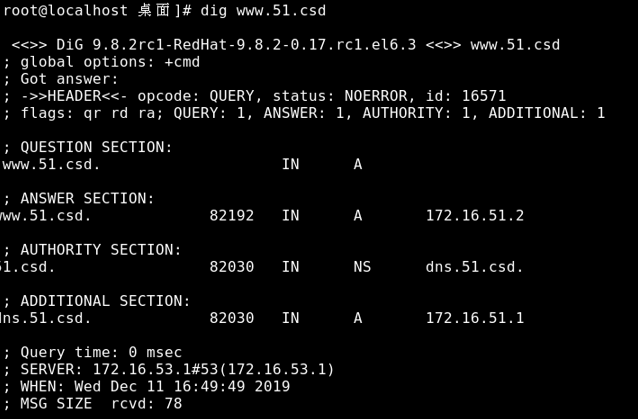
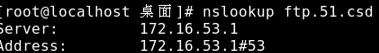
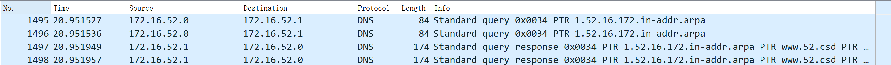
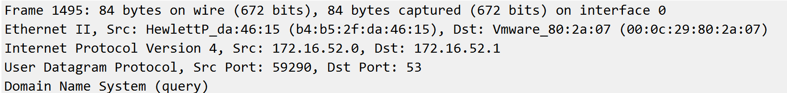
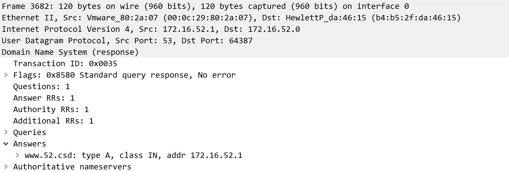

# 分析TCP和重要的应用层协议  

## 目录
[TOC]

## 个人信息

​	姓名：林逸泰
​	
​	学号：22920162203859

## 实验目的

- [x] ​     DNS服务  

- [x] ​     TCP协议分析  

- [x] ​     HTTP协议分析  

- [x] ​     FTP协议分析  

## 实验感想


## 相关代码与数据


# 实验内容与分析

## 任务一：DNS服务器

#### 实验环境


实验一中，将虚拟机设置为DNS服务器，具体地是利用bind服务，直接修改老师提供的配置文件。

#### 实验过程

​	配置文件修改

**named.conf**

```shell
zone "52.csd" IN {						# 正向域名
	type master;
	file "zone.csd";
};

zone "52.16.172.in-addr.arpa" IN {		# 反向域名
	type master;
	file "in-addr.arpa";
};
```

**zone.csd**： 配置正向区

```shell
$TTL 1D
@ 	IN 	SOA 	dns 	admin (
	01	;SERIAL number for zone update transfer
	1D	;REFRESH time interval before slave refresh zone
	1H	;RETRY time interval before failed REFRESH retry
	3D	;EXPIRE time interval before slave zone no longer authoritative
	3H	;MINIMUM time before negative cache expired
)
@ 	IN 	NS 	dns
dns	IN	A	172.16.52.1		# 前缀dns的解析
ftp	IN	A	172.16.52.1		# 前缀ftp的解析
www	IN	A	172.16.52.1		# 前缀www的解析
```

**in-addr.arp**：配置反向区

```shell
$TTL 1D
@ 	IN 	SOA 	dns.52.csd.	admin (
	01	;SERIAL number for zone update transfer
	1D	;REFRESH time interval before slave refresh zone
	1H	;RETRY time interval before failed REFRESH retry
	3D	;EXPIRE time interval before slave zone no longer authoritative
	3H	;MINIMUM time before negative cache expired
)
@ 	IN 	NS 	dns.52.csd.
1	IN	PTR	dns.52.csd.
1	IN	PTR	ftp.52.csd.
1	IN	PTR	www.52.csd.
```

#### 任务1.1

​	www，ftp添加如上

**诊断工具测试**

​	测试相邻的同学是否能接通

- dig：查询 *www.51.csd*

  

- host，查询*dns.51.csd*


- nslookup，查询*dns.51.csd*



#### 任务1.2

​	将宿主机的dns指向虚拟机，然后查询本机的Linux：

​	查询server：


​	用域名查询：


​	数据报：



可以看到本机查询了Linux的DNS服务器，服务器直接回复本机，展开分别能看到是请求和回复：

请求：



回复：



#### 任务1.3

 查询邻居

