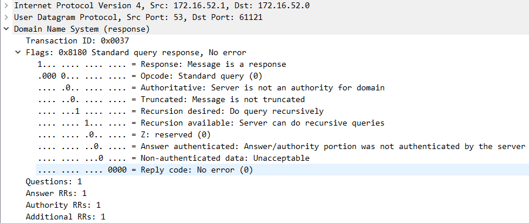
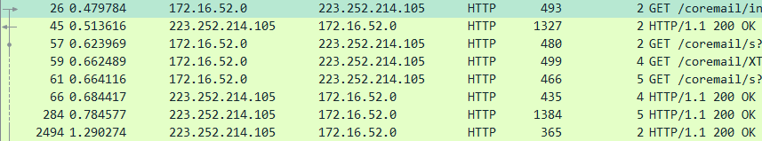

# 分析TCP和重要的应用层协议  

## 目录
[TOC]

## 个人信息

​	姓名：林逸泰
​	
​	学号：22920162203859

## 实验目的

- [x] ​     DNS服务  

- [x] ​     TCP协议分析  

- [x] ​     HTTP协议分析  

- [x] ​     FTP协议分析  

## 实验感想

​	本次是应用层实验，不能说很复杂，但是比较繁琐，不过也贴近日常应用。其中dns部分之前从未接触过，了解到了搭建dns服务的相关知识。http和其tcp连接部分是日常使用中解除最多的，通过实验也对http请求和响应的相应建立，处理，报文格式等有了更好了解，在TCP异常事件处理中，观察到网络对拥塞控制的具体举措，和书中举的简化版本例子还是有较大出入的。

## 相关代码与数据

​	相关数据已经打包在单独文件

# 实验内容与分析

## 任务一：DNS服务器

#### 实验环境


实验一中，将虚拟机设置为DNS服务器，具体地是利用bind服务，直接修改老师提供的配置文件。

#### 实验过程

​	配置文件修改

**named.conf**

```shell
zone "52.csd" IN {						# 正向域名
	type master;
	file "zone.csd";
};

zone "52.16.172.in-addr.arpa" IN {		# 反向域名
	type master;
	file "in-addr.arpa";
};
```

**zone.csd**： 配置正向区

```shell
$TTL 1D
@ 	IN 	SOA 	dns 	admin (
	01	;SERIAL number for zone update transfer
	1D	;REFRESH time interval before slave refresh zone
	1H	;RETRY time interval before failed REFRESH retry
	3D	;EXPIRE time interval before slave zone no longer authoritative
	3H	;MINIMUM time before negative cache expired
)
@ 	IN 	NS 	dns
dns	IN	A	172.16.52.1		# 前缀dns的解析
ftp	IN	A	172.16.52.1		# 前缀ftp的解析
www	IN	A	172.16.52.1		# 前缀www的解析
```

**in-addr.arp**：配置反向区

```shell
$TTL 1D
@ 	IN 	SOA 	dns.52.csd.	admin (
	01	;SERIAL number for zone update transfer
	1D	;REFRESH time interval before slave refresh zone
	1H	;RETRY time interval before failed REFRESH retry
	3D	;EXPIRE time interval before slave zone no longer authoritative
	3H	;MINIMUM time before negative cache expired
)
@ 	IN 	NS 	dns.52.csd.
1	IN	PTR	dns.52.csd.
1	IN	PTR	ftp.52.csd.
1	IN	PTR	www.52.csd.
```

### 任务1.1

​	www，ftp添加如上

**诊断工具测试**

​	测试相邻的同学是否能接通。

- dig：查询 *www.51.csd*

  

- host，查询*dns.51.csd*


- nslookup 在下面使用，这里不再给出

### 任务1.2

​	将宿主机的dns指向虚拟机，然后查询本机的Linux：

​	设置并查询server（本机Linux）：


​	用域名查询：


​	其中查询本机的某份数据报：


可以看到本机查询了Linux的DNS服务器，服务器直接回复本机，展开分别能看到是请求和回复：

**请求**：


- Questions：请求的问题数目，一个

- Query是查询包
  - Length字段：由于请求中的Name长度不确定，因此需要一个长度字段
  - Type A：表示IP地址查询
  - 类IN：为1，表示internet数据

**回复**：


- Answer RRs：为1，表示回答的个数

- Authority RRs和Additional RRs：分别表示了授权和额外的信息数，可以在数据报中看到

- Query：返回的数据报中包含了请求的内容

- Answer：应答，在回复信息中可以看到的对*www.52.csd*的查询结果，为*172.16.52.1*，其字段含义和请求的是一样的

  - Type：同样是1，这个字段不同的涵义如下：

  

### 任务1.3

 查询邻居，可以发现邻居的ftp还没有布置，但是dns已经布置完毕。


以下为查询*www.53.csd*流程的数据报


​	其中，从红色部分可以看出本机查询了本地dns服务器，本地dns服务器(52)又转而查询其他dns服务器(53)，然后其他dns服务器返回数据给本地dns服务器(52)，本地dns服务器(52)返回数据给本机。

​	标绿色部分的数据报为迭代查询数据报，其他为递归查询数据报

**本机向本地dns发送的查询数据报**


在flags字段可以看到“Do query recursicely”，即请求是以递归形式进行的

**本地DNS向其他DNS发送的数据**


在flags字段可以看到“Don't do query recursicely”，即请求是以递归形式进行的

**其他DNS给本地DNS的回复**

在flags字段可以看到“Don't do query recursicely”，即请求是以递归形式进行的，同时，可以看到有字段说明了对方服务器是域内的授权服务器

**本地DNS给本机的回复**



在flags字段可以看到“Do query recursicely”，即请求是以递归形式进行的

上述查询返回的是非权威的，将服务器指向邻居，在尝试查询得到应答为权威应答

> 非权威应答：Non-authoritative answer，除非实际存储DNS Server中获得域名解析回答的，都称为非权威应答。也就是从缓存中获取域名解析结果 

​	所以，当域名服务器指向本机的时候，查询结果是非权威的，而指向对方后，查询结果是权威的


## 任务二：TCP协议分析

### **1. TCP首部分析**：


截取其中一个报文进行分析：


软件已经很好地给出了所有字段名称以及含义，其中一些重要部分如下：

| 字段     | 值                        |
| -------- | ------------------------- |
| 源端口   | 80                        |
| 目的端口 | 47096                     |
| 序号     | 1（第一个包含数据的报文） |
| 确认号   | 119                       |
| flags    | 只有ACK设置了             |
| 窗口大小 | 14600                     |
| 检验和   | 0xdf15                    |
| 紧急指针 | 没有设置                  |

### **2. TCP流图**


错误帧用红色笔画出，在服务器端，有部分帧的到达以及发出时序不能很好地确认。


### **3. TCP异常事件分析**

​	异常事件主要来自拥塞控制部分，实验室网络环境不好，又同时有许多同学做一样的实验，导致出现大量重传报文。其中重复确认报文特别多。

- 重复确认


​	如图，接收方接收错误(红色)，即前面的段没有收到，因此**接收方**发出了三个ack重复应答，这时候接收方又接收到后面一帧的数据，于是又接着发送四个重复确认，都是针对201号帧。**发送方**在最后接收到发送方的重复确认后会执行快重传(见下方)。

- 快重传


​	如图，211号为快重传，对方收到快重传后，会马上进行回复，如上，214即是对方返回的回复，ack=53133。

同时，再上图可以看到发送方窗口在快重传后变小了(绿色部分)，即**发送方**调整了发送窗口大小

- 报文失序

  在上面的例子中没有看到失序的情况，寻找失序错误：

  
  
  在上面的例子中，接收方接收到seq=159397的包后马上收到了seq=163705的包，这个包即让接收端发现到前面段的缺失，于是类似前面的分析，进入接收方进行重复确认，发送方进行快重传，发送了seq=160883的包，和seq=162269的包，但是接收端前面一已经接收到seq=163705的包，所以这个包属于失序包，而后接收端又接收到了更后面的包，于是发送方马上发送了相应的ACK包。


- 在抓到的包中虽然有RST，但是接收方和发送方都不是这次传送的双方。出现RST后，理论上应当会重新建立连接，但图中这两个并没有重新建立，猜测可能是关闭浏览器页面之类的操作导致。


## 任务三：HTTP协议分析



​	使用显示过滤器‘http’过滤，即可得到http报文

> a)What capture filter can be used to capture only HTTP traffics?
>
> ​	‘http’
>
> b)What display filter can be used to display only HTTP traffics?
>
> ​	‘tcp port http’，可以在捕获前设置
>
> c)What is your IP address?
>
> ​	如上，172.16.52.0
>
> d)What is the server’s IP address?
>
> ​	223.252.214.105
>
> e)What is the HTTP version?
>
> ​	http协议版本1.1
>
> f)What is the HTTP request method?
>
> ​	请求方法都为“GET”
>
> g)How many HTTP request(s) is/are sent to the server? 
>
> ​	本机一共发送4个报文，服务器回复四个报文
>
> h)What is/are the status code(s) in the response(s)?
>
> ​	都是200
>
> i)How many application protocol(s) is/are captured while accessing the website?
>
> ​	只有http
>
> j)What protocol(s) does HTTP rely on?
>
> ​	依赖于网络层的tcp/ip协议。
>
> k)What is the relationship between HTTP and the World Wide Web (WWW)?
>
> ​	www是域名的一部分，和http没关系，http是协议。

选取一对http请求，响应报文进行分析：


### 请求报文


http请求头：


其形式是较为简单的，以键值对的形式保存，在上面的报文中：

| key          | value                     |
| ------------ | ------------------------- |
| 请求方法     | get                       |
| 请求uri      | /coremail/index.jsp?cus=1 |
| 版本         | http1.1                   |
| host         | stu.xmu.edu.cn            |
| 连接类型     | keep-alive，长连接        |
| 用户端类型   | ...                       |
| 接收文件类型 | ...                       |
| 编码类型     | gzip deflate              |
| 接收语言类型 | zh-CN zh                  |

### 响应报文

​	

http响应头：


​	主要字段：

| key          | value                            |
| ------------ | -------------------------------- |
| 协议版本     | http/1.1                         |
| 状态码       | 200                              |
| 状态码描述   | OK                               |
| 服务         | nginx(应该是用ngnix搭建的server) |
| content-type | text/html                        |
| 语言         | zh-CN                            |
| 编码         | gzip                             |

### TCP流

​	将tcp流标号应用为列，然后按其排序


tcp流标号最小的是0，最大的是10，只有标号为2，4，5的tcp流和上面的ip地址相符。

| 标号 | 传输数据类型 | 端口号                    |
| ---- | ------------ | ------------------------- |
| 2    | html/text    | client: 60457, server: 80 |
| 4    | html/text    | client: 60455, server: 80 |
| 5    | html/text    | client: 60456, server: 80 |

​	对于tcp来说，数据全当成二进制流，三个连接都以http作为应用层协议传输数据，其中大部分数据用标号为2的tcp流传输，标号为4的只有一次get和http 200(ok)的应答，标号为5的也有较多交互的数据报。从http的包来看，可以发现其协商传输的数据类型为html/text。

## 任务四：FTP分析

### 默认访问

​	**访问过程**


​	一共有两个TCP流，从书中对ftp的描述可以知道，ftp会使用多进程进行文件传输，在这里有两个TCP连接，其中一个传输文件数据，一个传输控制信息。


​	端口：传输数据的流在server为20号端口，在本地为35375，传输控制信息的流在server为21号，在本地为48482。

### 主动模式和被动模式

​	前面默认的方式为主动模式，被动模式访问流程：


​	同样一共有两个TCP流，其中一个传输文件数据，一个传输控制信息。

​	端口：传输数据的流在server为30040号端口，在本地为34422，传输控制信息的流在server为21号，在本地为48486。

#### 区别


​	 被动模式是FTP服务器返回数据传输需要的端口，FTP客户端去连接FTP服务端。 主动模式是FTP客户端向FTP服务器发送数据传输需要的端口，FTP服务端去连接FTP客户端的端口。

> **适合场景**
>
> ​	绝大部分互联网应用都是被动模式， 因为大部分客户端都是在路由器后面，没有独立的公网IP地址，服务器想要主动连接客户端，难度太大，在现在真实的互联网环境里面几乎是不可能完成的任务。
>
> ​	 当服务器位于内网的时候，可能会通过主动模式和客户端建立连接。这种方式也有利于服务器进行管理。

### web浏览器访问

​	使用web访问ftp服务器，速度非常缓慢，捉到的数据报也非常多，在访问过程中一共有8个TCP连接，浏览器会自动匿名登录。


​	观察其报文，发现它使用被动方式连接，存在在执行更改目录后出现了连接断开，然后重新登录的情况，但是也存在切换目录但是没有从连的情况，因此切换目录并不是重连的原因。

​	但是可以发现在进入"PASV"模式的时候会有重新握手的情况。


